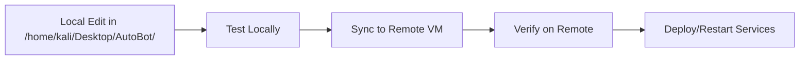

# 🚨 MANDATORY LOCAL-ONLY EDITING POLICY - CRITICAL ENFORCEMENT

## ⛔ ABSOLUTE PROHIBITION: NO REMOTE EDITING

**UNDER NO CIRCUMSTANCES ARE AGENTS ALLOWED TO:**
- ❌ SSH into remote machines to edit files directly
- ❌ Use remote text editors (vim, nano, emacs) on VMs
- ❌ Modify configuration files directly on servers
- ❌ Execute code changes directly on remote hosts
- ❌ Use `ssh user@host "edit command"` patterns
- ❌ Modify Docker containers directly on remote machines

## ✅ MANDATORY WORKFLOW: LOCAL EDIT → SYNC → DEPLOY

### The ONLY Acceptable Workflow:



## 📍 VM Infrastructure and Sync Requirements

### Remote VM Addresses:
- **VM1 Frontend**: `172.16.168.21` - Web interface
- **VM2 NPU Worker**: `172.16.168.22` - Hardware AI acceleration  
- **VM3 Redis**: `172.16.168.23` - Data layer
- **VM4 AI Stack**: `172.16.168.24` - AI processing
- **VM5 Browser**: `172.16.168.25` - Web automation

### Local Development Base:
- **Primary**: `/home/kali/Desktop/AutoBot/` - ALL edits happen here
- **NO EXCEPTIONS**: Every single code change must originate locally

## 🔄 Approved Sync Methods

### 1. SSH Key-Based Sync Scripts (Preferred)

```bash
# Frontend Sync
./scripts/utilities/sync-frontend.sh components/MyComponent.vue

# General VM Sync
./scripts/utilities/sync-to-vm.sh frontend autobot-vue/src/ /home/autobot/autobot-vue/src/

# Backend Sync
./scripts/utilities/sync-to-vm.sh ai-stack backend/ /home/autobot/backend/

# Configuration Sync
./scripts/utilities/sync-to-vm.sh redis config/redis.conf /etc/redis/redis.conf
```

### 2. Ansible Playbooks (Infrastructure Changes)

```bash
# Deploy to specific VM
ansible-playbook -i ansible/inventory ansible/playbooks/deploy-frontend.yml

# Update all VMs
ansible-playbook -i ansible/inventory ansible/playbooks/sync-all-vms.yml

# Configuration management
ansible-playbook -i ansible/inventory ansible/playbooks/update-configs.yml
```

### 3. Rsync with SSH Keys

```bash
# Sync directory to VM (SSH key required)
rsync -avz --delete \
  -e "ssh -i ~/.ssh/autobot_key" \
  /home/kali/Desktop/AutoBot/autobot-vue/ \
  autobot@172.16.168.21:/home/autobot/autobot-vue/

# Sync specific files
rsync -avz \
  -e "ssh -i ~/.ssh/autobot_key" \
  /home/kali/Desktop/AutoBot/backend/api/chat.py \
  autobot@172.16.168.24:/home/autobot/backend/api/
```

### 4. Docker Build and Push (Container Updates)

```bash
# Build locally
docker build -t autobot-frontend:latest ./autobot-vue

# Push to registry
docker push registry.local/autobot-frontend:latest

# Deploy on remote (via Ansible or SSH)
ansible-playbook -i ansible/inventory ansible/playbooks/deploy-containers.yml
```

## 🛠️ Agent-Specific Enforcement Rules

### Frontend Engineer
```markdown
MANDATORY: 
- Edit Vue components in /home/kali/Desktop/AutoBot/autobot-vue/
- Use ./scripts/utilities/sync-frontend.sh for deployment
- NEVER ssh to 172.16.168.21 to edit files
```

### Backend Engineer
```markdown
MANDATORY:
- Edit Python files in /home/kali/Desktop/AutoBot/backend/
- Use ansible-playbook for backend deployment
- NEVER modify FastAPI routes directly on VM4
```

### DevOps Engineer
```markdown
MANDATORY:
- Edit Docker/Ansible files locally
- Use ansible-playbook for all infrastructure changes
- NEVER modify docker-compose.yml on remote hosts
```

### Database Engineer
```markdown
MANDATORY:
- Edit schemas/migrations in /home/kali/Desktop/AutoBot/migrations/
- Use ansible-playbook for database updates
- NEVER modify Redis config directly on VM3
```

## 📝 Sync Script Templates

### Universal Sync Function
```bash
#!/bin/bash
# Universal sync function for all VMs

sync_to_vm() {
    local vm_name=$1
    local source_path=$2
    local dest_path=$3
    
    case $vm_name in
        frontend) VM_IP="172.16.168.21" ;;
        npu-worker) VM_IP="172.16.168.22" ;;
        redis) VM_IP="172.16.168.23" ;;
        ai-stack) VM_IP="172.16.168.24" ;;
        browser) VM_IP="172.16.168.25" ;;
        *) echo "Unknown VM: $vm_name"; return 1 ;;
    esac
    
    # MANDATORY: Use SSH key authentication
    rsync -avz --delete \
        -e "ssh -i ~/.ssh/autobot_key -o StrictHostKeyChecking=no" \
        "$source_path" \
        "autobot@${VM_IP}:${dest_path}"
    
    echo "✅ Synced $source_path to $vm_name ($VM_IP):$dest_path"
}
```

### Service-Specific Sync Scripts

#### Frontend Sync
```bash
#!/bin/bash
# sync-frontend-component.sh
COMPONENT=$1
LOCAL_PATH="/home/kali/Desktop/AutoBot/autobot-vue/src/components/${COMPONENT}"
REMOTE_PATH="/home/autobot/autobot-vue/src/components/"

rsync -avz -e "ssh -i ~/.ssh/autobot_key" \
    "$LOCAL_PATH" \
    "autobot@172.16.168.21:${REMOTE_PATH}"

# Restart Vite dev server
ssh -i ~/.ssh/autobot_key autobot@172.16.168.21 \
    "cd /home/autobot/autobot-vue && npm run dev:restart"
```

#### Backend Sync
```bash
#!/bin/bash
# sync-backend-api.sh
API_MODULE=$1
LOCAL_PATH="/home/kali/Desktop/AutoBot/backend/api/${API_MODULE}"
REMOTE_PATH="/home/autobot/backend/api/"

rsync -avz -e "ssh -i ~/.ssh/autobot_key" \
    "$LOCAL_PATH" \
    "autobot@172.16.168.24:${REMOTE_PATH}"

# Restart FastAPI
ssh -i ~/.ssh/autobot_key autobot@172.16.168.24 \
    "sudo systemctl restart autobot-backend"
```

## 🚀 Ansible Playbook Examples

### Deploy Frontend Changes
```yaml
---
# ansible/playbooks/deploy-frontend.yml
- hosts: frontend
  become: yes
  tasks:
    - name: Sync Vue application
      synchronize:
        src: /home/kali/Desktop/AutoBot/autobot-vue/
        dest: /home/autobot/autobot-vue/
        delete: yes
        recursive: yes
    
    - name: Install dependencies
      npm:
        path: /home/autobot/autobot-vue
        state: present
    
    - name: Build production
      command: npm run build
      args:
        chdir: /home/autobot/autobot-vue
    
    - name: Deploy to nginx
      synchronize:
        src: /home/autobot/autobot-vue/dist/
        dest: /var/www/html/
        delete: yes
    
    - name: Restart nginx
      systemd:
        name: nginx
        state: restarted
```

### Sync All VMs
```yaml
---
# ansible/playbooks/sync-all-vms.yml
- hosts: all
  tasks:
    - name: Sync common scripts
      synchronize:
        src: /home/kali/Desktop/AutoBot/scripts/
        dest: /home/autobot/scripts/
        delete: yes
    
    - name: Sync environment files
      copy:
        src: /home/kali/Desktop/AutoBot/.env
        dest: /home/autobot/.env
        mode: '0600'
    
    - name: Ensure services are running
      systemd:
        name: "{{ item }}"
        state: started
        enabled: yes
      loop:
        - docker
        - autobot-{{ inventory_hostname }}
```

## 🔍 Verification Commands

### Check What Will Be Synced (Dry Run)
```bash
# Rsync dry run
rsync -avzn -e "ssh -i ~/.ssh/autobot_key" \
    /home/kali/Desktop/AutoBot/autobot-vue/ \
    autobot@172.16.168.21:/home/autobot/autobot-vue/

# Ansible check mode
ansible-playbook -i ansible/inventory ansible/playbooks/deploy-frontend.yml --check
```

### Verify Remote State
```bash
# Check remote file without editing
ssh -i ~/.ssh/autobot_key autobot@172.16.168.21 \
    "ls -la /home/autobot/autobot-vue/src/components/"

# View remote logs
ssh -i ~/.ssh/autobot_key autobot@172.16.168.24 \
    "tail -f /var/log/autobot/backend.log"

# Check service status
ssh -i ~/.ssh/autobot_key autobot@172.16.168.21 \
    "systemctl status autobot-frontend"
```

## ⚠️ Common Violations and Corrections

### ❌ VIOLATION: Direct SSH Editing
```bash
# WRONG - NEVER DO THIS
ssh autobot@172.16.168.21 "vim /home/autobot/autobot-vue/src/App.vue"
```

### ✅ CORRECT: Local Edit + Sync
```bash
# RIGHT - ALWAYS DO THIS
vim /home/kali/Desktop/AutoBot/autobot-vue/src/App.vue
./scripts/utilities/sync-frontend.sh App.vue
```

### ❌ VIOLATION: Remote Configuration Change
```bash
# WRONG - NEVER DO THIS
ssh autobot@172.16.168.23 "sudo vim /etc/redis/redis.conf"
```

### ✅ CORRECT: Local Config + Ansible Deploy
```bash
# RIGHT - ALWAYS DO THIS
vim /home/kali/Desktop/AutoBot/config/redis.conf
ansible-playbook -i ansible/inventory ansible/playbooks/update-redis-config.yml
```

## 📋 Agent Checklist

Before ANY remote operation, agents MUST verify:

- [ ] Is the edit being made in `/home/kali/Desktop/AutoBot/`?
- [ ] Has the local change been tested?
- [ ] Is the sync script or Ansible playbook ready?
- [ ] Are SSH keys properly configured?
- [ ] Is the target VM and path correct?
- [ ] Has a dry run been performed?
- [ ] Is there a rollback plan?

## 🔒 Security Enforcement

### SSH Key Requirements
- **Location**: `~/.ssh/autobot_key` (4096-bit RSA)
- **Permissions**: 600 (read/write owner only)
- **NO PASSWORD AUTH**: Only key-based authentication allowed

### Sync Script Security
- **Always use SSH keys**: Never embed passwords
- **Verify paths**: Prevent accidental overwrites
- **Use --delete carefully**: Can remove remote files
- **Log all syncs**: Maintain audit trail

## 📢 FINAL ENFORCEMENT STATEMENT

**This policy is NON-NEGOTIABLE. Any agent attempting to edit files directly on remote servers is violating core architectural principles and creating:**

1. **Configuration drift** between environments
2. **Loss of version control** tracking
3. **Deployment inconsistencies**
4. **Security vulnerabilities**
5. **Debugging nightmares**

**REMEMBER**: The source of truth is ALWAYS local. Remote machines are deployment targets, not development environments.

---

**Policy Effective Date**: 2025-01-12  
**Enforcement Level**: MANDATORY  
**Exceptions**: NONE  
**Violations**: Will be logged and corrected immediately