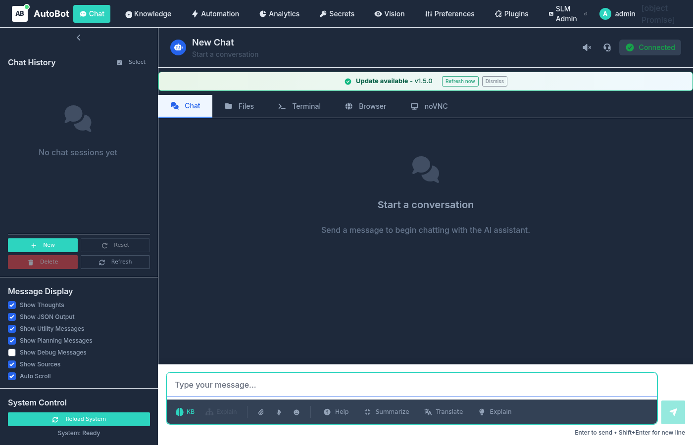
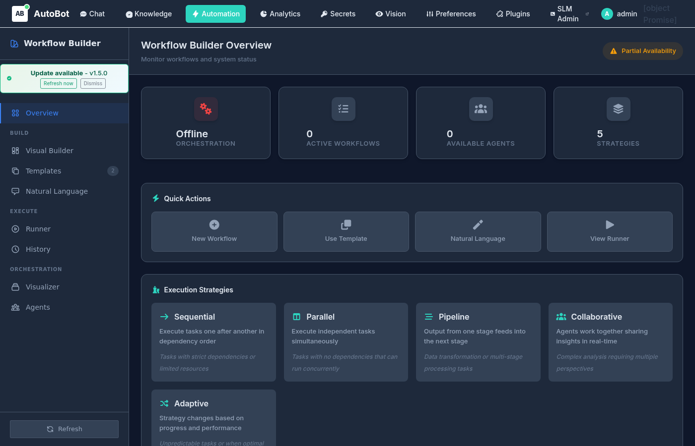
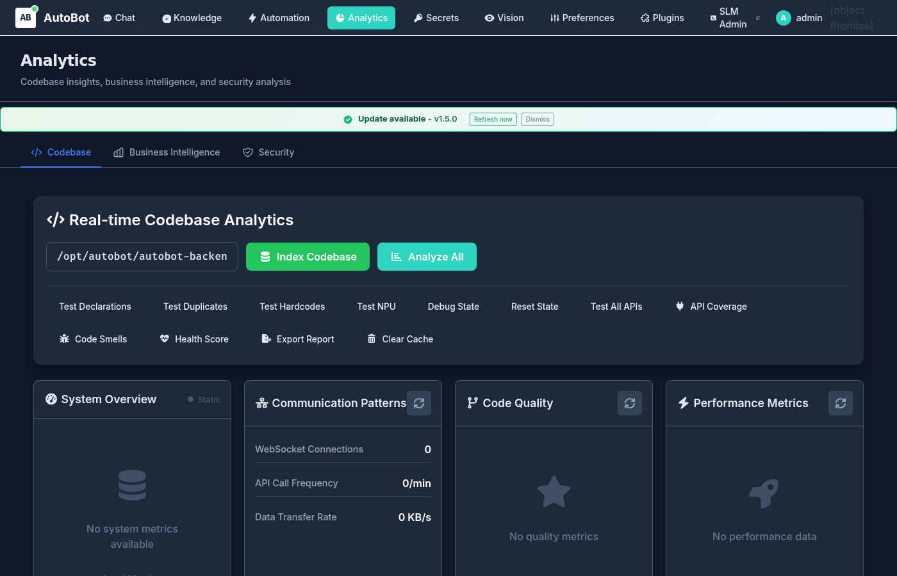
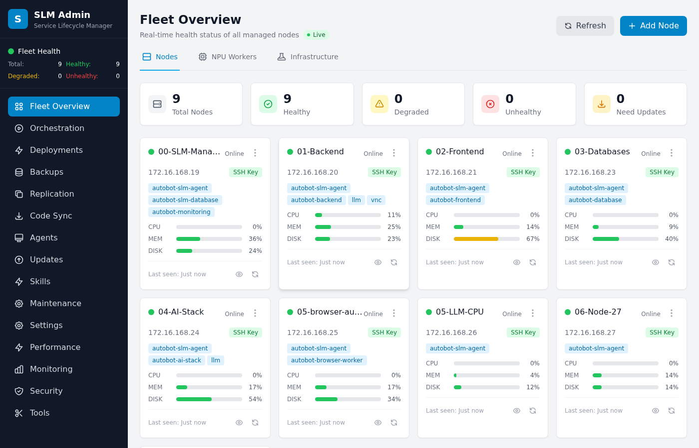

# AutoBot

> AI-powered autonomous platform for Linux administration, multi-modal AI interaction, and intelligent workflow automation.

AutoBot is a self-hosted platform that combines a conversational AI assistant with a distributed automation engine. Chat with AI models, run browser and terminal automation, manage knowledge bases, analyze codebases, and administer a fleet of Linux nodes — all from a single web dashboard.

**Status:** Active development · v1.5.0

---

## Screenshots

<table>
<tr>
<td><br><em>AI Chat with voice, terminal, browser &amp; desktop tabs</em></td>
<td><br><em>Visual Workflow Builder with execution strategy selection</em></td>
</tr>
<tr>
<td><br><em>Real-time codebase analytics and code quality scoring</em></td>
<td><br><em>Service Lifecycle Manager — fleet health across all nodes</em></td>
</tr>
</table>

---

## What You Can Do

| Module | What it does |
|--------|-------------|
| **Chat** | Conversational AI backed by Ollama and 8 LLM provider types. Voice input/output, file attachments, inline terminal, embedded browser, and VNC desktop — all within a single chat session |
| **Knowledge Base** | Upload documents and code, then query via semantic search or RAG-enhanced AI answers. Browse by category or explore the entity knowledge graph |
| **Automation** | Visual workflow builder with sequential, parallel, pipeline, collaborative, and adaptive execution strategies. Describe workflows in natural language |
| **Analytics** | Index and analyze codebases in real-time. Code quality scores, duplicate detection, API coverage, hardcoded value scanning, and business intelligence dashboards |
| **Vision** | AI screen capture and element analysis. Identify UI components, extract text from screenshots, and feed results into automation workflows |
| **SLM Admin** | Service Lifecycle Manager — deploy, monitor, update, and roll back services across a fleet of Linux nodes via Ansible automation |

---

## Requirements

| Component | Minimum | Recommended |
|-----------|---------|-------------|
| OS | Linux or WSL2 | Ubuntu 22.04 LTS |
| RAM | 16 GB | 32 GB+ |
| CPU | 8 cores | 16+ cores |
| Storage | 50 GB | 200 GB+ (model + knowledge base storage) |
| GPU | — | NVIDIA (CUDA) or Intel NPU for accelerated inference |
| Python | 3.10 | 3.12 (conda env) |
| Node.js | 18 | 20 |

---

## Quick Start

### 1. Clone the repository

```bash
git clone https://github.com/mrveiss/AutoBot-AI.git
cd AutoBot-AI
```

### 2. Run initial setup

```bash
bash setup.sh
```

Installs dependencies, configures environment variables, initializes Redis databases, and prepares all containers.

### 3. Start AutoBot

```bash
# Development mode — auto-reload, debug logging
bash run_autobot.sh --dev

# Production mode
bash run_autobot.sh --prod

# Skip container rebuild if images already exist
bash run_autobot.sh --dev --no-build
```

### 4. Open the interface

| Interface | URL | Default credentials |
|-----------|-----|---------------------|
| User Frontend | https://172.16.168.21 | admin / admin |
| Backend API docs | https://172.16.168.20:8443/docs | — |
| SLM Fleet Admin | https://172.16.168.19 | admin / admin |
| VNC Desktop | http://127.0.0.1:6080 | — |

> **Change the default password on first login.**

### 5. Verify services are running

```bash
scripts/start-services.sh status
```

---

## How to Use

### Chat

The main interface at **https://172.16.168.21/chat**. Start a conversation and switch between:

- **Chat** — send messages to the AI assistant
- **Files** — browse and manage files on the server
- **Terminal** — run shell commands without leaving the chat
- **Browser** — embedded Playwright browser with visual automation
- **noVNC** — full remote desktop access

**Input toolbar shortcuts:** `KB` searches the knowledge base, `Explain`, `Summarize`, and `Translate` are one-click AI actions. Mic button enables voice input. Attach files with the paperclip.

---

### Knowledge Base

Go to **Knowledge → Search**. Two modes:

- **Traditional Search** — fast semantic search across all indexed documents
- **RAG Enhanced** — full AI pipeline with retrieval-augmented generation for richer answers

Filter by category or access level (Platform, Public, System, User). Upload and manage documents at **Knowledge → Manage**. Explore entity relationships at **Knowledge → Graph**.

---

### Automation

Go to **Automation → Workflow Builder**. Choose an execution strategy:

| Strategy | When to use |
|----------|------------|
| **Sequential** | Tasks with strict dependencies |
| **Parallel** | Independent tasks that can run concurrently |
| **Pipeline** | Output of one stage feeds into the next |
| **Collaborative** | Multiple agents sharing context in real-time |
| **Adaptive** | Strategy adjusts dynamically based on progress |

Use **Natural Language** mode to describe what you want in plain English — AutoBot generates the workflow automatically. Run workflows with **Runner** and review history under **History**.

---

### Analytics

Go to **Analytics → Codebase**. Point it at a codebase directory and click **Index Codebase**. Available analyses:

- Code quality score, code smells, health score
- Duplicate detection, hardcoded value scanning
- API endpoint coverage, NPU compatibility check
- Communication patterns, performance metrics
- Export to report

---

### Vision

Go to **Vision → Image Processing**. Click **Capture & Analyze** to take a screenshot of the connected desktop and run AI element detection. Enable **Auto-refresh** to continuously monitor a screen. Use detected elements as inputs for browser automation workflows.

---

### SLM Fleet Admin

Accessed at **https://172.16.168.19** or via the **SLM Admin** button in the top-right corner.

| Section | Purpose |
|---------|---------|
| **Fleet Overview** | Real-time CPU/RAM/disk health across all nodes |
| **Orchestration** | Start, stop, restart services on any node |
| **Deployments** | Roll out code updates via Ansible playbooks |
| **Backups** | Schedule and restore node backups |
| **Replication** | Manage data replication between nodes |
| **Code Sync** | Push code updates to the fleet from git |
| **Agents** | View and manage AI agents running across nodes |
| **Updates** | Check and apply software updates |
| **Skills** | Deploy AI skill libraries to nodes |
| **Monitoring** | Prometheus metrics and alerting |

---

## Architecture

AutoBot runs as a distributed system. Each component is isolated on its own node:

```
                        User Browser
                             │
                    ┌────────▼─────────┐
                    │  Frontend (.21)  │
                    │  Vue 3 + Vite    │
                    └────────┬─────────┘
                             │ HTTPS / WebSocket
                    ┌────────▼─────────┐
                    │  Backend (.20)   │
                    │  FastAPI · Py3.12│
                    │  RTX 4070 · 22c  │
                    └──┬──┬──┬──┬──┬──┘
                       │  │  │  │  │
           ┌───────────┘  │  │  │  └────────────┐
           │              │  │  │               │
     Redis (.23)    AI Stack  Browser VM    NPU VM (.22)
     Vector DB +    (.24)     (.25)         Intel OpenVINO
     Session store  LLM       Playwright    Hardware accel
                              automation
                                   │
                          ┌────────▼────────┐
                          │   SLM (.19)     │
                          │  Fleet Manager  │
                          │  Ansible ctrl   │
                          └─────────────────┘
```

**Tech stack at a glance:**
- Backend: Python 3.12, FastAPI, asyncpg, ChromaDB, Ollama
- Frontend: Vue 3, TypeScript, Vite
- Data: Redis Stack, PostgreSQL (user management), ChromaDB (vectors)
- Infra: Ansible, systemd, nginx, self-signed TLS

---

## Service Management

```bash
# Start / stop / restart all services
scripts/start-services.sh start
scripts/start-services.sh stop
scripts/start-services.sh restart

# Start specific service
scripts/start-services.sh start backend

# View logs
scripts/start-services.sh logs backend
scripts/start-services.sh logs frontend

# Open SLM GUI
scripts/start-services.sh gui
```

Direct systemctl:
```bash
sudo systemctl start autobot-backend
sudo systemctl status autobot-backend
journalctl -u autobot-backend -f
```

---

## Documentation

| Topic | Link |
|-------|------|
| Developer Reference | [docs/developer/AUTOBOT_REFERENCE.md](docs/developer/AUTOBOT_REFERENCE.md) |
| Getting Started (full) | [docs/GETTING_STARTED_COMPLETE.md](docs/GETTING_STARTED_COMPLETE.md) |
| API Documentation | [docs/api/COMPREHENSIVE_API_DOCUMENTATION.md](docs/api/COMPREHENSIVE_API_DOCUMENTATION.md) |
| Redis Architecture | [docs/api/redis-documentation.md](docs/api/redis-documentation.md) |
| Distributed Architecture | [docs/architecture/DISTRIBUTED_6VM_ARCHITECTURE.md](docs/architecture/DISTRIBUTED_6VM_ARCHITECTURE.md) |
| Service Management | [docs/developer/SERVICE_MANAGEMENT.md](docs/developer/SERVICE_MANAGEMENT.md) |
| Troubleshooting | [docs/troubleshooting/INDEX.md](docs/troubleshooting/INDEX.md) |
| Infrastructure & Scripts | [autobot-infrastructure/README.md](autobot-infrastructure/README.md) |

For development workflow, coding standards, and rules: see [CLAUDE.md](CLAUDE.md).

---

*Copyright © 2025 mrveiss. All rights reserved.*
