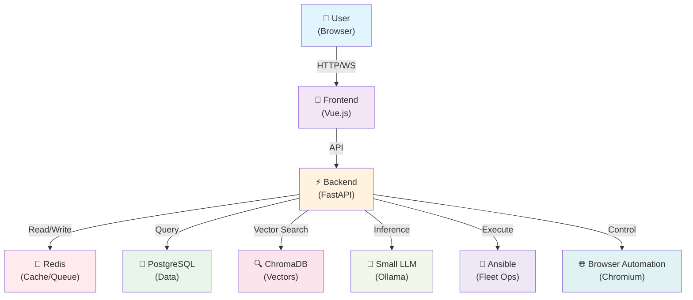

# AutoBot: Self-Hosted AI Automation Platform

> **One Dashboard. Your Infrastructure. Complete Control.**
>
> AutoBot is a self-hosted platform that brings conversational AI to distributed Linux administration, fleet management, and infrastructure automation — all from a beautiful, modern interface.

[](https://github.com/mrveiss/AutoBot-AI/actions/workflows/docker-smoke-test.yml)
[](https://github.com/sponsors/mrveiss)

## Quick Start (3 Steps)

### 1. Clone the Repository
```bash
git clone https://github.com/mrveiss/AutoBot-AI.git
cd AutoBot-AI
```

### 2. Start with Docker
```bash
cp .env.example .env
docker compose up -d
```

### 3. Open Your Dashboard
Visit **http://localhost** in your browser. AutoBot is ready to use.

---

## What AutoBot Does

AutoBot combines conversational AI with distributed automation to give you:

- **Unified Dashboard** — Manage infrastructure, fleet operations, and analytics from one place
- **Natural Language Control** — Issue commands in plain English; AutoBot handles the complexity
- **Knowledge Integration** — Build custom knowledge bases for your infrastructure and workflows
- **Code Analytics** — Understand codebases, extract insights, identify risks
- **Vision Processing** — Analyze screenshots and diagrams to guide infrastructure decisions
- **Fleet Management** — Orchestrate multi-server deployments, updates, and monitoring with Ansible
- **Self-Hosted & Private** — Full data control, no external dependencies, runs on your hardware

---

## System Requirements

| Component | Minimum | Recommended |
|-----------|---------|-------------|
| **CPU** | 4 cores | 8+ cores |
| **RAM** | 8 GB | 16+ GB |
| **Storage** | 20 GB SSD | 50+ GB SSD |
| **GPU** | None (CPU-only mode) | NVIDIA GPU for faster inference |
| **OS** | Ubuntu 20.04+ / Debian 11+ | Ubuntu 22.04 LTS |
| **Docker** | 24.0+ | 25.0+ |

---

## Features at a Glance

| Feature | Capability |
|---------|-----------|
| **Chat** | Multi-turn conversations with function calling, streaming responses |
| **Knowledge Bases** | RAG-powered retrieval from documents, code, infrastructure docs |
| **Workflow Builder** | Visual and code-based workflow creation for infrastructure tasks |
| **Codebase Analytics** | Code structure analysis, risk detection, dependency insights |
| **Vision** | Image/screenshot analysis for infrastructure troubleshooting |
| **Fleet Management** | Ansible-powered multi-server orchestration and monitoring |

---

## Architecture Overview


```mermaid
graph TB
    User["👤 User<br/>(Browser)"]
    Frontend["🎨 Frontend<br/>(Vue.js)"]
    Backend["⚡ Backend<br/>(FastAPI)"]
    
    Redis["🔴 Redis<br/>(Cache/Queue)"]
    PostgreSQL["🐘 PostgreSQL<br/>(Data)"]
    ChromaDB["🔍 ChromaDB<br/>(Vectors)"]
    
    SLM["🧠 Small LLM<br/>(Ollama)"]
    
    Ansible["🔧 Ansible<br/>(Fleet Ops)"]
    Browser["🌐 Browser Automation<br/>(Chromium)"]

    User -->|HTTP/WS| Frontend
    Frontend -->|API| Backend
    
    Backend -->|Read/Write| Redis
    Backend -->|Query| PostgreSQL
    Backend -->|Vector Search| ChromaDB
    Backend -->|Inference| SLM
    
    Backend -->|Execute| Ansible
    Backend -->|Control| Browser

    style User fill:#e1f5ff
    style Frontend fill:#f3e5f5
    style Backend fill:#fff3e0
    style Redis fill:#ffebee
    style PostgreSQL fill:#e8f5e9
    style ChromaDB fill:#fce4ec
    style SLM fill:#f1f8e9
    style Ansible fill:#ede7f6
    style Browser fill:#e0f2f1
```

---

## Deployment Options

### Docker (Recommended for Most Users)
Fastest way to get started. Includes all services pre-configured.

```bash
docker compose up -d
```

### Native Installation
For development or custom setups. See [INSTALL.md](INSTALL.md).

### Development Mode
For contributing to AutoBot:
```bash
docker compose -f docker-compose.dev.yml up -d
```

---

## Core Services

AutoBot runs as a coordinated set of services:

| Service | Role | Port |
|---------|------|------|
| **Frontend** | Vue.js UI, TLS termination | 80, 443 |
| **Backend** | FastAPI API server | 8001 |
| **Redis** | Cache, message queue | 6379 |
| **PostgreSQL** | Relational database | 5432 |
| **ChromaDB** | Vector embeddings store | 8100 |
| **SLM (Ollama)** | Small language model inference | 11434 (optional) |
| **Prometheus** | Metrics collection | 9090 (optional) |
| **Grafana** | Monitoring dashboards | 3000 (optional) |

---

## Usage Guide

### Dashboard Overview
Once running, navigate to **http://localhost** to access:
- **Chat Interface** — Start conversing with AutoBot about your infrastructure
- **Knowledge Bases** — Upload and manage documents, codebases, runbooks
- **Workflows** — Create automated tasks and infrastructure operations
- **Fleet Management** — View and orchestrate multiple servers
- **Analytics** — Monitor system health, performance, and activity

### Example: Managing a Fleet
```bash
# In the AutoBot chat:
# "Deploy the latest application version to all production servers"
# AutoBot handles the Ansible orchestration automatically
```

### Example: Infrastructure Insights
```bash
# Ask AutoBot to analyze your codebase:
# "What are the critical dependencies in the auth module?"
```

---

## Configuration

All configuration uses environment variables in `.env`. See `.env.example` for all options.

Key settings:
- `AUTOBOT_DEPLOYMENT_MODE` — `hybrid` or `distributed`
- `AUTOBOT_LLM_PROVIDER` — `ollama` (default) or others
- `AUTOBOT_SINGLE_USER_MODE` — `true` (development) or `false` (multi-user)

---

## Contributing

We welcome contributions! Whether you're fixing bugs, adding features, or improving documentation:

1. Check out [CONTRIBUTING.md](CONTRIBUTING.md) for guidelines
2. Look for issues tagged `good-first-issue` if you're new
3. Bounty opportunities available on some issues — see the `bounty` label

---

## Support

- 💬 **Questions?** Start a discussion in [GitHub Discussions](https://github.com/mrveiss/AutoBot-AI/discussions)
- 🐛 **Found a bug?** Open an [issue](https://github.com/mrveiss/AutoBot-AI/issues)
- 💡 **Have an idea?** Share it in [Discussions → Ideas](https://github.com/mrveiss/AutoBot-AI/discussions/categories/ideas)

---

## Sponsors & Supporters

Support AutoBot's development:

- **[GitHub Sponsors](https://github.com/sponsors/mrveiss)** — Get updates and direct support
- **[Ko-fi](https://ko-fi.com/mrveiss)** — One-time or recurring donations

Your support helps us:
- Maintain and improve the codebase
- Add new features and capabilities
- Expand documentation and examples
- Grow the community

---

## License

AutoBot is open source. See [LICENSE](LICENSE) for details.

---

## Roadmap

### Upcoming
- [ ] Multi-user authentication and RBAC
- [ ] Kubernetes orchestration support
- [ ] Advanced analytics dashboards
- [ ] Custom integrations marketplace
- [ ] Mobile companion app

### Under Consideration
- Cloud deployment templates
- Managed hosting option
- Enterprise features (SAML, audit logs)

---

## Technology Stack

- **Frontend**: Vue.js, TypeScript, Vite
- **Backend**: FastAPI, Python, AsyncIO
- **Database**: PostgreSQL, Redis, ChromaDB
- **LLM**: Ollama (local), LangChain
- **Orchestration**: Ansible, Docker, Kubernetes (coming)
- **Infrastructure**: Docker Compose, systemd

---

## Documentation

Full documentation coming soon. In the meantime:
- See [INSTALL.md](INSTALL.md) for detailed setup instructions
- Check [CONTRIBUTING.md](CONTRIBUTING.md) to get involved
- Explore [docs/](docs/) for architecture details

---

## Status

**Current Version**: v1.5.0 (Active Development)

AutoBot is actively developed and used for infrastructure automation. It's suitable for:
- ✅ Self-hosted deployments on your infrastructure
- ✅ Development and testing environments
- ✅ Learning AI-driven automation
- 🚀 Production use (with monitoring and backups)

---

**Made with ❤️ by the AutoBot community**
