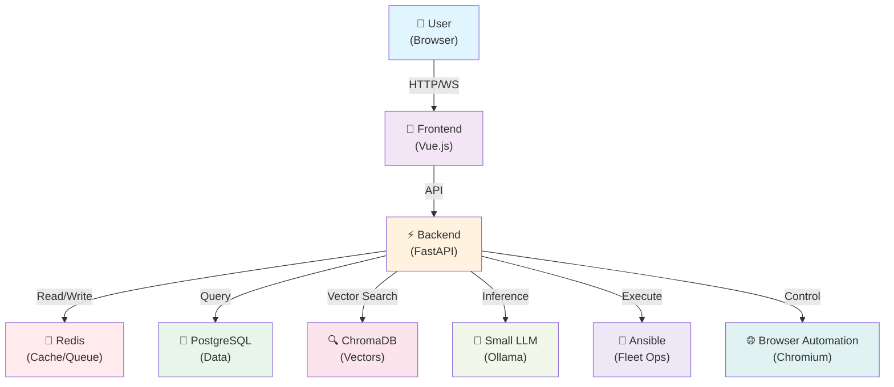

<div align="center">

# Your data. Your AI.

**AutoBot is the self-hosted AI platform that belongs to you — not to us.**

Feed it your docs, your codebase, your business knowledge.
Plug in any brain you want — Ollama, OpenAI, Claude, Gemini, or any LLM.
Your data stays on your machine. Your AI stays yours.

[Get Started](#quick-start-3-steps) · [Documentation](docs/) · [Community](https://github.com/mrveiss/AutoBot-AI/discussions) · [Sponsor](https://github.com/sponsors/mrveiss)

[](https://github.com/mrveiss/AutoBot-AI/actions/workflows/docker-smoke-test.yml)
[](https://codecov.io/gh/mrveiss/AutoBot-AI)
[](https://github.com/sponsors/mrveiss)

</div>

---

> WordPress gave everyone a website. AutoBot gives everyone an AI.
> Self-hosted. Open source. Yours to extend.

**AutoBot is not a SaaS subscription. It's infrastructure you own.**
Deploy it once with Docker Compose. Feed your knowledge base — drag in docs, paste URLs, upload files.
Connect whatever LLM you trust. Run it forever, on your terms.

| What you get | What stays yours |
|---|---|
| Chat interface | Your prompts |
| RAG knowledge base | Your documents |
| Fleet management | Your infrastructure |
| Plugin ecosystem | Your data |

## Quick Start (3 Steps)

### 1. Clone the Repository
```bash
git clone https://github.com/mrveiss/AutoBot-AI.git
cd AutoBot-AI
```

### 2. Start with Docker
```bash
cp .env.example .env
docker compose up -d
```

### 3. Open Your Dashboard
Visit **http://localhost** in your browser. AutoBot is ready to use.

---

## What AutoBot Does

AutoBot is a **self-hosted infrastructure automation platform** that combines conversational AI with distributed automation. Deploy it on your own hardware and keep complete control:

- **Unified Self-Hosted Dashboard** — Manage infrastructure, fleet operations, and analytics from one place on your servers
- **Natural Language Control** — Issue commands in plain English; AutoBot handles the complexity locally
- **Self-Hosted Knowledge Bases** — Build custom knowledge bases from your infrastructure docs, runbooks, and workflows — all stored locally
- **Code Analytics** — Understand codebases, extract insights, identify risks without sending data to external services
- **Vision Processing** — Analyze screenshots and diagrams locally to guide infrastructure decisions
- **Self-Hosted Fleet Management** — Orchestrate multi-server deployments, updates, and monitoring with Ansible across your infrastructure
- **Complete Data Privacy** — Full data control, no external dependencies, runs entirely on your hardware, no cloud vendor lock-in

---

## System Requirements

| Component | Minimum | Recommended |
|-----------|---------|-------------|
| **CPU** | 4 cores | 8+ cores |
| **RAM** | 8 GB | 16+ GB |
| **Storage** | 20 GB SSD | 50+ GB SSD |
| **GPU** | None (CPU-only mode) | NVIDIA GPU for faster inference |
| **OS** | Ubuntu 20.04+ / Debian 11+ | Ubuntu 22.04 LTS |
| **Docker** | 24.0+ | 25.0+ |

---

## Features at a Glance

| Feature | Capability |
|---------|-----------|
| **Chat** | Multi-turn conversations with function calling, streaming responses |
| **Knowledge Bases** | RAG-powered retrieval from documents, code, infrastructure docs |
| **Workflow Builder** | Visual and code-based workflow creation for infrastructure tasks |
| **Codebase Analytics** | Code structure analysis, risk detection, dependency insights |
| **Vision** | Image/screenshot analysis for infrastructure troubleshooting |
| **Fleet Management** | Ansible-powered multi-server orchestration and monitoring |

---

## Why Self-Hosted? AutoBot vs Cloud Alternatives

| Aspect | AutoBot (Self-Hosted) | Cloud AI Tools | 
|--------|----------------------|----------------|
| **Data Privacy** | Your data stays on your hardware | Data sent to external servers |
| **Cost** | One-time setup, no per-request fees | Recurring API costs, usage-based pricing |
| **Control** | Full customization, no vendor lock-in | Limited by cloud provider's roadmap |
| **Compliance** | Meet HIPAA, GDPR, SOC2 requirements | Subject to cloud provider's compliance |
| **Latency** | Local inference, millisecond response times | Network latency to cloud APIs |
| **Offline Capability** | Works without internet connection | Requires constant cloud connectivity |
| **Customization** | Run custom models, modify code | Locked to cloud provider's models |
| **Scalability** | Scale within your infrastructure | Limited by cloud provider's quotas |

For teams prioritizing **data privacy, cost efficiency, and infrastructure control**, self-hosted automation with AutoBot is the ideal choice.

📚 **Learn more:** [Why Self-Hosted Infrastructure Automation?](docs/self-hosted-advantages.md)

---

## Architecture Overview

> Full diagrams (data flows, deployment topologies, sequence diagrams): [docs/architecture/system-diagram.md](docs/architecture/system-diagram.md)  
> Feature walkthroughs and demo recording scripts: [docs/DEMOS.md](docs/DEMOS.md)


```mermaid
graph TB
    User["👤 User<br/>(Browser)"]
    Frontend["🎨 Frontend<br/>(Vue.js)"]
    Backend["⚡ Backend<br/>(FastAPI)"]
    
    Redis["🔴 Redis<br/>(Cache/Queue)"]
    PostgreSQL["🐘 PostgreSQL<br/>(Data)"]
    ChromaDB["🔍 ChromaDB<br/>(Vectors)"]
    
    SLM["🧠 Small LLM<br/>(Ollama)"]
    
    Ansible["🔧 Ansible<br/>(Fleet Ops)"]
    Browser["🌐 Browser Automation<br/>(Chromium)"]

    User -->|HTTP/WS| Frontend
    Frontend -->|API| Backend
    
    Backend -->|Read/Write| Redis
    Backend -->|Query| PostgreSQL
    Backend -->|Vector Search| ChromaDB
    Backend -->|Inference| SLM
    
    Backend -->|Execute| Ansible
    Backend -->|Control| Browser

    style User fill:#e1f5ff
    style Frontend fill:#f3e5f5
    style Backend fill:#fff3e0
    style Redis fill:#ffebee
    style PostgreSQL fill:#e8f5e9
    style ChromaDB fill:#fce4ec
    style SLM fill:#f1f8e9
    style Ansible fill:#ede7f6
    style Browser fill:#e0f2f1
```

---

## Deployment Options

### Docker (Recommended for Most Users)
Fastest way to get started. Includes all services pre-configured.

```bash
docker compose up -d
```

### Native Installation
For development or custom setups. See [INSTALL.md](INSTALL.md).

### Development Mode
For contributing to AutoBot:
```bash
docker compose -f docker-compose.dev.yml up -d
```

---

## Core Services

AutoBot runs as a coordinated set of services:

| Service | Role | Port |
|---------|------|------|
| **Frontend** | Vue.js UI, TLS termination | 80, 443 |
| **Backend** | FastAPI API server | 8001 |
| **Redis** | Cache, message queue | 6379 |
| **PostgreSQL** | Relational database | 5432 |
| **ChromaDB** | Vector embeddings store | 8100 |
| **SLM (Ollama)** | Small language model inference | 11434 (optional) |
| **Prometheus** | Metrics collection | 9090 (optional) |
| **Grafana** | Monitoring dashboards | 3000 (optional) |

---

## Usage Guide

### Dashboard Overview
Once running, navigate to **http://localhost** to access:
- **Chat Interface** — Start conversing with AutoBot about your infrastructure
- **Knowledge Bases** — Upload and manage documents, codebases, runbooks
- **Workflows** — Create automated tasks and infrastructure operations
- **Fleet Management** — View and orchestrate multiple servers
- **Analytics** — Monitor system health, performance, and activity

### Example: Managing a Fleet
```bash
# In the AutoBot chat:
# "Deploy the latest application version to all production servers"
# AutoBot handles the Ansible orchestration automatically
```

### Example: Infrastructure Insights
```bash
# Ask AutoBot to analyze your codebase:
# "What are the critical dependencies in the auth module?"
```

---

## Configuration

All configuration uses environment variables in `.env`. See `.env.example` for all options.

Key settings:
- `AUTOBOT_DEPLOYMENT_MODE` — `hybrid` or `distributed`
- `AUTOBOT_LLM_PROVIDER` — `ollama` (default) or others
- `AUTOBOT_SINGLE_USER_MODE` — `true` (development) or `false` (multi-user)

### LLM Providers and Fallback

AutoBot supports Ollama, OpenAI, Anthropic Claude, Groq, vLLM, HuggingFace, and OpenRouter. When a model hits a rate limit or quota cap, requests automatically route to a backup model via configurable fallback chains.

- [LLM Fallback Configuration](docs/backend/llm-fallback.md) — configure fallback chains, tune rate limits, and troubleshoot quota issues
- [Environment Variables Reference](docs/configuration/environment-variables.md) — full variable listing including `AUTOBOT_FALLBACK_CHAIN_*` and `AUTOBOT_LLM_RL_*`

---

## Contributing

We welcome contributions! Whether you're fixing bugs, adding features, or improving documentation:

1. Check out [CONTRIBUTING.md](CONTRIBUTING.md) for guidelines
2. Look for issues tagged `good-first-issue` if you're new
3. Join the community discussion in [GitHub Discussions](https://github.com/mrveiss/AutoBot-AI/discussions)

---

## Support

- 💬 **Questions?** Start a discussion in [GitHub Discussions](https://github.com/mrveiss/AutoBot-AI/discussions)
- 🐛 **Found a bug?** Open an [issue](https://github.com/mrveiss/AutoBot-AI/issues)
- 💡 **Have an idea?** Share it in [Discussions → Ideas](https://github.com/mrveiss/AutoBot-AI/discussions/categories/ideas)

---

## How to Contribute

AutoBot is open source and we welcome contributions from the community! Whether you're fixing bugs, adding features, or improving documentation, your contributions help build better infrastructure automation for everyone.

### 🚀 For Beginners (New to Open Source)

Start with [**good-first-issue** labeled tasks](https://github.com/mrveiss/AutoBot-AI/issues?q=is%3Aissue+is%3Aopen+label%3Agood-first-issue). These are:
- Self-contained and beginner-friendly
- Expected to take less than 2 hours
- Perfect for learning the codebase
- Great introduction to our contribution process

### 💻 For Experienced Developers

Find issues matching your skill area:

- **🎨 Frontend** (Vue.js, TypeScript, CSS, Vite)
  - [Help Wanted: Frontend](https://github.com/mrveiss/AutoBot-AI/issues?q=is%3Aissue+is%3Aopen+label%3Afrontend+label%3Ahelp-wanted)
  - [All Frontend Issues](https://github.com/mrveiss/AutoBot-AI/issues?q=is%3Aissue+is%3Aopen+label%3Afrontend)

- **🔧 Backend** (FastAPI, Python, APIs, Databases)
  - [Help Wanted: Backend](https://github.com/mrveiss/AutoBot-AI/issues?q=is%3Aissue+is%3Aopen+label%3Abackend+label%3Ahelp-wanted)
  - [All Backend Issues](https://github.com/mrveiss/AutoBot-AI/issues?q=is%3Aissue+is%3Aopen+label%3Abackend)

- **🚀 Infrastructure & DevOps** (Docker, Ansible, CI/CD, Deployment)
  - [Help Wanted: Infrastructure](https://github.com/mrveiss/AutoBot-AI/issues?q=is%3Aissue+is%3Aopen+label%3Ainfrastructure+label%3Ahelp-wanted)
  - [All Infrastructure Issues](https://github.com/mrveiss/AutoBot-AI/issues?q=is%3Aissue+is%3Aopen+label%3Ainfrastructure)

- **📚 Documentation** (Guides, Examples, README, API Docs)
  - [Help Wanted: Docs](https://github.com/mrveiss/AutoBot-AI/issues?q=is%3Aissue+is%3Aopen+label%3Adocs+label%3Ahelp-wanted)
  - [All Docs Issues](https://github.com/mrveiss/AutoBot-AI/issues?q=is%3Aissue+is%3Aopen+label%3Adocs)

- **🧪 Testing & QA** (Unit Tests, Integration Tests, Test Coverage)
  - [Help Wanted: Testing](https://github.com/mrveiss/AutoBot-AI/issues?q=is%3Aissue+is%3Aopen+label%3Atesting+label%3Ahelp-wanted)
  - [All Testing Issues](https://github.com/mrveiss/AutoBot-AI/issues?q=is%3Aissue+is%3Aopen+label%3Atesting)

### 📖 Step-by-Step Contribution Guide

Detailed contribution process, code style guidelines, and development setup:
→ **[Read CONTRIBUTORS.md](CONTRIBUTORS.md)**

---

## Sponsors & Supporters

Support AutoBot's development in multiple ways:

### Sponsorship & Donations
- **[GitHub Sponsors](https://github.com/sponsors/mrveiss)** — Recurring sponsorship with direct support and updates
- **[Ko-fi](https://ko-fi.com/mrveiss)** — One-time or recurring donations for maintenance and features

Your support helps us:
- Maintain and improve the codebase
- Add new features and capabilities
- Expand documentation and examples
- Grow the community
- Enable contributors to participate

---

## License

AutoBot is open source. See [LICENSE](LICENSE) for details.

---

## Roadmap

### Upcoming
- [ ] Multi-user authentication and RBAC
- [ ] Kubernetes orchestration support
- [ ] Advanced analytics dashboards
- [ ] Custom integrations marketplace
- [ ] Mobile companion app

### Under Consideration
- Cloud deployment templates
- Managed hosting option
- Enterprise features (SAML, audit logs)

---

## Technology Stack

- **Frontend**: Vue.js, TypeScript, Vite
- **Backend**: FastAPI, Python, AsyncIO
- **Database**: PostgreSQL, Redis, ChromaDB
- **LLM**: Ollama (local), LangChain
- **Orchestration**: Ansible, Docker, Kubernetes (coming)
- **Infrastructure**: Docker Compose, systemd

---

## Documentation

Full documentation coming soon. In the meantime:
- See [INSTALL.md](INSTALL.md) for detailed setup instructions
- Check [CONTRIBUTING.md](CONTRIBUTING.md) to get involved
- Explore [docs/](docs/) for architecture details

---

## Status

**Current Version**: v1.5.0 (Active Development)

AutoBot is actively developed and used for infrastructure automation. It's suitable for:
- ✅ Self-hosted deployments on your infrastructure
- ✅ Development and testing environments
- ✅ Learning AI-driven automation
- 🚀 Production use (with monitoring and backups)

---

**Made with ❤️ by the AutoBot community**
