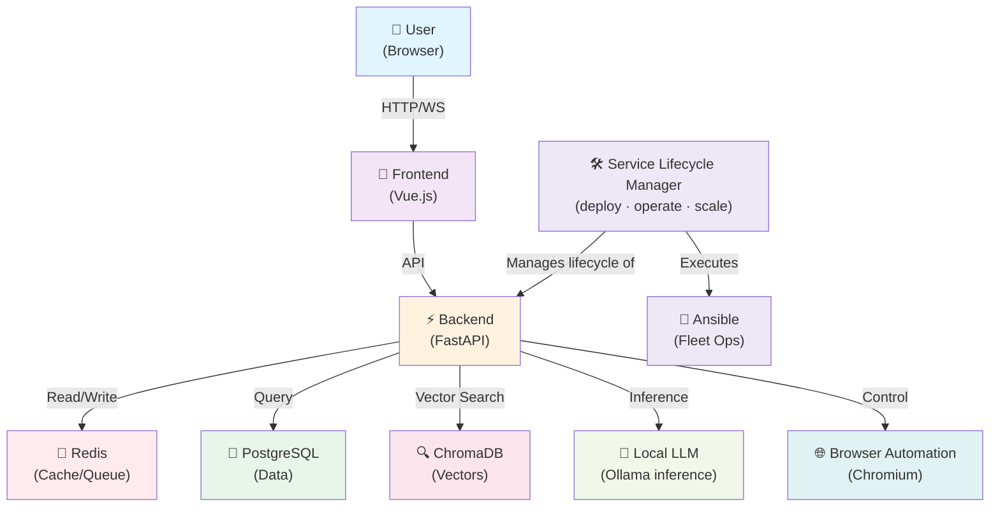

<div align="center">

# Your data. Your AI.

**AutoBot is a self-hosted AI platform you own — not a service you rent.**

Feed it your docs, your codebase, your business knowledge.
Plug in any LLM you trust — local or hosted.
Your data stays on your machines. Your AI stays yours.

[Get Started](#quick-start-3-steps) · [Documentation](docs/) · [Community](https://github.com/mrveiss/AutoBot-AI/discussions) · [Sponsor](https://github.com/sponsors/mrveiss)

[](https://github.com/mrveiss/AutoBot-AI/actions/workflows/docker-smoke-test.yml)
[](https://codecov.io/gh/mrveiss/AutoBot-AI)
[](https://github.com/sponsors/mrveiss)
[](LICENSE)

</div>

---

> **AutoBot is infrastructure you own, not a subscription.**
> A small, solid core. A management layer that runs the hard infrastructure for you.
> Modules you install on top. Deploy it once, feed it your knowledge, connect whatever
> LLM you trust, and run it forever — on your terms.

| What you get | What stays yours |
|---|---|
| Chat interface | Your prompts |
| RAG knowledge base | Your documents |
| Fleet management | Your infrastructure |
| Module ecosystem | Your data |

## The Platform Model

AutoBot is three layers, bottom to top:

1. **Platform Core** — small, solid, and yours. Chat and streaming, a RAG knowledge
   base backed by a knowledge graph (your *institutional memory*), an LLM gateway with
   provider fallback, local inference, hooks, and governance (auth, RBAC, review gates,
   budgets). It changes slowly so everything above can depend on it.
2. **Management Layer — Service Lifecycle Manager (SLM).** Private AI has a lot of
   moving infrastructure: vector DB, cache, database, inference, and background workers,
   often across several machines. The **Service Lifecycle Manager (SLM)** owns the full
   lifecycle — **deploy → operate → scale** — so you can run it in production without
   becoming a full-time operator. *(SLM means Service Lifecycle Manager, never "small
   language model.")*
3. **Modules** — installable capabilities built on the core's bones. A module inherits
   institutional memory, local inference at zero marginal cost, hooks, and governance,
   so it stays small relative to what it delivers. Modules include **AutoBot LLC** (an
   autonomous *agent-company*), **Codebase Analytics**, and the **Transcriber**.

→ Full picture: [The AutoBot Platform Model](docs/architecture/PLATFORM_MODEL.md)

## Quick Start (3 Steps)

### 1. Clone the Repository
```bash
git clone https://github.com/mrveiss/AutoBot-AI.git
cd AutoBot-AI
```

### 2. Start with Docker
```bash
cp .env.example .env
docker compose up -d
```

### 3. Open Your Dashboard
Visit **http://localhost** in your browser. AutoBot is ready to use.

---

## What AutoBot Does

AutoBot is a **self-hosted AI platform**: conversational AI, a private knowledge base,
and the machinery to deploy and operate it all on your own hardware. You keep complete
control:

- **Unified Self-Hosted Dashboard** — manage AI, infrastructure, fleet operations, and
  analytics from one place on your servers
- **Natural Language Control** — issue commands in plain English; AutoBot handles the
  complexity locally
- **Self-Hosted Knowledge Bases** — build knowledge bases from your docs, code, runbooks,
  and workflows — RAG-indexed and stored locally
- **Vision Processing** — analyze screenshots and diagrams locally to guide decisions
- **Self-Hosted Fleet Management** — deploy, operate, and scale multi-server stacks with
  the Service Lifecycle Manager (SLM)
- **Installable Modules** — extend the platform with AutoBot LLC (an autonomous
  agent-company), Codebase Analytics, the Transcriber, and more
- **Complete Data Privacy** — full data control, no external dependencies, runs entirely
  on your hardware, no vendor lock-in

→ Browse everything in the [Capability Catalog](docs/features/CATALOG.md).

---

## System Requirements

| Component | Minimum | Recommended |
|-----------|---------|-------------|
| **CPU** | 4 cores | 8+ cores |
| **RAM** | 8 GB | 16+ GB |
| **Storage** | 20 GB SSD | 50+ GB SSD |
| **GPU** | None (CPU-only mode) | NVIDIA GPU for faster inference |
| **OS** | Ubuntu 20.04+ / Debian 11+ | Ubuntu 22.04 LTS |
| **Docker** | 24.0+ | 25.0+ |

---

## Platform Core: Features at a Glance

| Feature | Capability |
|---------|-----------|
| **Chat** | Multi-turn conversations with function calling, streaming responses |
| **Knowledge Bases** | RAG-powered retrieval from documents, code, infrastructure docs |
| **Knowledge Graph** | Institutional memory shared across sessions and modules |
| **LLM Gateway** | One place to plug in any model, with provider routing and fallback |
| **Workflow Builder** | Visual and code-based workflow creation |
| **Vision** | Image/screenshot analysis for troubleshooting |

## Management Layer: the Service Lifecycle Manager (SLM)

The **Service Lifecycle Manager (SLM)** is how AutoBot runs the infrastructure behind
private AI for you. It owns the full lifecycle of the stack — vector DB, cache, database,
inference, and workers — across one or more machines:

| Stage | What the SLM does |
|-------|-------------------|
| **Deploy** | Stand up the full stack from a blank host or across a fleet (Ansible) |
| **Operate** | Upgrades, health monitoring, recovery, certificate rotation, configuration |
| **Scale** | Add fleet nodes, add NPU workers, assign roles, provision new capacity |

The SLM dashboard lives at **http://localhost/slm**. See
[SLM deployment](docs/guides/slm-docker-ansible-deployment.md).

## Modules

Modules are large capabilities you install on the core. Because they inherit the core's
institutional memory, local inference, hooks, and governance, they stay small relative to
what they deliver.

- **AutoBot LLC** — an autonomous *agent-company*: define a company of AI agents (and
  human co-workers), give them goals and a backlog, schedule them to work autonomously,
  and govern their spend. See [AutoBot LLC](docs/llc/_index.md).
- **Codebase Analytics** — understand codebases, extract insights, and identify risks
  entirely on your own hardware: code structure analysis, risk detection, and dependency
  insights, with no source ever leaving your machines.
- **Transcriber** — a general-purpose audio transcription module: organize projects and
  recordings, transcribe locally, and export transcripts.

→ Browse all capabilities in the [Capability Catalog](docs/features/CATALOG.md).

---

## Why Self-Hosted

AutoBot keeps your AI and your data on infrastructure you control:

- **Data privacy & compliance** — your data never leaves your hardware; supports HIPAA,
  GDPR, and SOC2 requirements
- **Predictable cost** — local inference runs at zero marginal cost per request; no
  per-request fees
- **Full control** — run custom models, modify the code, no vendor lock-in
- **Low latency** — local inference and command execution, no network round-trip
- **Scale on your terms** — grow within your own infrastructure with the SLM

📚 **Learn more:** [Why Self-Hosted Infrastructure Automation?](docs/self-hosted-advantages.md)

---

## Architecture Overview

> Full diagrams (data flows, deployment topologies, sequence diagrams): [docs/architecture/system-diagram.md](docs/architecture/system-diagram.md)  
> The conceptual model (core → SLM → modules): [docs/architecture/PLATFORM_MODEL.md](docs/architecture/PLATFORM_MODEL.md)  
> Feature walkthroughs and demo recording scripts: [docs/DEMOS.md](docs/DEMOS.md)


```mermaid
graph TB
    User["👤 User<br/>(Browser)"]
    Frontend["🎨 Frontend<br/>(Vue.js)"]
    Backend["⚡ Backend<br/>(FastAPI)"]

    Redis["🔴 Redis<br/>(Cache/Queue)"]
    PostgreSQL["🐘 PostgreSQL<br/>(Data)"]
    ChromaDB["🔍 ChromaDB<br/>(Vectors)"]

    Inference["🧠 Local LLM<br/>(Ollama inference)"]

    SLM["🛠️ Service Lifecycle Manager<br/>(deploy · operate · scale)"]
    Ansible["🔧 Ansible<br/>(Fleet Ops)"]
    Browser["🌐 Browser Automation<br/>(Chromium)"]

    User -->|HTTP/WS| Frontend
    Frontend -->|API| Backend

    Backend -->|Read/Write| Redis
    Backend -->|Query| PostgreSQL
    Backend -->|Vector Search| ChromaDB
    Backend -->|Inference| Inference

    Backend -->|Control| Browser
    SLM -->|Manages lifecycle of| Backend
    SLM -->|Executes| Ansible

    style User fill:#e1f5ff
    style Frontend fill:#f3e5f5
    style Backend fill:#fff3e0
    style Redis fill:#ffebee
    style PostgreSQL fill:#e8f5e9
    style ChromaDB fill:#fce4ec
    style Inference fill:#f1f8e9
    style SLM fill:#ede7f6
    style Ansible fill:#ede7f6
    style Browser fill:#e0f2f1
```

---

## Deployment Options

### Docker (Recommended for Most Users)
Fastest way to get started. Includes all services pre-configured.

```bash
docker compose up -d
```

### Native Installation
For development or custom setups. See [INSTALL.md](INSTALL.md).

### Development Mode
For contributing to AutoBot:
```bash
docker compose -f docker-compose.dev.yml up -d
```

---

## Core Services

AutoBot runs as a coordinated set of services:

| Service | Role | Port |
|---------|------|------|
| **Frontend** | Vue.js UI, TLS termination | 80, 443 |
| **Backend** | FastAPI API server | 8001 |
| **SLM** | Service Lifecycle Manager — fleet deploy/operate/scale | (via dashboard `/slm`) |
| **Redis** | Cache, message queue | 6379 |
| **PostgreSQL** | Relational database | 5432 |
| **ChromaDB** | Vector embeddings store | 8100 |
| **Inference (Ollama)** | Local LLM inference | 11434 (optional) |
| **Prometheus** | Metrics collection | 9090 (optional) |
| **Grafana** | Monitoring dashboards | 3000 (optional) |

---

## Usage Guide

### Dashboard Overview
Once running, navigate to **http://localhost** to access:
- **Chat Interface** — start conversing with AutoBot about your knowledge and infrastructure
- **Knowledge Bases** — upload and manage documents, codebases, runbooks
- **Workflows** — create automated tasks and operations
- **Fleet Management** — view and orchestrate multiple servers
- **Analytics** — monitor system health, performance, and activity

The **Service Lifecycle Manager (SLM)** — AutoBot's management layer for deploying,
operating, and scaling your AI infrastructure (vector DB, cache, database, inference, and
workers) — lives at **http://localhost/slm**.

### Example: Managing a Fleet
```bash
# In the AutoBot chat:
# "Deploy the latest application version to all production servers"
# AutoBot handles the Ansible orchestration automatically
```

### Example: Infrastructure Insights
```bash
# Ask AutoBot to analyze your codebase:
# "What are the critical dependencies in the auth module?"
```

---

## Configuration

All configuration uses environment variables in `.env`. See `.env.example` for all options.

Key settings:
- `AUTOBOT_DEPLOYMENT_MODE` — `hybrid` or `distributed`
- `AUTOBOT_LLM_PROVIDER` — `ollama` (default) or others
- `AUTOBOT_SINGLE_USER_MODE` — `true` (development) or `false` (multi-user)

### LLM Providers and Fallback

AutoBot's LLM gateway supports local and hosted providers (Ollama, OpenAI, Anthropic,
Groq, vLLM, HuggingFace, and OpenRouter). When a model hits a rate limit or quota cap,
requests automatically route to a backup model via configurable fallback chains.

- [LLM Fallback Configuration](docs/backend/llm-fallback.md) — configure fallback chains, tune rate limits, and troubleshoot quota issues
- [Environment Variables Reference](docs/configuration/environment-variables.md) — full variable listing including `AUTOBOT_FALLBACK_CHAIN_*` and `AUTOBOT_LLM_RL_*`

---

## Contributing

We welcome contributions! Whether you're fixing bugs, adding features, or improving documentation:

1. Check out [CONTRIBUTING.md](CONTRIBUTING.md) for guidelines
2. Look for issues tagged `good-first-issue` if you're new
3. Join the community discussion in [GitHub Discussions](https://github.com/mrveiss/AutoBot-AI/discussions)

---

## Support

- 💬 **Questions?** Start a discussion in [GitHub Discussions](https://github.com/mrveiss/AutoBot-AI/discussions)
- 🐛 **Found a bug?** Open an [issue](https://github.com/mrveiss/AutoBot-AI/issues)
- 💡 **Have an idea?** Share it in [Discussions → Ideas](https://github.com/mrveiss/AutoBot-AI/discussions/categories/ideas)

---

## How to Contribute

AutoBot is open source and we welcome contributions from the community! Whether you're fixing bugs, adding features, or improving documentation, your contributions help build a better self-hosted AI platform for everyone.

### 🚀 For Beginners (New to Open Source)

Start with [**good-first-issue** labeled tasks](https://github.com/mrveiss/AutoBot-AI/issues?q=is%3Aissue+is%3Aopen+label%3Agood-first-issue). These are:
- Self-contained and beginner-friendly
- Expected to take less than 2 hours
- Perfect for learning the codebase
- Great introduction to our contribution process

### 💻 For Experienced Developers

Find issues matching your skill area:

- **🎨 Frontend** (Vue.js, TypeScript, CSS, Vite)
  - [Help Wanted: Frontend](https://github.com/mrveiss/AutoBot-AI/issues?q=is%3Aissue+is%3Aopen+label%3Afrontend+label%3Ahelp-wanted)
  - [All Frontend Issues](https://github.com/mrveiss/AutoBot-AI/issues?q=is%3Aissue+is%3Aopen+label%3Afrontend)

- **🔧 Backend** (FastAPI, Python, APIs, Databases)
  - [Help Wanted: Backend](https://github.com/mrveiss/AutoBot-AI/issues?q=is%3Aissue+is%3Aopen+label%3Abackend+label%3Ahelp-wanted)
  - [All Backend Issues](https://github.com/mrveiss/AutoBot-AI/issues?q=is%3Aissue+is%3Aopen+label%3Abackend)

- **🚀 Infrastructure & DevOps** (Docker, Ansible, CI/CD, Deployment)
  - [Help Wanted: Infrastructure](https://github.com/mrveiss/AutoBot-AI/issues?q=is%3Aissue+is%3Aopen+label%3Ainfrastructure+label%3Ahelp-wanted)
  - [All Infrastructure Issues](https://github.com/mrveiss/AutoBot-AI/issues?q=is%3Aissue+is%3Aopen+label%3Ainfrastructure)

- **📚 Documentation** (Guides, Examples, README, API Docs)
  - [Help Wanted: Docs](https://github.com/mrveiss/AutoBot-AI/issues?q=is%3Aissue+is%3Aopen+label%3Adocs+label%3Ahelp-wanted)
  - [All Docs Issues](https://github.com/mrveiss/AutoBot-AI/issues?q=is%3Aissue+is%3Aopen+label%3Adocs)

- **🧪 Testing & QA** (Unit Tests, Integration Tests, Test Coverage)
  - [Help Wanted: Testing](https://github.com/mrveiss/AutoBot-AI/issues?q=is%3Aissue+is%3Aopen+label%3Atesting+label%3Ahelp-wanted)
  - [All Testing Issues](https://github.com/mrveiss/AutoBot-AI/issues?q=is%3Aissue+is%3Aopen+label%3Atesting)

### 📖 Step-by-Step Contribution Guide

Detailed contribution process, code style guidelines, and development setup:
→ **[Read CONTRIBUTORS.md](CONTRIBUTORS.md)**

---

## Sponsors & Supporters

Support AutoBot's development in multiple ways:

### Sponsorship & Donations
- **[GitHub Sponsors](https://github.com/sponsors/mrveiss)** — Recurring sponsorship with direct support and updates
- **[Ko-fi](https://ko-fi.com/mrveiss)** — One-time or recurring donations for maintenance and features

Your support helps us:
- Maintain and improve the codebase
- Add new features and capabilities
- Expand documentation and examples
- Grow the community
- Enable contributors to participate

---

## License

AutoBot is open source under the **[Apache License 2.0](LICENSE)**. Free forever for
everyone — use it, modify it, distribute it, and profit from it, no permission or fees
required. Attribution is required (see [NOTICE](NOTICE)), and the "AutoBot" / "mrveiss"
names may not be used to endorse derived products without permission.

**Free forever for individuals and hobbyists.** Nothing you can do with AutoBot today
becomes paid tomorrow. Production support is how we keep it funded — see
[FUNDING.md](FUNDING.md).

## Production support & funding

<!-- Tier copy is canonical in FUNDING.md (#9846) — do not restate tier definitions here. -->
AutoBot is free to run forever. Paid production support (Community / Production Support /
Compliance Pack) is how the project stays funded — tier definitions, sponsorship links, and
the support contact path live in **[FUNDING.md](FUNDING.md)**.

---

## Roadmap

### Upcoming
- [ ] Multi-user authentication and RBAC
- [ ] Kubernetes orchestration support
- [ ] Advanced analytics dashboards
- [ ] Module ecosystem and registry
- [ ] Mobile companion app

### Under Consideration
- Cloud deployment templates
- Managed hosting option
- Enterprise features (SAML, audit logs)

---

## Technology Stack

- **Frontend**: Vue.js, TypeScript, Vite
- **Backend**: FastAPI, Python, AsyncIO
- **Database**: PostgreSQL, Redis, ChromaDB
- **Inference**: Ollama (local), LangChain
- **Orchestration**: Ansible, Docker, Kubernetes (coming)
- **Infrastructure**: Docker Compose, systemd

---

## Documentation

- [Documentation Index](docs/INDEX.md) — the full documentation home
- [The AutoBot Platform Model](docs/architecture/PLATFORM_MODEL.md) — core → SLM → modules
- [Capability Catalog](docs/features/CATALOG.md) — everything AutoBot can do
- [INSTALL.md](INSTALL.md) — detailed setup instructions
- [CONTRIBUTING.md](CONTRIBUTING.md) — get involved

---

## Status

**Current Version**: v1.5.0 (Active Development)

AutoBot is actively developed and used for self-hosted AI and infrastructure automation.
It's suitable for:
- ✅ Self-hosted deployments on your infrastructure
- ✅ Development and testing environments
- ✅ Learning AI-driven automation
- 🚀 Production use (with monitoring and backups)

---

**Made with ❤️ by the AutoBot community**

<!-- always-report gate verification (#10022): this README-only PR touches none of the
     code-quality / startup-import-smoke / frontend filters, so those three checks must
     skip-to-success rather than deadlock. Verification artifact; safe to revert. -->
