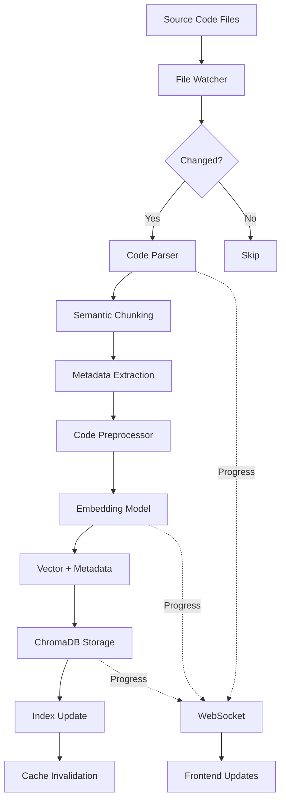
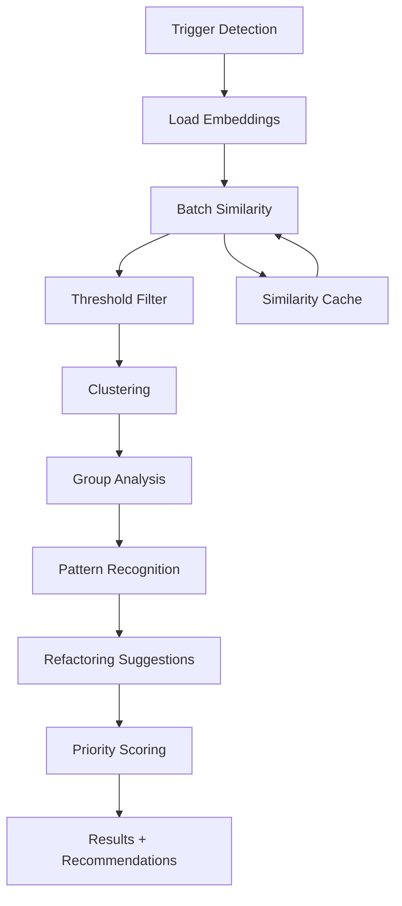

# Code Vectorization and Semantic Analysis Architecture
**Version**: 1.0
**Date**: 2025-10-25
**Status**: Design Phase

---

## Executive Summary

This document outlines the architecture for a comprehensive code vectorization and semantic analysis system for the AutoBot platform. The system will enable semantic duplicate detection, function reuse recommendations, and code quality insights through advanced embedding techniques and similarity analysis.

### Key Capabilities
- **Semantic Code Search**: Find functionally similar code across the entire codebase
- **Duplicate Detection**: Identify copy-paste patterns and near-duplicates
- **Refactoring Recommendations**: Suggest centralization opportunities for scattered utilities
- **Quality Insights**: Provide maintainability scores and complexity analysis

---

## System Architecture

### High-Level Architecture

```
┌─────────────────────────────────────────────────────────────────┐
│                         Frontend (Vue.js)                        │
│  ┌──────────────┐  ┌──────────────┐  ┌────────────────────┐   │
│  │  Dashboard   │  │  Duplicate   │  │  Code Quality      │   │
│  │  Components  │  │  Viewer      │  │  Insights          │   │
│  └──────────────┘  └──────────────┘  └────────────────────┘   │
└────────────────────────────┬────────────────────────────────────┘
                             │ WebSocket/REST
┌────────────────────────────┴────────────────────────────────────┐
│                     Backend API (FastAPI)                        │
│  ┌──────────────────────────────────────────────────────────┐  │
│  │              Code Vectorization Service                   │  │
│  │  ┌──────────┐  ┌──────────┐  ┌────────────────────┐    │  │
│  │  │  Parser  │→ │ Embedder │→ │ Similarity Engine  │    │  │
│  │  └──────────┘  └──────────┘  └────────────────────┘    │  │
│  └──────────────────────────────────────────────────────────┘  │
│  ┌──────────────────────────────────────────────────────────┐  │
│  │           Existing Codebase Analytics Service             │  │
│  │  (AST parsing, regex analysis, static analysis)           │  │
│  └──────────────────────────────────────────────────────────┘  │
└────────────────────────────┬────────────────────────────────────┘
                             │
┌────────────────────────────┴────────────────────────────────────┐
│                        Storage Layer                             │
│  ┌──────────────────┐  ┌──────────────────┐  ┌─────────────┐  │
│  │   ChromaDB       │  │   Redis DB 11    │  │  File System│  │
│  │ (Code Embeddings)│  │ (Static Analysis)│  │  (Source)   │  │
│  └──────────────────┘  └──────────────────┘  └─────────────┘  │
└──────────────────────────────────────────────────────────────────┘
```

---

## Data Model

### ChromaDB Collection Structure

```python
# Collection: autobot_code_embeddings (SEPARATE from knowledge base)
{
    "id": "uuid-v4",  # Unique identifier
    "embedding": [...],  # Vector representation (768-1024 dimensions)
    "document": "code_snippet",  # The actual code
    "metadata": {
        # File Information
        "file_path": "autobot-user-backend/api/analytics.py",
        "file_type": "python",  # python|javascript|vue
        "project_relative_path": "autobot-user-backend/api/analytics.py",

        # Code Location
        "line_start": 45,
        "line_end": 89,
        "character_start": 1234,
        "character_end": 2456,

        # Code Semantics
        "code_type": "function",  # function|class|method|module|component
        "name": "analyze_communication_patterns",
        "signature": "async def analyze_communication_patterns(self) -> Dict[str, Any]",
        "parent_class": "AnalyticsController",  # If applicable
        "parent_module": "analytics",

        # AST Information
        "ast_hash": "sha256_of_ast_structure",
        "ast_depth": 5,
        "ast_node_count": 42,

        # Complexity Metrics
        "cyclomatic_complexity": 8,
        "cognitive_complexity": 12,
        "halstead_difficulty": 15.3,
        "maintainability_index": 72.5,
        "lines_of_code": 44,

        # Dependencies
        "imports": ["redis", "asyncio", "json"],
        "calls_functions": ["get_redis_connection", "track_api_call"],
        "called_by": ["get_analytics_overview", "websocket_handler"],

        # Quality Indicators
        "has_docstring": true,
        "has_type_hints": true,
        "test_coverage": 0.85,
        "last_modified": "2025-10-25T10:30:00Z",
        "author": "git_author_email",

        # Indexing Metadata
        "indexed_at": "2025-10-25T12:00:00Z",
        "index_version": "1.0",
        "embedding_model": "codebert-base",
        "chunk_strategy": "function",  # function|class|sliding_window

        # Semantic Tags
        "semantic_tags": ["async", "redis", "monitoring", "analytics"],
        "detected_patterns": ["singleton", "async_handler"],
        "potential_issues": ["long_function", "complex_logic"]
    }
}
```

### Embedding Strategies

#### 1. Function-Level Embeddings (Primary)
- Embed each function/method as a separate document
- Preserves semantic boundaries
- Best for finding duplicate functions

#### 2. Class-Level Embeddings (Secondary)
- Embed entire classes for structural similarity
- Useful for architectural pattern detection
- Helps identify similar class designs

#### 3. Sliding Window Embeddings (Supplementary)
- 50-line windows with 25-line overlap
- Catches cross-function patterns
- Helps with partial code matching

---

## API Specifications

### Core Endpoints

#### 1. Vectorization Control

```python
# POST /api/analytics/code/vectorize
{
    "request": {
        "target_path": "/home/kali/Desktop/AutoBot",  # Optional, defaults to project root
        "incremental": true,  # Only process changed files
        "force_reindex": false,  # Force complete re-indexing
        "languages": ["python", "javascript", "vue"],  # Optional filter
        "embedding_model": "codebert-base"  # Optional, defaults to config
    },
    "response": {
        "status": "in_progress",
        "job_id": "uuid-v4",
        "estimated_time": 120,  # seconds
        "total_files": 450,
        "websocket_channel": "wss://172.16.168.20:8443/ws/vectorization/{job_id}"
    }
}

# GET /api/analytics/code/vectorize/status/{job_id}
{
    "response": {
        "status": "completed",  # in_progress|completed|failed
        "progress": {
            "files_processed": 450,
            "total_files": 450,
            "functions_embedded": 2340,
            "classes_embedded": 156,
            "errors": 3
        },
        "duration": 115.4,
        "result_summary": {
            "total_embeddings": 2496,
            "storage_size_mb": 245.6,
            "average_embedding_time_ms": 45
        }
    }
}
```

#### 2. Duplicate Detection

```python
# GET /api/analytics/code/duplicates
{
    "parameters": {
        "similarity_threshold": 0.85,  # 0-1, default 0.85
        "min_lines": 10,  # Minimum lines to consider
        "languages": ["python"],  # Optional filter
        "exclude_tests": true,  # Exclude test files
        "group_by": "semantic"  # semantic|exact|structural
    },
    "response": {
        "duplicate_groups": [
            {
                "group_id": "dup_001",
                "similarity_score": 0.92,
                "pattern_type": "error_handling",
                "instances": [
                    {
                        "file": "autobot-user-backend/api/chat.py",
                        "function": "handle_error",
                        "lines": "45-67",
                        "snippet": "...",
                        "complexity": 5
                    },
                    {
                        "file": "autobot-user-backend/api/files.py",
                        "function": "process_error",
                        "lines": "123-145",
                        "snippet": "...",
                        "complexity": 6
                    }
                ],
                "refactoring_suggestion": {
                    "action": "extract_to_utility",
                    "target_location": "backend/utils/error_handlers.py",
                    "estimated_loc_reduction": 200,
                    "difficulty": "low"
                }
            }
        ],
        "summary": {
            "total_duplicate_groups": 23,
            "total_duplicate_lines": 1456,
            "potential_loc_reduction": 890,
            "highest_duplication_file": "autobot-user-backend/api/chat.py"
        }
    }
}
```

#### 3. Semantic Search

```python
# POST /api/analytics/code/similarity-search
{
    "request": {
        "query_type": "code",  # code|natural_language|function_signature
        "query": "async def process_message(self, message: str) -> Dict",
        "top_k": 10,
        "filters": {
            "file_type": "python",
            "exclude_paths": ["tests/", "archives/"],
            "min_similarity": 0.7
        }
    },
    "response": {
        "results": [
            {
                "score": 0.94,
                "file": "backend/services/chat_service.py",
                "function": "handle_message",
                "lines": "234-267",
                "snippet": "async def handle_message(self, msg: str) -> Dict[str, Any]:",
                "why_similar": "Similar async message processing pattern with Dict return"
            }
        ]
    }
}
```

#### 4. Reuse Opportunities

```python
# GET /api/analytics/code/reuse-opportunities
{
    "response": {
        "opportunities": [
            {
                "pattern": "Redis connection initialization",
                "occurrences": 12,
                "files_affected": ["autobot-user-backend/api/chat.py", "autobot-user-backend/api/files.py", ...],
                "current_loc": 340,
                "potential_reduction": 280,
                "suggested_utility": {
                    "name": "get_redis_connection",
                    "location": "backend/utils/redis_helper.py",
                    "template": "..."
                },
                "priority": "high",
                "effort": "low"
            }
        ]
    }
}
```

#### 5. Code Quality Insights

```python
# GET /api/analytics/code/quality-insights
{
    "parameters": {
        "scope": "project",  # project|directory|file
        "path": "/backend",  # Optional
        "metrics": ["complexity", "duplication", "maintainability"]
    },
    "response": {
        "insights": {
            "complexity_hotspots": [
                {
                    "file": "autobot-user-backend/api/chat.py",
                    "function": "process_complex_request",
                    "cyclomatic_complexity": 25,
                    "recommendation": "Consider breaking into smaller functions"
                }
            ],
            "maintainability_issues": [
                {
                    "file": "backend/services/agent_service.py",
                    "maintainability_index": 45,
                    "issues": ["long_functions", "deep_nesting", "no_docstrings"],
                    "priority": "medium"
                }
            ],
            "duplication_summary": {
                "duplication_percentage": 12.5,
                "most_duplicated_patterns": ["error_handling", "redis_connection"]
            }
        },
        "overall_health_score": 72,  # 0-100
        "trend": "improving",  # improving|stable|degrading
        "recommendations": [
            "Extract common error handling patterns",
            "Reduce cyclomatic complexity in 5 functions",
            "Add docstrings to 23 public functions"
        ]
    }
}
```

---

## Implementation Architecture

### Component Design

#### 1. Code Parser Service
```python
class CodeParserService:
    """Parses source code into semantic chunks"""

    def __init__(self):
        self.python_parser = PythonASTParser()
        self.js_parser = JavaScriptParser()
        self.vue_parser = VueTemplateParser()

    async def parse_file(self, file_path: str) -> List[CodeChunk]:
        """Parse file into semantic chunks"""
        # Detect language
        # Parse using appropriate parser
        # Extract semantic units (functions, classes)
        # Calculate complexity metrics
        # Return standardized chunks

    async def extract_metadata(self, chunk: CodeChunk) -> Dict:
        """Extract rich metadata from code chunk"""
        # AST analysis
        # Complexity calculation
        # Dependency extraction
        # Pattern detection
```

#### 2. Embedding Service
```python
class CodeEmbeddingService:
    """Generates embeddings for code chunks"""

    def __init__(self):
        self.model = self._load_embedding_model()
        self.preprocessor = CodePreprocessor()

    async def embed_chunk(self, chunk: CodeChunk) -> np.ndarray:
        """Generate embedding for code chunk"""
        # Preprocess code (normalize, tokenize)
        # Generate embedding
        # Post-process (normalize, dimension reduction if needed)

    def _load_embedding_model(self):
        """Load code-specific embedding model"""
        # Options:
        # - CodeBERT (Microsoft)
        # - GraphCodeBERT (Microsoft)
        # - CodeT5 (Salesforce)
        # - StarCoder (HuggingFace)
        # - Custom fine-tuned model
```

#### 3. Similarity Engine
```python
class SimilarityEngine:
    """Performs similarity computations and analysis"""

    def __init__(self, chroma_client):
        self.vector_store = chroma_client
        self.cache = SimilarityCache()

    async def find_similar(self, query_embedding: np.ndarray,
                          top_k: int = 10,
                          threshold: float = 0.7) -> List[SimilarResult]:
        """Find similar code chunks"""
        # Query ChromaDB
        # Apply filters
        # Rank results
        # Explain similarity

    async def detect_duplicates(self, threshold: float = 0.85) -> List[DuplicateGroup]:
        """Detect duplicate code groups"""
        # Batch similarity computation
        # Clustering similar code
        # Group analysis
        # Generate recommendations
```

#### 4. WebSocket Handler
```python
class VectorizationWebSocketHandler:
    """Handles real-time updates for long-running operations"""

    async def handle_connection(self, websocket: WebSocket, job_id: str):
        """Handle WebSocket connection for job updates"""
        await websocket.accept()

        while job_active(job_id):
            progress = get_job_progress(job_id)
            await websocket.send_json({
                "type": "progress",
                "data": progress
            })
            await asyncio.sleep(1)

        # Send completion
        result = get_job_result(job_id)
        await websocket.send_json({
            "type": "completed",
            "data": result
        })
```

---

## Data Flow

### Vectorization Flow



### Duplicate Detection Flow



---

## Performance Optimization

### 1. Embedding Generation
- **Batch Processing**: Process files in batches of 50
- **Parallel Execution**: Use asyncio for concurrent processing
- **Model Optimization**: Use quantized models where possible
- **Caching**: Cache embeddings for unchanged files

### 2. Similarity Computation
- **Approximate Nearest Neighbors**: Use HNSW index in ChromaDB
- **Dimension Reduction**: Consider PCA/UMAP for very large codebases
- **Query Optimization**: Pre-filter by metadata before vector search
- **Result Caching**: Cache frequently requested similarities

### 3. Storage Optimization
- **Compression**: Store embeddings in compressed format
- **Partitioning**: Partition by file type or directory
- **Indexing**: Create indexes on frequently queried metadata
- **Cleanup**: Remove embeddings for deleted files

### Performance Targets
- **Embedding Generation**: < 100ms per function
- **Similarity Search**: < 500ms for top-10 results
- **Duplicate Detection**: < 30s for entire codebase
- **Incremental Updates**: < 5s for single file changes

---

## Implementation Phases

### Phase 1: Foundation (Week 1-2)
1. Create `autobot-user-backend/api/code_vectorization.py`
2. Implement basic code parser for Python
3. Set up ChromaDB collection for code
4. Integrate with existing `codebase_analytics.py`
5. Implement basic embedding generation

### Phase 2: Core Features (Week 3-4)
1. Add JavaScript and Vue parsers
2. Implement similarity search endpoint
3. Add duplicate detection algorithm
4. Create WebSocket handler for progress
5. Build basic frontend dashboard

### Phase 3: Advanced Features (Week 5-6)
1. Implement reuse opportunity detection
2. Add code quality insights
3. Create refactoring recommendations
4. Implement incremental updates
5. Add caching layer

### Phase 4: Optimization (Week 7)
1. Performance tuning
2. Add batch processing
3. Implement result caching
4. Optimize vector searches
5. Add monitoring and metrics

### Phase 5: Polish (Week 8)
1. Complete frontend UI
2. Add comprehensive tests
3. Documentation
4. Error handling improvements
5. Production deployment

---

## Risk Analysis

### Technical Risks

| Risk | Impact | Likelihood | Mitigation |
|------|--------|------------|------------|
| Embedding model performance | High | Medium | Use GPU acceleration, batch processing |
| Storage growth | Medium | High | Implement retention policies, compression |
| Memory usage for large codebases | High | Medium | Stream processing, pagination |
| Accuracy of duplicate detection | High | Low | Tunable thresholds, manual review UI |
| Integration complexity | Medium | Medium | Phased rollout, feature flags |

### Operational Risks

| Risk | Impact | Likelihood | Mitigation |
|------|--------|------------|------------|
| Long initial indexing time | Low | High | Background processing, progress indicators |
| ChromaDB compatibility | Medium | Low | Version pinning, migration scripts |
| Model availability | Medium | Low | Fallback models, local hosting |
| Network latency to Ollama | Low | Medium | Local caching, async processing |

---

## Security Considerations

1. **Code Privacy**: Ensure embeddings don't leak sensitive code
2. **Access Control**: Implement proper authentication for API endpoints
3. **Rate Limiting**: Prevent abuse of compute-intensive operations
4. **Input Validation**: Validate file paths and query parameters
5. **Secure Storage**: Encrypt embeddings at rest if needed

---

## Monitoring & Metrics

### Key Metrics
- **Embedding Generation Rate**: embeddings/second
- **Search Latency**: p50, p95, p99
- **Duplicate Detection Accuracy**: precision/recall
- **Storage Growth Rate**: MB/day
- **Cache Hit Rate**: percentage

### Monitoring Dashboard
- Real-time embedding progress
- Search query performance
- Duplicate detection results
- Storage usage trends
- Error rates and types

---

## Integration Points

### Existing Systems
1. **codebase_analytics.py**: Extend with vectorization triggers
2. **Redis DB 11**: Continue using for static analysis
3. **Analytics API**: Add new endpoints under `/api/analytics/code/`
4. **WebSocket Infrastructure**: Reuse existing WebSocket handlers
5. **Frontend Router**: Add new routes for code analytics views

### New Components
1. **ChromaDB Collection**: `autobot_code_embeddings`
2. **Embedding Service**: New microservice or embedded in backend
3. **Similarity Cache**: Redis DB 12 (new database)
4. **Background Jobs**: Celery or asyncio tasks

---

## Configuration

```yaml
# config/code_vectorization.yaml
code_vectorization:
  enabled: true

  # ChromaDB settings
  chromadb:
    collection_name: "autobot_code_embeddings"
    path: "data/chromadb"

  # Embedding model configuration
  embedding:
    model: "codebert-base"  # or "graphcodebert", "codet5"
    dimensions: 768
    batch_size: 32
    device: "cpu"  # or "cuda" if GPU available

  # Processing settings
  processing:
    chunk_strategy: "function"  # function|class|sliding_window
    max_chunk_size: 2000  # tokens
    overlap_size: 200  # for sliding window

  # Similarity settings
  similarity:
    algorithm: "cosine"  # cosine|euclidean|dot_product
    duplicate_threshold: 0.85
    search_threshold: 0.7

  # Performance settings
  performance:
    max_parallel_files: 10
    cache_ttl: 3600  # seconds
    batch_timeout: 30  # seconds

  # Storage settings
  storage:
    compression: true
    retention_days: 90
    max_embeddings: 100000
```

---

## Success Metrics

### Quantitative Metrics
- **Duplicate Code Reduction**: Target 20% reduction in 3 months
- **Search Accuracy**: > 90% relevant results in top-10
- **Processing Speed**: < 1 hour for full codebase indexing
- **API Response Time**: < 1s for 95% of queries
- **Storage Efficiency**: < 500MB for 10,000 functions

### Qualitative Metrics
- **Developer Satisfaction**: Survey scores > 4/5
- **Code Quality Improvement**: Measurable reduction in complexity
- **Refactoring Velocity**: Increased refactoring PRs
- **Bug Prevention**: Fewer duplicate bug fixes
- **Knowledge Sharing**: Improved code discovery

---

## Conclusion

This architecture provides a robust, scalable solution for code vectorization and semantic analysis within the AutoBot platform. By leveraging ChromaDB for vector storage, code-specific embedding models, and integration with existing analytics infrastructure, the system will enable powerful code intelligence features while maintaining performance and reliability.

The phased implementation approach ensures incremental value delivery while managing technical complexity and risk. With proper monitoring, optimization, and security measures in place, this system will significantly enhance AutoBot's code analysis capabilities and developer productivity.
