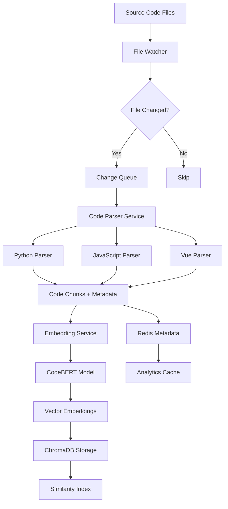
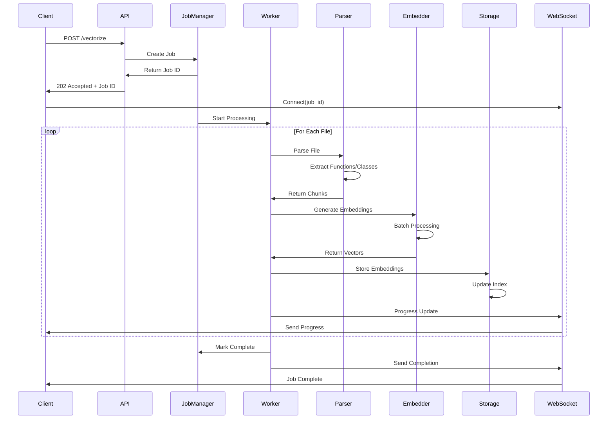
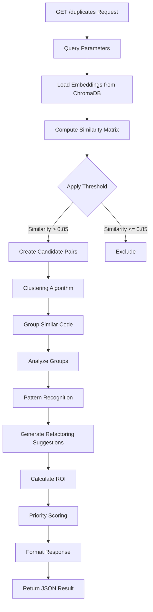
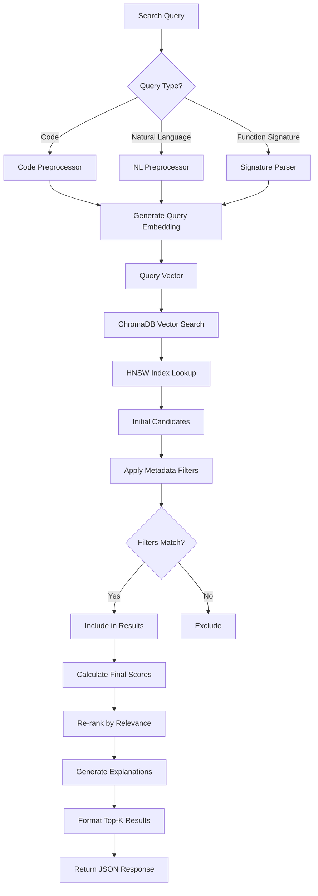
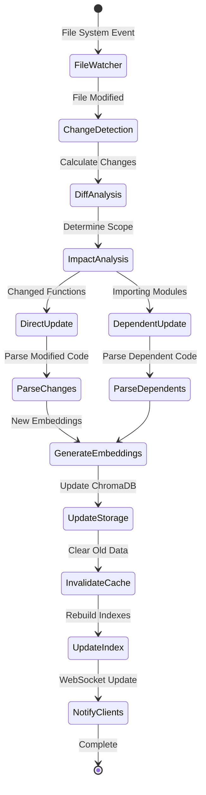
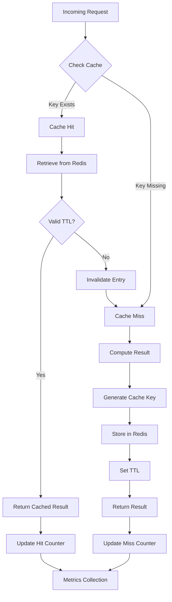
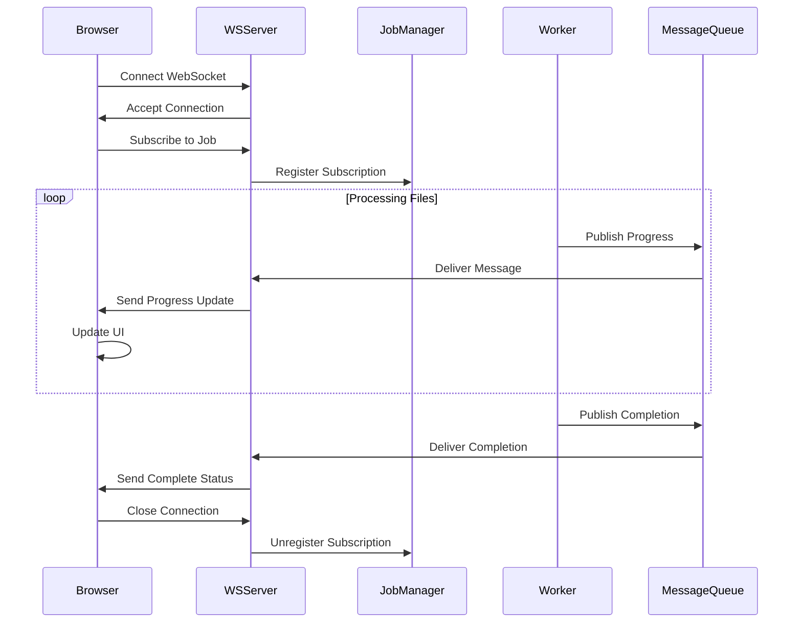
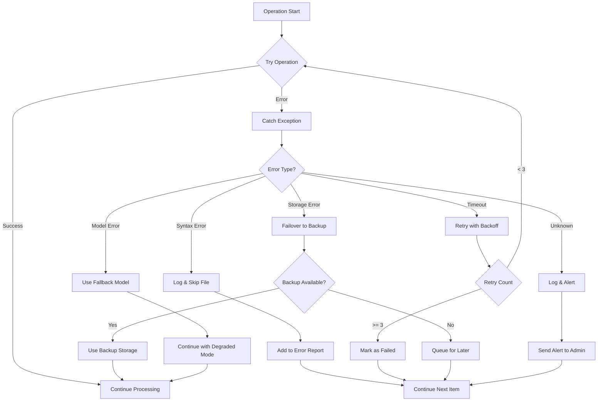

# Code Vectorization Data Flow Diagrams
**Version**: 1.0
**Date**: 2025-10-25

---

## 1. Overall System Data Flow

### ASCII Diagram
```
┌─────────────────┐
│  Source Code    │
│     Files       │
└────────┬────────┘
         │
         ▼
┌─────────────────┐      ┌──────────────┐
│  File Watcher   │─────►│ Change Queue │
└────────┬────────┘      └──────┬───────┘
         │                       │
         ▼                       ▼
┌─────────────────────────────────────┐
│         Code Parser Service          │
│  ┌─────────┐ ┌─────────┐ ┌────────┐│
│  │ Python  │ │   JS    │ │  Vue   ││
│  │ Parser  │ │ Parser  │ │ Parser ││
│  └─────────┘ └─────────┘ └────────┘│
└────────────────┬────────────────────┘
                 │
                 ▼
         ┌──────────────┐
         │ Code Chunks  │
         │ + Metadata   │
         └──────┬───────┘
                │
                ▼
┌────────────────────────────────┐
│    Embedding Service           │
│  ┌──────────────────────────┐ │
│  │ CodeBERT/GraphCodeBERT   │ │
│  └──────────────────────────┘ │
└───────────────┬────────────────┘
                │
                ▼
        ┌──────────────┐
        │  Embeddings  │
        │   (vectors)  │
        └──────┬───────┘
               │
               ▼
┌──────────────────────────────┐
│         Storage Layer        │
│  ┌─────────┐  ┌────────────┐│
│  │ChromaDB │  │  Redis     ││
│  │(vectors)│  │(metadata)  ││
│  └─────────┘  └────────────┘│
└──────────────────────────────┘
```

### Mermaid Diagram


---

## 2. Vectorization Pipeline Flow

### ASCII Diagram
```
┌──────────────────┐
│  API Request:    │
│  POST /vectorize │
└────────┬─────────┘
         │
         ▼
┌──────────────────┐
│  Job Manager     │
│  - Create Job ID │
│  - Queue Task    │
└────────┬─────────┘
         │
         ├──────────────┐
         ▼              ▼
┌──────────────┐  ┌─────────────┐
│ WebSocket    │  │  Background │
│ Connection   │  │   Worker    │
└──────┬───────┘  └──────┬──────┘
       │                  │
       │                  ▼
       │         ┌──────────────┐
       │         │ File Scanner │
       │         └──────┬───────┘
       │                │
       │                ▼
       │         ┌──────────────┐
       │         │   Parallel   │
       │         │  Processing  │
       │         │  ┌────┐      │
       │         │  │ T1 │      │
       │         │  ├────┤      │
       │         │  │ T2 │      │
       │         │  ├────┤      │
       │         │  │ T3 │      │
       │         │  └────┘      │
       │         └──────┬───────┘
       │                │
       │                ▼
       │         ┌──────────────┐
       │         │   Embedding  │
       │         │   Generator  │
       │         └──────┬───────┘
       │                │
       │                ▼
       │         ┌──────────────┐
       │         │   Storage    │
       │         │   Writer     │
       │         └──────┬───────┘
       │                │
       └────────────────┤
                       ▼
              ┌──────────────┐
              │  Progress    │
              │   Updates    │
              └──────────────┘
```

### Mermaid Diagram


---

## 3. Duplicate Detection Flow

### ASCII Diagram
```
┌────────────────┐
│  GET           │
│  /duplicates   │
└───────┬────────┘
        │
        ▼
┌────────────────┐
│ Load All       │
│ Embeddings     │
└───────┬────────┘
        │
        ▼
┌────────────────────────────┐
│ Similarity Matrix           │
│ ┌──┬──┬──┬──┬──┬──┬──┬──┐│
│ │  │F1│F2│F3│F4│F5│F6│F7││
│ ├──┼──┼──┼──┼──┼──┼──┼──┤│
│ │F1│1 │.2│.9│.3│.1│.8│.2││
│ │F2│.2│1 │.3│.7│.2│.1│.9││
│ │F3│.9│.3│1 │.2│.1│.7│.3││
│ └──┴──┴──┴──┴──┴──┴──┴──┘│
└────────────┬───────────────┘
             │
             ▼
    ┌────────────────┐
    │   Threshold    │
    │   Filter       │
    │   (> 0.85)     │
    └────────┬───────┘
             │
             ▼
    ┌────────────────┐
    │   Clustering   │
    │   Algorithm    │
    └────────┬───────┘
             │
             ▼
    ┌────────────────────┐
    │  Duplicate Groups  │
    │  ┌──────────────┐  │
    │  │ Group 1:     │  │
    │  │ F1, F3, F6   │  │
    │  ├──────────────┤  │
    │  │ Group 2:     │  │
    │  │ F2, F7       │  │
    │  └──────────────┘  │
    └────────┬───────────┘
             │
             ▼
    ┌────────────────┐
    │  Refactoring   │
    │  Suggestions   │
    └────────────────┘
```

### Mermaid Diagram


---

## 4. Similarity Search Flow

### ASCII Diagram
```
┌─────────────────┐
│  Search Query   │
│  "async def..." │
└────────┬────────┘
         │
         ▼
┌─────────────────┐
│  Query Parser   │
│  - Type detect  │
│  - Preprocess   │
└────────┬────────┘
         │
         ▼
┌─────────────────┐
│    Embedding    │
│    Generator    │
└────────┬────────┘
         │
         ▼
┌─────────────────┐
│  Query Vector   │
│  [0.1, -0.3...] │
└────────┬────────┘
         │
         ▼
┌──────────────────────────┐
│     ChromaDB Query       │
│  ┌────────────────────┐  │
│  │ HNSW Index Search  │  │
│  └────────────────────┘  │
└───────────┬──────────────┘
            │
            ▼
┌──────────────────────────┐
│    Metadata Filters      │
│  - file_type = "python"  │
│  - complexity < 20       │
└───────────┬──────────────┘
            │
            ▼
┌──────────────────────────┐
│     Candidate Set        │
│  [Match1, Match2, ...]   │
└───────────┬──────────────┘
            │
            ▼
┌──────────────────────────┐
│      Re-ranking          │
│  - Semantic similarity   │
│  - Structural similarity │
└───────────┬──────────────┘
            │
            ▼
┌──────────────────────────┐
│     Top-K Results        │
│  With explanations       │
└──────────────────────────┘
```

### Mermaid Diagram


---

## 5. Incremental Update Flow

### ASCII Diagram
```
┌──────────────┐
│ File Change  │
│   Detected   │
└──────┬───────┘
       │
       ▼
┌──────────────────────┐
│  Dependency Graph    │
│  ┌─────────────────┐ │
│  │ file.py imports │ │
│  │ - module_a      │ │
│  │ - module_b      │ │
│  └─────────────────┘ │
└──────────┬───────────┘
           │
           ▼
    ┌──────────────┐
    │ Impact       │
    │ Analysis     │
    └──────┬───────┘
           │
           ├───────────────┐
           ▼               ▼
  ┌──────────────┐  ┌──────────────┐
  │ Direct       │  │ Dependent    │
  │ Updates      │  │ Updates      │
  └──────┬───────┘  └──────┬───────┘
         │                  │
         ▼                  ▼
  ┌──────────────────────────────┐
  │      Update Queue             │
  │  1. file.py (changed)        │
  │  2. dependent_1.py (imports) │
  │  3. dependent_2.py (imports) │
  └───────────────┬───────────────┘
                  │
                  ▼
         ┌──────────────┐
         │   Process    │
         │   Updates    │
         └──────┬───────┘
                │
                ▼
         ┌──────────────┐
         │ Invalidate   │
         │   Caches     │
         └──────────────┘
```

### Mermaid Diagram


---

## 6. Cache Flow

### ASCII Diagram
```
┌─────────────┐
│   Request   │
└──────┬──────┘
       │
       ▼
┌─────────────────────┐
│   Cache Check       │
│  ┌───────────────┐  │
│  │ Key: hash(q)  │  │
│  └───────────────┘  │
└──────┬──────────────┘
       │
       ├──────────────┐
       ▼              ▼
┌─────────────┐  ┌─────────────┐
│  Cache Hit  │  │ Cache Miss  │
└──────┬──────┘  └──────┬──────┘
       │                 │
       │                 ▼
       │         ┌─────────────┐
       │         │   Compute   │
       │         │   Result    │
       │         └──────┬──────┘
       │                 │
       │                 ▼
       │         ┌─────────────┐
       │         │ Store in    │
       │         │   Cache     │
       │         └──────┬──────┘
       │                 │
       └─────────────────┤
                        ▼
                ┌─────────────┐
                │   Return    │
                │   Result    │
                └─────────────┘

Cache Structure:
┌──────────────────────────────┐
│      Redis DB 12             │
│  ┌────────────────────────┐  │
│  │ Embedding Cache        │  │
│  │ - TTL: 1 hour         │  │
│  ├────────────────────────┤  │
│  │ Similarity Cache       │  │
│  │ - TTL: 30 minutes     │  │
│  ├────────────────────────┤  │
│  │ Query Result Cache     │  │
│  │ - TTL: 5 minutes      │  │
│  └────────────────────────┘  │
└──────────────────────────────┘
```

### Mermaid Diagram


---

## 7. WebSocket Real-time Update Flow

### ASCII Diagram
```
┌──────────────┐
│   Browser    │
│   Client     │
└──────┬───────┘
       │
       │ WS Connect
       ▼
┌──────────────────────┐
│  WebSocket Server    │
│  ┌────────────────┐  │
│  │ Connection     │  │
│  │ Handler        │  │
│  └────────────────┘  │
└──────────┬───────────┘
           │
           ▼
┌──────────────────────┐
│  Job Subscription    │
│  job_id: xxx         │
└──────────┬───────────┘
           │
           ▼
┌──────────────────────────────┐
│      Message Queue            │
│  ┌────────────────────────┐  │
│  │ Progress Events        │  │
│  ├────────────────────────┤  │
│  │ 1. File: api.py (10%) │  │
│  │ 2. File: chat.py (20%)│  │
│  │ 3. Error: syntax.py   │  │
│  └────────────────────────┘  │
└───────────┬──────────────────┘
            │
            ▼
     ┌──────────────┐
     │  Broadcast   │
     │  to Client   │
     └──────────────┘
```

### Mermaid Diagram


---

## 8. Error Handling Flow

### Mermaid Diagram


---

## Performance Optimization Points

### Critical Path Optimization
```
┌─────────────┐
│   Input     │
└──────┬──────┘
       │
       ▼
┌─────────────────────────┐
│  🔥 Bottleneck:         │
│  Embedding Generation   │
│  Solution: Batch + GPU  │
└──────────┬──────────────┘
           │
           ▼
┌─────────────────────────┐
│  🔥 Bottleneck:         │
│  ChromaDB Writes        │
│  Solution: Bulk Insert  │
└──────────┬──────────────┘
           │
           ▼
┌─────────────────────────┐
│  🔥 Bottleneck:         │
│  Similarity Computation │
│  Solution: FAISS Index  │
└──────────┬──────────────┘
           │
           ▼
┌─────────────┐
│   Output    │
└─────────────┘
```

---

## Summary

These data flow diagrams illustrate the complete lifecycle of code vectorization operations:

1. **Overall Flow**: Shows how code moves from files to embeddings
2. **Vectorization Pipeline**: Details the processing pipeline
3. **Duplicate Detection**: Explains similarity computation and clustering
4. **Similarity Search**: Shows query processing and ranking
5. **Incremental Updates**: Handles file changes efficiently
6. **Cache Flow**: Optimizes repeated operations
7. **WebSocket Updates**: Provides real-time feedback
8. **Error Handling**: Ensures robust operation

Each flow is designed for:
- **Efficiency**: Minimal latency and resource usage
- **Scalability**: Handles large codebases
- **Reliability**: Graceful error handling
- **Real-time**: Immediate feedback to users