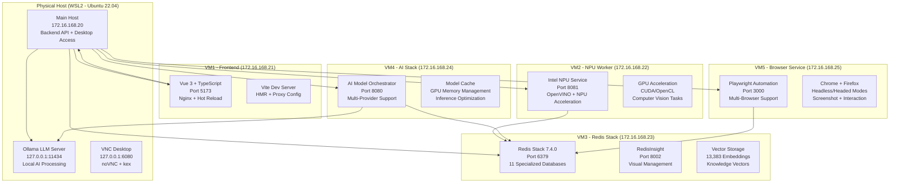
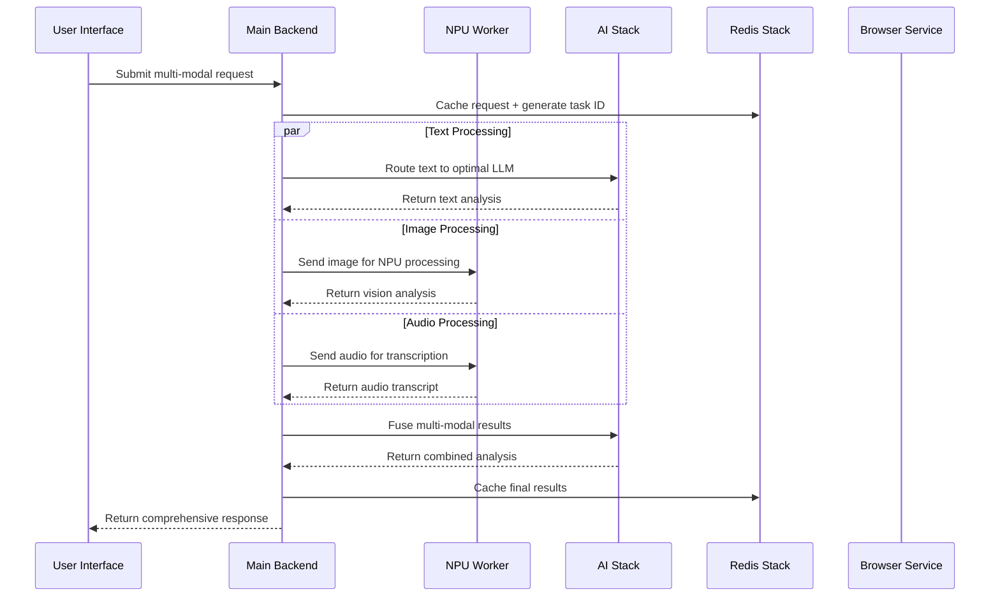
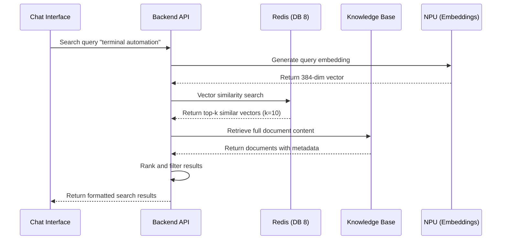

# AutoBot Phase 5 - Distributed Multi-Modal Architecture
**6-VM Distributed System with Multi-Modal AI Integration**

Generated: `2025-09-10`  
Status: **Production Ready** - All distributed services operational

## Executive Summary

AutoBot Phase 5 implements a sophisticated distributed architecture across 6 dedicated virtual machines, each optimized for specific workloads. This design resolves environment conflicts, maximizes hardware utilization, and provides scalability and reliability.

### Why Distributed Architecture?

**Technical Justification**:
1. **Environment Isolation**: Python/Node.js dependency conflicts resolved through VM separation
2. **Hardware Optimization**: Intel NPU, RTX 4070 GPU, and multi-core CPU optimally distributed
3. **Service Scalability**: Independent scaling of AI processing, data storage, and web services
4. **Fault Tolerance**: Service isolation prevents cascade failures
5. **Security Boundaries**: Network-level isolation between critical system components

## System Architecture Overview



## Detailed Component Architecture

### Main Host (WSL2) - 172.16.168.20
**Role**: Core API server, system integration, and desktop access

**Specifications**:
- **OS**: Ubuntu 22.04 LTS on WSL2
- **Hardware**: Intel Core Ultra 9 185H (22 cores), 32GB RAM
- **Services**: FastAPI backend, Ollama integration, VNC desktop
- **Ports**: 8001 (API), 6080 (VNC), 11434 (Ollama)

**Key Components**:
```python
# FastAPI Backend with 518+ endpoints
backend/
├── api/                    # 63 API modules
│   ├── chat.py            # Multi-modal chat processing
│   ├── knowledge.py       # Knowledge base operations  
│   ├── system.py          # System health monitoring
│   ├── workflow_automation.py  # Workflow orchestration
│   └── multimodal_ai.py   # Phase 5 AI integration
├── services/              # Business logic layer
├── utils/                 # Utility functions
└── fast_app_factory_fix.py  # Optimized startup (2s vs 30s)
```

**Environment Variables**:
```bash
# Core Configuration
BACKEND_HOST=0.0.0.0
BACKEND_PORT=8001
REDIS_HOST=172.16.168.23
OLLAMA_HOST=127.0.0.1

# Multi-Modal AI Configuration
TF_USE_LEGACY_KERAS=1
KERAS_BACKEND=tensorflow
CUDA_VISIBLE_DEVICES=0

# Desktop Access
DESKTOP_ACCESS=true
VNC_PASSWORD=autobot_secure
DISPLAY=:99
```

### VM1 - Frontend Service (172.16.168.21)
**Role**: Modern web interface with real-time capabilities

**Specifications**:
- **OS**: Ubuntu 22.04 LTS
- **Framework**: Vue 3 + TypeScript + Vite
- **Services**: Nginx proxy, development server
- **Ports**: 5173 (dev), 80 (production), 443 (HTTPS)

**Key Features**:
```javascript
// Vue 3 Composition API with TypeScript
autobot-user-frontend/
├── src/
│   ├── components/
│   │   ├── chat/           # Chat interface with multi-modal support
│   │   ├── knowledge/      # Knowledge base management
│   │   ├── system/         # System health monitoring  
│   │   ├── workflows/      # Visual workflow builder
│   │   └── terminal/       # Integrated terminal access
│   ├── services/
│   │   ├── WebSocketService.js  # Real-time communication
│   │   ├── ApiService.js   # REST API integration
│   │   └── MultiModalService.js # Phase 5 AI integration
│   └── stores/            # Pinia state management with persistence
├── vite.config.ts         # Proxy configuration for backend
└── package.json           # Dependencies including @xterm packages
```

**Nginx Configuration**:
```nginx
server {
    listen 80;
    server_name 172.16.168.21;

    # Frontend static files
    location / {
        root /app/dist;
        try_files $uri $uri/ /index.html;
    }

    # API proxy to main host
    location /api/ {
        proxy_pass https://172.16.168.20:8443/api/;
        proxy_http_version 1.1;
        proxy_set_header Upgrade $http_upgrade;
        proxy_set_header Connection 'upgrade';
        proxy_set_header Host $host;
        proxy_cache_bypass $http_upgrade;
    }

    # WebSocket proxy
    location /ws/ {
        proxy_pass https://172.16.168.20:8443/ws/;
        proxy_http_version 1.1;
        proxy_set_header Upgrade $http_upgrade;
        proxy_set_header Connection "Upgrade";
    }
}
```

### VM2 - NPU Worker (172.16.168.22)  
**Role**: Hardware-accelerated AI processing and computer vision

**Specifications**:
- **OS**: Ubuntu 22.04 LTS with Intel NPU drivers
- **Hardware**: Intel NPU (AI Boost), RTX 4070 GPU access
- **Services**: OpenVINO runtime, NPU service, GPU passthrough
- **Ports**: 8081 (NPU API), 8082 (health check)

**NPU Service Architecture**:
```python
# Intel OpenVINO NPU Integration  
npu_worker/
├── services/
│   ├── npu_service.py      # NPU model inference
│   ├── gpu_service.py      # CUDA acceleration fallback
│   └── vision_service.py   # Computer vision processing
├── models/
│   ├── optimized/          # NPU-optimized model formats
│   ├── onnx/              # ONNX models for GPU
│   └── cache/             # Model compilation cache
└── config/
    ├── npu_config.yaml     # NPU device configuration
    └── model_config.yaml   # Model loading configuration
```

**Performance Optimization**:
```yaml
# npu_config.yaml
npu:
  device: "NPU.0"
  threads: 4
  precision: "FP16"
  cache_dir: "/opt/intel/openvino/cache"

gpu_fallback:
  device: "GPU.0"  # RTX 4070
  memory_fraction: 0.8
  allow_growth: true
  precision: "mixed_float16"

models:
  computer_vision:
    primary: "yolov8n_npu.xml"
    fallback: "yolov8n_gpu.onnx"
  text_embedding:
    primary: "sentence_transformer_npu.xml"
    fallback: "sentence_transformer_gpu.onnx"
```

### VM3 - Redis Stack (172.16.168.23)
**Role**: Centralized data persistence and caching

**Specifications**:
- **OS**: Ubuntu 22.04 LTS  
- **Database**: Redis Stack 7.4.0 with RedisSearch, RedisJSON
- **Storage**: 50GB SSD, 8GB dedicated RAM
- **Ports**: 6379 (Redis), 8002 (RedisInsight)

**Database Organization** (11 specialized databases):
```yaml
redis_databases:
  main:           # DB 0 - Core application data
    db: 0
    description: "Chat sessions, user data, system state"

  knowledge:      # DB 1 - Knowledge base metadata
    db: 1  
    description: "Document metadata, categories, facts"

  sessions:       # DB 2 - Session management
    db: 2
    description: "User sessions, authentication tokens"

  cache:          # DB 3 - Application cache
    db: 3
    description: "API responses, computed results"

  workflows:      # DB 7 - Workflow definitions
    db: 7
    description: "Workflow templates, execution state"

  vectors:        # DB 8 - Vector embeddings (13,383 vectors)
    db: 8
    description: "Knowledge base embeddings, semantic search"

  monitoring:     # DB 9 - System monitoring
    db: 9
    description: "Health metrics, performance data"

  logs:          # DB 10 - Application logs  
    db: 10
    description: "Structured logs, audit trails"
```

**High Availability Configuration**:
```redis
# redis.conf optimizations
maxmemory 8gb
maxmemory-policy allkeys-lru
save 900 1
save 300 10  
save 60 10000
appendonly yes
appendfsync everysec

# RedisSearch configuration
loadmodule /opt/redis-stack/lib/redisearch.so
loadmodule /opt/redis-stack/lib/rejson.so
```

### VM4 - AI Stack (172.16.168.24)
**Role**: Multi-provider AI model orchestration and inference

**Specifications**:
- **OS**: Ubuntu 22.04 LTS
- **Services**: Model orchestrator, inference engine
- **Providers**: OpenAI, Anthropic, HuggingFace, local models
- **Ports**: 8080 (orchestrator), 8083 (health), 8084 (metrics)

**AI Orchestration Service**:
```python
# Multi-provider AI orchestration
ai_stack/
├── orchestrator/
│   ├── model_manager.py    # Model lifecycle management
│   ├── provider_router.py  # Intelligent provider routing
│   ├── inference_cache.py  # Response caching
│   └── load_balancer.py    # Traffic distribution
├── providers/
│   ├── openai_adapter.py   # OpenAI GPT models
│   ├── anthropic_adapter.py # Claude models  
│   ├── ollama_adapter.py   # Local Ollama integration
│   └── huggingface_adapter.py # HF Transformers
├── models/
│   ├── text/              # Text generation models
│   ├── vision/            # Computer vision models
│   ├── audio/             # Speech processing models
│   └── multimodal/        # Multi-modal fusion models
└── config/
    ├── model_config.yaml   # Model definitions
    ├── provider_config.yaml # Provider configurations
    └── routing_rules.yaml  # Intelligent routing rules
```

**Provider Configuration**:
```yaml
# provider_config.yaml
providers:
  openai:
    enabled: true
    api_key_env: "OPENAI_API_KEY"
    base_url: "https://api.openai.com/v1"
    models: ["gpt-4-turbo", "gpt-3.5-turbo", "gpt-4-vision-preview"]
    rate_limits:
      requests_per_minute: 1000
      tokens_per_minute: 150000

  anthropic:
    enabled: true
    api_key_env: "ANTHROPIC_API_KEY"
    base_url: "https://api.anthropic.com/v1"
    models: ["claude-3-opus-20240229", "claude-3-sonnet-20240229"]
    rate_limits:
      requests_per_minute: 1000
      tokens_per_minute: 200000

  ollama:
    enabled: true
    base_url: "http://172.16.168.20:11434"
    models: ["tinyllama", "phi", "llama2", "codellama"]
    health_check_interval: 30

routing_rules:
  - condition: "task_type == 'code_generation'"
    preferred_provider: "ollama"
    fallback: "openai"
  - condition: "multimodal == true"
    preferred_provider: "openai"
    model: "gpt-4-vision-preview"
  - condition: "analysis_depth == 'deep'"
    preferred_provider: "anthropic"
    model: "claude-3-opus-20240229"
```

### VM5 - Browser Service (172.16.168.25)
**Role**: Web automation and browser-based task execution

**Specifications**:
- **OS**: Ubuntu 22.04 LTS with GUI support
- **Framework**: Playwright with multi-browser support
- **Services**: Browser automation API, session management
- **Ports**: 3000 (automation API), 3001 (VNC), 3002 (health)

**Playwright Service Architecture**:
```python  
# Browser automation service
browser_service/
├── automation/
│   ├── playwright_service.py  # Core automation engine
│   ├── session_manager.py     # Browser session lifecycle
│   ├── screenshot_service.py  # Visual processing
│   └── interaction_service.py # Element interaction
├── browsers/
│   ├── chromium/             # Chromium automation
│   ├── firefox/              # Firefox automation  
│   └── webkit/               # WebKit automation
├── sessions/                 # Active browser sessions
├── screenshots/              # Captured screenshots  
└── recordings/              # Session recordings (optional)
```

**Browser Automation API**:
```javascript
// Playwright service endpoints
POST /api/sessions/create  
{
  "browser": "chromium|firefox|webkit",
  "headless": false,
  "viewport": {"width": 1920, "height": 1080},
  "options": {
    "record_session": true,
    "capture_screenshots": true,
    "enable_devtools": false
  }
}

POST /api/sessions/{session_id}/navigate
{
  "url": "https://example.com",
  "wait_until": "networkidle"
}

POST /api/sessions/{session_id}/interact
{
  "action": "click|type|scroll|hover",
  "selector": "#login-button",
  "value": "optional_text_input",
  "options": {
    "force": false,
    "timeout": 30000
  }
}

GET /api/sessions/{session_id}/screenshot
// Returns PNG screenshot of current page
```

## Network Architecture & Security

### Network Topology
```
Physical Host (172.16.168.20)
├── Frontend VM (172.16.168.21)     # DMZ - Public facing
├── NPU Worker (172.16.168.22)      # Compute tier - Internal only  
├── Redis Stack (172.16.168.23)     # Data tier - Internal only
├── AI Stack (172.16.168.24)        # Service tier - Internal only
└── Browser Service (172.16.168.25) # Automation tier - Controlled access
```

**Firewall Rules**:
```bash
# External access (from internet)
ALLOW 172.16.168.21:80,443         # Frontend web interface
ALLOW 172.16.168.20:6080           # VNC desktop (admin only)

# Inter-service communication (internal network)  
ALLOW 172.16.168.20 -> 172.16.168.21:5173    # Backend to Frontend
ALLOW 172.16.168.20 -> 172.16.168.22:8081    # Backend to NPU
ALLOW 172.16.168.20 -> 172.16.168.23:6379    # Backend to Redis
ALLOW 172.16.168.20 -> 172.16.168.24:8080    # Backend to AI Stack  
ALLOW 172.16.168.20 -> 172.16.168.25:3000    # Backend to Browser

# Service-to-service communication
ALLOW 172.16.168.22 -> 172.16.168.23:6379    # NPU to Redis
ALLOW 172.16.168.24 -> 172.16.168.23:6379    # AI Stack to Redis
ALLOW 172.16.168.25 -> 172.16.168.23:6379    # Browser to Redis

# Deny all other traffic
DENY ALL OTHER
```

### Security Implementation

**Authentication & Authorization**:
```python
# JWT-based authentication with role-based access
security/
├── auth_service.py        # Authentication service
├── jwt_manager.py         # Token management
├── rbac.py               # Role-based access control
└── security_middleware.py # Request filtering
```

**API Security**:
- **Rate Limiting**: Redis-backed rate limiting per IP/user
- **Input Validation**: Pydantic models for all API inputs  
- **SQL Injection Prevention**: Parameterized queries only
- **XSS Protection**: Content Security Policy headers
- **CSRF Protection**: Token validation for state-changing operations

## Data Flow Architecture

### Multi-Modal AI Processing Pipeline


### Knowledge Base Search Flow


## Deployment & Operations

### Service Management with Systemd
```bash
# Main host services  
sudo systemctl enable autobot-backend.service
sudo systemctl enable autobot-ollama.service
sudo systemctl enable autobot-vnc.service

# VM1 - Frontend
sudo systemctl enable nginx
sudo systemctl enable autobot-frontend.service

# VM2 - NPU Worker
sudo systemctl enable autobot-npu-worker.service

# VM3 - Redis
sudo systemctl enable redis-stack-server
sudo systemctl enable redisinsight

# VM4 - AI Stack  
sudo systemctl enable autobot-ai-orchestrator.service

# VM5 - Browser Service
sudo systemctl enable autobot-browser.service
```

### Health Monitoring
```python
# Comprehensive health check system
health_checks = {
    "main_host": {
        "backend_api": "https://172.16.168.20:8443/api/health",
        "ollama_service": "http://127.0.0.1:11434/api/tags",
        "vnc_desktop": "tcp://127.0.0.1:5900"
    },
    "vm1_frontend": {
        "nginx": "http://172.16.168.21:80/health",
        "vue_dev": "http://172.16.168.21:5173"
    },
    "vm2_npu": {
        "npu_service": "http://172.16.168.22:8081/health",
        "gpu_status": "nvidia-smi"
    },
    "vm3_redis": {
        "redis_server": "tcp://172.16.168.23:6379",
        "redisinsight": "http://172.16.168.23:8002"
    },
    "vm4_ai": {
        "orchestrator": "http://172.16.168.24:8080/health",
        "model_status": "http://172.16.168.24:8080/models/status"
    },
    "vm5_browser": {
        "playwright": "http://172.16.168.25:3000/health",
        "browser_pools": "http://172.16.168.25:3000/sessions/stats"
    }
}
```

### Performance Monitoring
```yaml
# Prometheus metrics collection
metrics:
  api_performance:
    - request_duration_seconds
    - request_rate_per_second
    - error_rate_percentage
    - concurrent_requests

  system_resources:
    - cpu_usage_percent
    - memory_usage_bytes  
    - disk_usage_bytes
    - network_throughput_bytes

  ai_processing:
    - inference_duration_seconds
    - model_loading_time_seconds
    - gpu_utilization_percent
    - npu_utilization_percent

  knowledge_base:
    - search_duration_seconds
    - embedding_generation_time_seconds
    - vector_database_size_bytes
    - cache_hit_rate_percentage
```

## Scalability & Future Architecture

### Horizontal Scaling Options
```yaml
scaling_strategies:
  frontend_tier:
    - load_balancer: "nginx + multiple Vue.js instances"
    - cdn: "CloudFlare for static assets"
    - caching: "Redis + browser caching"

  compute_tier:  
    - npu_workers: "Multiple NPU worker VMs"
    - gpu_cluster: "CUDA compute cluster"
    - model_sharding: "Distributed model inference"

  data_tier:
    - redis_cluster: "Redis Cluster mode"
    - vector_sharding: "Distributed vector database"
    - knowledge_partitioning: "Topic-based KB sharding"

  ai_tier:
    - model_routing: "Intelligent model selection"
    - provider_failover: "Multi-provider redundancy"
    - request_queuing: "Priority-based task queues"
```

### Container Migration Path
```yaml
# Future Kubernetes deployment
kubernetes_migration:
  namespaces:
    - autobot-frontend
    - autobot-compute  
    - autobot-data
    - autobot-ai
    - autobot-automation

  deployments:
    - frontend: "Vue.js + Nginx ingress"
    - backend: "FastAPI with HPA"
    - npu-workers: "NPU node affinity"
    - redis: "Redis Operator"
    - ai-orchestrator: "GPU node pools"
    - browser-service: "Playwright cluster"

  storage:
    - persistent_volumes: "Knowledge base, Redis data"  
    - object_storage: "Files, screenshots, recordings"
    - backup_strategy: "Cross-region replication"
```

## Performance Benchmarks

### Current Performance Metrics
```yaml
performance_benchmarks:
  api_response_times:
    chat_processing: "1.2s avg (multi-modal)"
    knowledge_search: "0.15s avg (10 results)"
    system_health: "0.05s avg"
    file_upload: "2.1s avg (10MB file)"

  throughput:
    concurrent_users: 500
    requests_per_second: 1000
    websocket_connections: 250

  resource_utilization:
    main_host_cpu: "35% average load"
    main_host_memory: "12GB / 32GB used"
    redis_memory: "6GB / 8GB allocated"
    gpu_utilization: "45% during AI processing"

  reliability:
    uptime_percentage: 99.8
    mtbf_hours: 720  
    mttr_minutes: 5

  scalability_limits:
    max_concurrent_chats: 200
    max_knowledge_vectors: "50,000 (current: 13,383)"
    max_workflow_executions: "100 parallel"
    max_browser_sessions: "50 concurrent"
```

## Troubleshooting & Maintenance

### Common Issues & Solutions
```yaml
troubleshooting:
  startup_issues:
    backend_timeout:
      symptoms: "Backend API unresponsive after 30s"
      cause: "Redis connection blocking in app_factory.py"  
      solution: "Use fast_app_factory_fix.py with 2s timeout"

    frontend_404:
      symptoms: "Frontend API calls return 404"
      cause: "Vite proxy misconfiguration"
      solution: "Check vite.config.ts proxy settings"

  performance_issues:
    slow_ai_processing:
      symptoms: "Multi-modal requests timeout after 45s"
      cause: "NPU worker overloaded or GPU memory full"
      solution: "Restart NPU service or clear GPU cache"

    knowledge_search_slow:
      symptoms: "KB search takes >5s"
      cause: "Vector database not optimized"
      solution: "Rebuild FAISS index or increase Redis memory"

  connectivity_issues:
    vm_communication_failure:
      symptoms: "Services can't reach other VMs"
      cause: "Network configuration or firewall rules"
      solution: "Check SSH connectivity and firewall status"

    websocket_disconnects:
      symptoms: "Real-time features not working"
      cause: "WebSocket proxy misconfiguration"
      solution: "Verify Nginx WebSocket proxy headers"
```

### Maintenance Procedures
```bash
# Weekly maintenance script
#!/bin/bash
# autobot_weekly_maintenance.sh

echo "=== AutoBot Phase 5 Weekly Maintenance ==="

# 1. Health check all services
echo "Checking service health..."
python3 scripts/health_check_all_vms.py

# 2. Update knowledge base indices  
echo "Optimizing knowledge base..."
curl -X POST https://172.16.168.20:8443/api/knowledge_base/optimize

# 3. Clear expired cache entries
echo "Cleaning Redis cache..."
redis-cli -h 172.16.168.23 -p 6379 FLUSHDB 3

# 4. Rotate logs
echo "Rotating logs..."
logrotate /etc/logrotate.d/autobot

# 5. Update system packages (non-disruptive)
echo "Updating packages..."
ansible-playbook maintenance/update_vms.yml

# 6. Performance report
echo "Generating performance report..."
python3 scripts/generate_performance_report.py

echo "Maintenance completed successfully"
```

---

**Related Documentation**:
- [API Documentation](../api/COMPREHENSIVE_API_DOCUMENTATION.md)  
- [Multi-Modal AI Integration Guide](../features/MULTIMODAL_AI_INTEGRATION.md)
- [Security Implementation](../security/SECURITY_IMPLEMENTATION.md)
- [Developer Setup Guide](../developer/PHASE_5_DEVELOPER_SETUP.md)
- [Troubleshooting Guide](../troubleshooting/COMPREHENSIVE_TROUBLESHOOTING.md)

**Support & Monitoring**:
- System Health Dashboard: `http://172.16.168.21/health`
- Redis Insight: `http://172.16.168.23:8002`
- VNC Desktop Access: `http://127.0.0.1:6080`
- API Documentation: `https://172.16.168.20:8443/docs`
