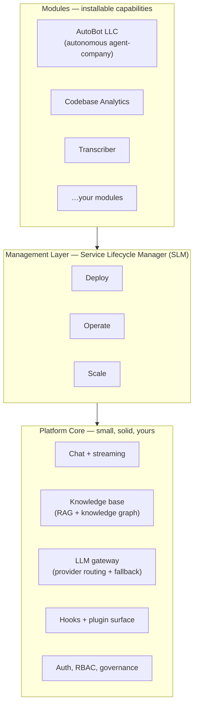

---
tags:
  - architecture
  - concept
  - positioning
aliases:
  - Platform Model
  - AutoBot Platform Model
  - The AutoBot Stack
  - Core, SLM, and Modules
  - What AutoBot Is
status: current
---

# The AutoBot Platform Model

> **Your data. Your AI.**
>
> AutoBot is a self-hosted AI platform you own: a small, solid core, a management
> layer that runs the hard infrastructure for you, and modules you install on top.
> Nothing leaves your machines unless you decide it does.

AutoBot is not a SaaS subscription and not a single application. It is a **platform**:
a stable core that does a few things well, the operational machinery to run private
AI on your own hardware, and an extension surface where larger capabilities are
installed as modules. This document is the canonical description of that model — the
mental picture every other doc builds on.

---

## Three Layers

AutoBot is best understood as three layers, bottom to top:

### 1. Platform Core — small, solid, yours

The core is deliberately small. It does a handful of things well and changes slowly,
so everything built on top can rely on it:

- **Chat and streaming** — multi-turn conversation with tool/function calling.
- **Knowledge base** — a RAG pipeline over your documents, code, and runbooks,
  backed by a vector store and a **knowledge graph**. This is your platform's
  *institutional memory*: it persists across sessions and is shared by everything
  that runs on the core.
- **LLM gateway** — one place to plug in whichever model you trust, with provider
  routing and automatic fallback when a model hits a rate limit or quota.
- **Local inference** — run models on your own hardware (CPU, GPU, or NPU) at zero
  marginal cost per request.
- **Hooks and plugins** — the extension points modules attach to.
- **Auth, RBAC, and governance** — review gates, budgets, and access control that
  every layer above inherits.

The core's promise is the lead identity: **your data stays on your machines, and the
AI stays yours.**

### 2. Management Layer — Service Lifecycle Manager (SLM)

Private AI has a lot of moving infrastructure behind it: a vector database, a cache,
a relational database, an inference server, and background workers — often spread
across more than one machine. The **Service Lifecycle Manager (SLM)** is AutoBot's
management layer for all of it.

> **SLM always means *Service Lifecycle Manager* — AutoBot's management layer.**
> It is never an abbreviation for "small language model." For local model inference,
> see *local inference* in the core layer above.

The SLM owns the full lifecycle of that infrastructure:

| Stage | What the SLM does |
|-------|-------------------|
| **Deploy** | Stands up the stack — vector DB, cache, database, inference, workers — from a blank host or across a fleet, via Ansible. |
| **Operate** | Keeps it running: upgrades, health monitoring, recovery, certificate rotation, and configuration. |
| **Scale** | Grows it: add fleet nodes, add NPU workers, assign roles, and provision new capacity. |

The SLM is what turns "a pile of services" into infrastructure you can actually run
in production without becoming a full-time operator.

### 3. Modules — capabilities installed on the core's bones

Modules are the large capabilities you add on top. A module is not a bolt-on script;
it is built on the platform's bones and **inherits** what the core already provides:

- **Institutional memory** — the RAG knowledge base and knowledge graph, so a module's
  agents start with organizational context instead of a blank slate.
- **Local inference at zero marginal cost** — every model call runs on hardware you own.
- **Hooks** — the same extension points the core exposes.
- **Governance** — review gates, budgets, and RBAC enforced by the core.

Because modules inherit these primitives, they are small relative to what they deliver:
the hard parts (memory, inference, governance, lifecycle) already live in the platform.

Modules that ship with or for AutoBot include:

| Module | What it adds |
|--------|--------------|
| **[AutoBot LLC](../llc/_index.md)** | An autonomous *agent-company* — agents, goals, backlog, heartbeat scheduling, and board governance |
| **Codebase Analytics** | Code structure analysis, risk detection, and dependency insights — all on your own hardware |
| **Transcriber** | A general-purpose audio transcription module: projects, recordings, local transcription, and export |

See the [Capability Catalog](../features/CATALOG.md) for the full picture of what each
module and the core provide.

---

## The Flagship Module: AutoBot LLC

**AutoBot LLC** is the reference module — an autonomous *agent-company* you install on
AutoBot. It lets you define a company of AI agents (and human co-workers), give them
goals and a backlog, schedule them to work autonomously, and govern their spend.

LLC is a clean illustration of the module model because it is almost entirely composed
of inherited platform primitives:

| LLC needs… | …inherited from the platform core |
|------------|-----------------------------------|
| Agents that remember across runs | Knowledge base + knowledge graph (institutional memory) |
| Affordable 24/7 autonomous execution | Local inference at zero marginal cost |
| Wiring agents into scheduled work | Hooks |
| Budget caps and approval gates | Governance (RBAC, review gates, budgets) |

See **[AutoBot LLC](../llc/_index.md)** for the module overview and the
[LLC module PRD](../planning/PRD_AutoBot_LLC_Module.md) for the full specification.

---

## Why this model

- **Stability where it matters.** A small core that changes slowly lets modules and
  fleets depend on it without churn.
- **Operability.** The SLM means private AI is something you can deploy and *keep
  running*, not just stand up once.
- **Leverage.** Modules deliver large outcomes with little code because the platform
  already carries memory, inference, and governance.
- **Ownership, end to end.** Core, management layer, and modules all run on
  infrastructure you control. Your data. Your AI.

---

## Related

- [Architecture Overview](README.md) — component-level system architecture
- [Distributed Architecture](DISTRIBUTED_ARCHITECTURE.md) — multi-node deployment
- [SSOT Configuration](SSOT_CONFIGURATION_ARCHITECTURE.md) — single source of truth
- [AutoBot LLC](../llc/_index.md) — the flagship module
- [Glossary](../GLOSSARY.md) — terminology, including SLM and LLC
