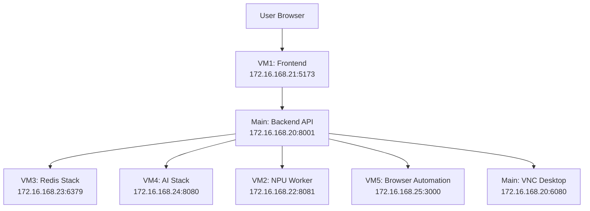

# AutoBot Architecture Overview

**Last Updated**: 2025-12-13

This document provides a high-level overview of the AutoBot platform architecture and serves as the central navigation hub for all architecture documentation.

---

## System Overview

AutoBot is an AI-powered automation platform built on a distributed 6-VM architecture. The system provides:

- **Multi-LLM Chat Interface** - Intelligent conversation with multiple AI models
- **Knowledge Base** - Vectorized document storage and retrieval
- **Workflow Automation** - Automated task execution and orchestration
- **Multi-Modal AI** - Image, voice, and desktop interaction
- **Browser Automation** - Web scraping and automation via Playwright

---

## Infrastructure Topology



### Service Responsibilities

| VM | IP Address | Services | Purpose |
|----|------------|----------|---------|
| **Main (WSL)** | 172.16.168.20 | Backend API (8001), VNC (6080) | Core API, desktop automation |
| **VM1 Frontend** | 172.16.168.21 | Vite (5173) | Web interface (single source) |
| **VM2 NPU Worker** | 172.16.168.22 | NPU API (8081) | Hardware-accelerated AI |
| **VM3 Redis** | 172.16.168.23 | Redis Stack (6379) | Data persistence, caching |
| **VM4 AI Stack** | 172.16.168.24 | Ollama (8080) | LLM inference, embeddings |
| **VM5 Browser** | 172.16.168.25 | Playwright (3000) | Web automation |

---

## Architecture Decision Records (ADRs)

Key architectural decisions are documented in ADRs. See [docs/adr/](../adr/README.md) for the complete index.

| ADR | Decision | Status |
|-----|----------|--------|
| [ADR-001](../adr/001-distributed-vm-architecture.md) | Distributed 6-VM Architecture | Accepted |
| [ADR-002](../adr/002-redis-database-separation.md) | Redis Database Separation | Accepted |
| [ADR-003](../adr/003-npu-integration-strategy.md) | NPU Hardware Acceleration | Accepted |
| [ADR-004](../adr/004-chat-workflow-architecture.md) | Chat Workflow Architecture | Accepted |
| [ADR-005](../adr/005-single-frontend-mandate.md) | Single Frontend Server | Accepted |

---

## Technology Stack

### Backend
- **Python 3.11+** - Core backend language
- **FastAPI** - REST API framework
- **Redis Stack** - Data layer (cache, vectors, queues)
- **LlamaIndex** - RAG and knowledge base
- **OpenVINO** - NPU model optimization

### Frontend
- **Vue 3** - UI framework
- **TypeScript** - Type-safe JavaScript
- **Vite** - Build tool and dev server
- **Tailwind CSS** - Styling

### AI/ML
- **Ollama** - Local LLM inference
- **OpenAI API** - Cloud LLM (fallback)
- **ChromaDB** - Vector storage (code analysis)
- **Intel NPU** - Hardware acceleration

### Infrastructure
- **Hyper-V** - VM hypervisor
- **Docker** - Containerization (optional)
- **Playwright** - Browser automation
- **noVNC** - Desktop streaming

---

## Documentation Index

### Core Architecture
| Document | Description |
|----------|-------------|
| [DISTRIBUTED_6VM_ARCHITECTURE.md](DISTRIBUTED_6VM_ARCHITECTURE.md) | Detailed VM infrastructure |
| [PHASE_5_DISTRIBUTED_ARCHITECTURE.md](PHASE_5_DISTRIBUTED_ARCHITECTURE.md) | Phase 5 architecture details |
| [VISUAL_ARCHITECTURE.md](VISUAL_ARCHITECTURE.md) | Architecture diagrams |
| [AGENT_SYSTEM_ARCHITECTURE.md](AGENT_SYSTEM_ARCHITECTURE.md) | Agent system design |

### Data Layer
| Document | Description |
|----------|-------------|
| [REDIS_SERVICE_MANAGEMENT_ARCHITECTURE.md](REDIS_SERVICE_MANAGEMENT_ARCHITECTURE.md) | Redis management |
| [AUTOBOT_MEMORY_GRAPH_ARCHITECTURE.md](AUTOBOT_MEMORY_GRAPH_ARCHITECTURE.md) | Memory graph system |
| [VECTOR_STORE_MIGRATION.md](VECTOR_STORE_MIGRATION.md) | Vector store design |

### Features
| Document | Description |
|----------|-------------|
| [TERMINAL_ARCHITECTURE_DISTRIBUTED.md](TERMINAL_ARCHITECTURE_DISTRIBUTED.md) | Terminal integration |
| [LONG_RUNNING_OPERATIONS_ARCHITECTURE.md](LONG_RUNNING_OPERATIONS_ARCHITECTURE.md) | Long-running tasks |
| [SECURITY_ASSESSMENT_WORKFLOW.md](SECURITY_ASSESSMENT_WORKFLOW.md) | Security workflows |

### Code Analysis
| Document | Description |
|----------|-------------|
| [INDEX.md](INDEX.md) | Code vectorization index |
| [CODE_VECTORIZATION_ARCHITECTURE.md](CODE_VECTORIZATION_ARCHITECTURE.md) | Vectorization system |
| [CODE_VECTORIZATION_DATA_FLOWS.md](CODE_VECTORIZATION_DATA_FLOWS.md) | Data flow diagrams |

### Infrastructure
| Document | Description |
|----------|-------------|
| [NPU_WORKER_ARCHITECTURE.json](NPU_WORKER_ARCHITECTURE.json) | NPU worker design |
| [Docker_Architecture_Documentation.md](Docker_Architecture_Documentation.md) | Docker setup |
| [Kubernetes_Migration_Strategy.md](Kubernetes_Migration_Strategy.md) | K8s future plans |
| [Scaling_Roadmap_and_Architecture_Evolution.md](Scaling_Roadmap_and_Architecture_Evolution.md) | Scaling strategy |

---

## Quick Reference

### Health Checks

```bash
# Backend API
curl http://localhost:8001/api/health

# Frontend
curl http://172.16.168.21:5173

# Redis
redis-cli -h 172.16.168.23 ping

# Ollama
curl http://172.16.168.24:8080/api/tags
```

### Key Configuration Files

| File | Purpose |
|------|---------|
| `run_autobot.sh` | Main startup script |
| `.env` | Environment variables |
| `backend/core/config.py` | Backend configuration |
| `autobot-vue/vite.config.ts` | Frontend configuration |

### Critical Rules

1. **Single Frontend** - Only VM1 runs frontend server
2. **Edit Locally** - Never edit directly on VMs
3. **Sync Changes** - Use sync scripts after edits
4. **Named Databases** - Use `get_redis_client(database="name")`

---

## Related Documentation

- [API Documentation](../api/COMPREHENSIVE_API_DOCUMENTATION.md)
- [Developer Setup](../developer/PHASE_5_DEVELOPER_SETUP.md)
- [System State](../system-state.md)
- [Glossary](../GLOSSARY.md)

---

**Author**: mrveiss
**Copyright**: © 2025 mrveiss
