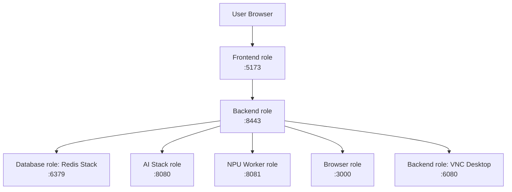

# AutoBot Architecture Overview

**Last Updated**: 2025-12-13

This document provides a high-level overview of the AutoBot platform architecture and serves as the central navigation hub for all architecture documentation.

---

## System Overview

AutoBot is an AI-powered automation platform built on a distributed, role-based architecture.
It runs in Docker, on a single VM, or across any number of machines an operator scales to —
see [VM_ROLES.md](VM_ROLES.md) for the role definitions. The system provides:

- **Multi-LLM Chat Interface** - Intelligent conversation with multiple AI models
- **Knowledge Base** - Vectorized document storage and retrieval
- **Workflow Automation** - Automated task execution and orchestration
- **Multi-Modal AI** - Image, voice, and desktop interaction
- **Browser Automation** - Web scraping and automation via Playwright

---

## Infrastructure Topology


```mermaid
graph TB
    User[User Browser] --> Frontend[Frontend role<br/><frontend-ip>:5173]
    Frontend --> Backend[Backend role<br/><backend-ip>:8443]
    Backend --> Redis[Database role: Redis Stack<br/><database-ip>:6379]
    Backend --> AI[AI Stack role<br/><aiml-ip>:8080]
    Backend --> NPU[NPU Worker role<br/><npu-ip>:8081]
    Backend --> Browser[Browser role<br/><browser-ip>:3000]
    Backend --> Desktop[Backend role: VNC Desktop<br/><backend-ip>:6080]
```

Example placement for a fully distributed deployment; a co-located deployment runs every
role on one host instead. See [VM_ROLES.md](VM_ROLES.md).

### Service Responsibilities

| Role | Example Host | Services | Purpose |
|----|------------|----------|---------|
| **Backend** | <backend-ip> | Backend API (8001), VNC (6080) | Core API, desktop automation |
| **Frontend** | <frontend-ip> | Vite (5173) | Web interface (single source) |
| **NPU Worker** | <npu-ip> | NPU API (8081) | Hardware-accelerated AI |
| **Database (Redis)** | <database-ip> | Redis Stack (6379) | Data persistence, caching |
| **AI Stack** | <aiml-ip> | Ollama (8080) | LLM inference, embeddings |
| **Browser** | <browser-ip> | Playwright (3000) | Web automation |

Hosts shown are illustrative; each role can be co-located with any other on one machine or
placed on its own host, in any combination the deployment needs.

---

## Architecture Decision Records (ADRs)

Key architectural decisions are documented in ADRs. See [docs/adr/](../adr/README.md) for the complete index.

| ADR | Decision | Status |
|-----|----------|--------|
| [ADR-001](../adr/001-distributed-vm-architecture.md) | Distributed VM Architecture (historical, fixed count) | Superseded by ADR-010 |
| [ADR-002](../adr/002-redis-database-separation.md) | Redis Database Separation | Accepted |
| [ADR-003](../adr/003-npu-integration-strategy.md) | NPU Hardware Acceleration | Accepted |
| [ADR-004](../adr/004-chat-workflow-architecture.md) | Chat Workflow Architecture | Accepted |
| [ADR-005](../adr/005-single-frontend-mandate.md) | Single Frontend Server | Accepted |
| [ADR-010](../adr/010-role-separation-count-agnostic-placement.md) | Role Separation with Count-Agnostic Placement | Accepted |

---

## Technology Stack

### Backend
- **Python 3.14** - Core backend language
- **FastAPI** - REST API framework
- **Redis Stack** - Data layer (cache, vectors, queues)
- **LlamaIndex** - RAG and knowledge base
- **OpenVINO** - NPU model optimization

### Frontend
- **Vue 3** - UI framework
- **TypeScript** - Type-safe JavaScript
- **Vite** - Build tool and dev server
- **Tailwind CSS** - Styling

### AI/ML
- **Ollama** - Local LLM inference
- **OpenAI API** - Cloud LLM (fallback)
- **ChromaDB** - Vector storage (code analysis)
- **Intel NPU** - Hardware acceleration

### Infrastructure
- **Hypervisor-agnostic** - runs on any supported hypervisor or bare metal (VirtualBox, VMware, Hyper-V, KVM, WSL2); requires only a supported OS + hardware
- **Docker** - Containerization (optional)
- **Playwright** - Browser automation
- **noVNC** - Desktop streaming

---

## Documentation Index

### Core Architecture
| Document | Description |
|----------|-------------|
| [VM_ROLES.md](VM_ROLES.md) | Role definitions, ports, and count-agnostic placement |
| [DISTRIBUTED_ARCHITECTURE.md](DISTRIBUTED_ARCHITECTURE.md) | Canonical distributed architecture (roles, not a VM count) |
| [VISUAL_ARCHITECTURE.md](VISUAL_ARCHITECTURE.md) | Architecture diagrams |
| [AGENT_SYSTEM_ARCHITECTURE.md](AGENT_SYSTEM_ARCHITECTURE.md) | Agent system design |

### Data Layer
| Document | Description |
|----------|-------------|
| [REDIS_SERVICE_MANAGEMENT_ARCHITECTURE.md](REDIS_SERVICE_MANAGEMENT_ARCHITECTURE.md) | Redis management |
| [AUTOBOT_MEMORY_GRAPH_ARCHITECTURE.md](AUTOBOT_MEMORY_GRAPH_ARCHITECTURE.md) | Memory graph system |
| [VECTOR_STORE_MIGRATION.md](VECTOR_STORE_MIGRATION.md) | Vector store design |

### Auth & Security
| Document | Description |
|----------|-------------|
| [auth.md](auth.md) | Authentication and RBAC architecture |
| [SECURITY_ASSESSMENT_WORKFLOW.md](SECURITY_ASSESSMENT_WORKFLOW.md) | Security assessment workflow |

### Features
| Document | Description |
|----------|-------------|
| [TERMINAL_ARCHITECTURE_DISTRIBUTED.md](TERMINAL_ARCHITECTURE_DISTRIBUTED.md) | Terminal integration |
| [LONG_RUNNING_OPERATIONS_ARCHITECTURE.md](LONG_RUNNING_OPERATIONS_ARCHITECTURE.md) | Long-running tasks |

### Code Analysis
| Document | Description |
|----------|-------------|
| [INDEX.md](INDEX.md) | Code vectorization index |
| [CODE_VECTORIZATION_ARCHITECTURE.md](CODE_VECTORIZATION_ARCHITECTURE.md) | Vectorization system |
| [CODE_VECTORIZATION_DATA_FLOWS.md](CODE_VECTORIZATION_DATA_FLOWS.md) | Data flow diagrams |

### Infrastructure
| Document | Description |
|----------|-------------|
| [NPU_WORKER_ARCHITECTURE.json](NPU_WORKER_ARCHITECTURE.json) | NPU worker design |
| [Docker_Architecture_Documentation.md](Docker_Architecture_Documentation.md) | Docker setup |
| [Kubernetes_Migration_Strategy.md](../planning/Kubernetes_Migration_Strategy.md) | K8s future plans |
| [Scaling_Roadmap_and_Architecture_Evolution.md](Scaling_Roadmap_and_Architecture_Evolution.md) | Scaling strategy |

---

## Quick Reference

### Health Checks

```bash
# Backend API
curl http://localhost:8001/api/health

# Frontend
curl http://<frontend-ip>:5173

# Redis
redis-cli -h <database-ip> ping

# Ollama
curl http://<aiml-ip>:8080/api/tags
```

### Key Configuration Files

| File | Purpose |
|------|---------|
| `scripts/start-services.sh` | CLI service wrapper (replaces deprecated `run_autobot.sh`) |
| `.env` | Environment variables |
| `backend/core/config.py` | Backend configuration |
| `autobot-frontend/vite.config.ts` | Frontend configuration |

### Critical Rules

1. **Single Frontend** - Only the designated frontend host runs the frontend server
2. **Edit Locally** - Never edit directly on remote hosts
3. **Sync Changes** - Use sync scripts after edits
4. **Named Databases** - Use `get_redis_client(database="name")`

---

## Related Documentation

- [API Documentation](../api/COMPREHENSIVE_API_DOCUMENTATION.md)
- [Developer Setup](../developer/DEVELOPER_SETUP.md)
- [System State](../system-state.md)
- [Glossary](../GLOSSARY.md)

---

**Author**: mrveiss
**Copyright**: © 2025 mrveiss
