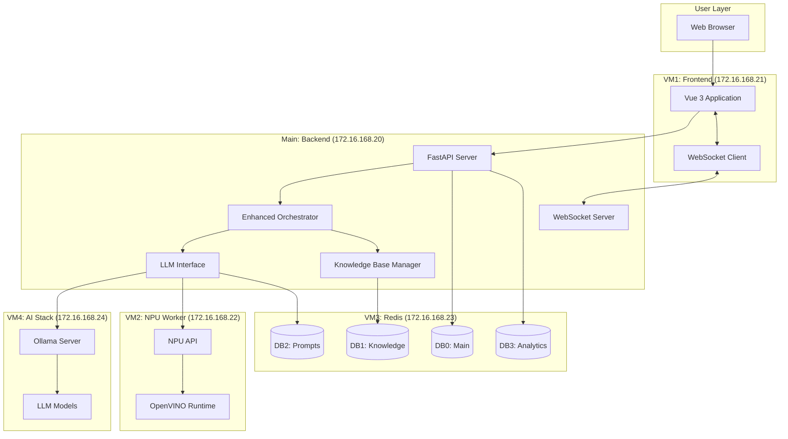
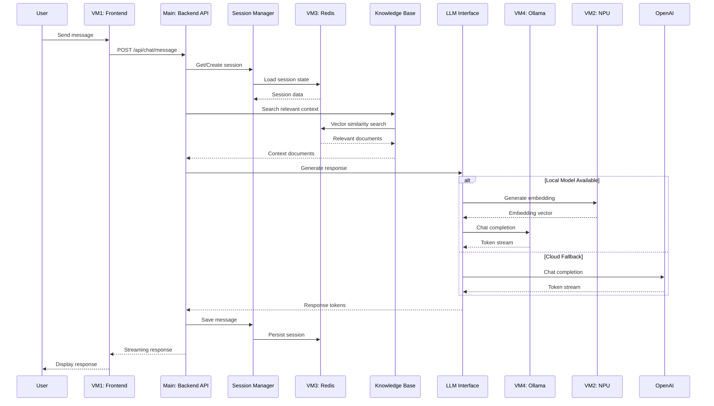
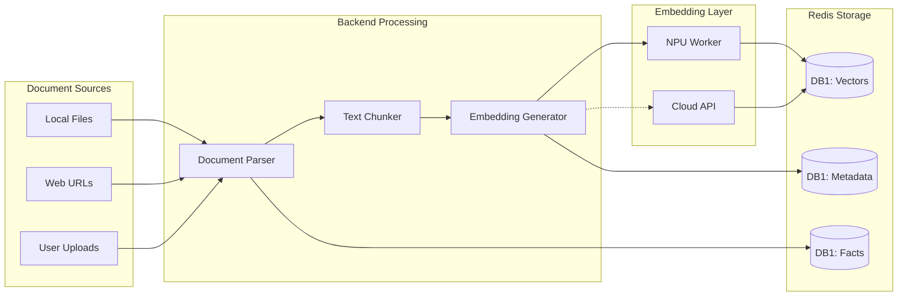
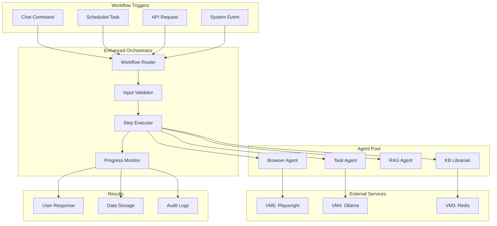
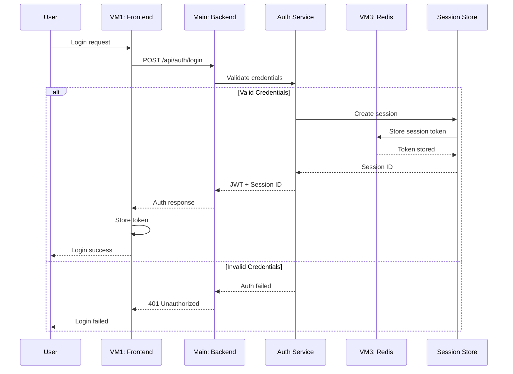
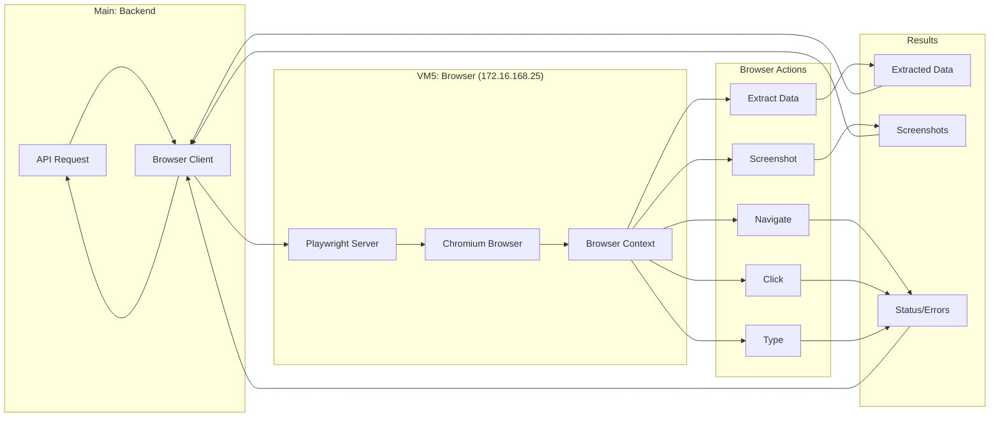
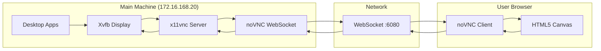
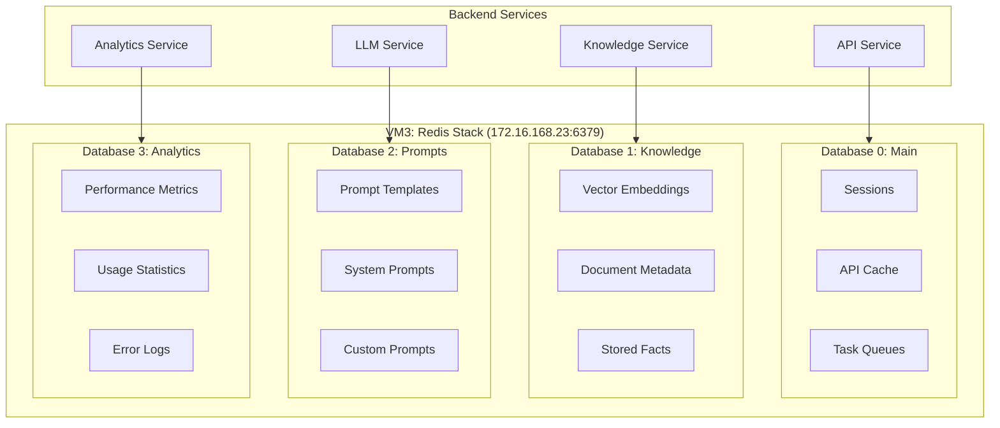

# AutoBot Data Flow Diagrams

**Last Updated**: 2025-12-13
**Related Issue**: [#251](https://github.com/mrveiss/AutoBot-AI/issues/251)

This document provides visual representations of data flows through the AutoBot distributed system.

---

## 1. Overall System Data Flow

---

## 2. Chat Message Flow

This diagram shows how a user message flows through the system to generate a response.

---

## 3. Knowledge Base Ingestion Flow

This diagram shows how documents are processed and indexed into the knowledge base.

---

## 4. Workflow Execution Flow

This diagram shows how automated workflows are executed.

---

## 5. Authentication Flow

---

## 6. Browser Automation Flow

---

## 7. VNC Desktop Stream Flow

---

## 8. Redis Database Layout

---

## Data Flow Summary

| Flow | Source | Destination | Protocol | Purpose |
|------|--------|-------------|----------|---------|
| Chat Messages | Frontend | Backend | HTTP/WS | User interaction |
| LLM Inference | Backend | Ollama/NPU | HTTP | AI responses |
| Knowledge Search | Backend | Redis | Redis Protocol | RAG retrieval |
| Browser Automation | Backend | Playwright | HTTP | Web automation |
| Desktop Stream | VNC Server | Browser | WebSocket | Remote desktop |
| Session State | Backend | Redis | Redis Protocol | User sessions |

---

## Related Documentation

- [ADR-001: Distributed VM Architecture](../adr/001-distributed-vm-architecture.md)
- [ADR-002: Redis Database Separation](../adr/002-redis-database-separation.md)
- [ADR-004: Chat Workflow Architecture](../adr/004-chat-workflow-architecture.md)
- [Architecture Overview](README.md)

---

**Author**: mrveiss
**Copyright**: © 2025 mrveiss
