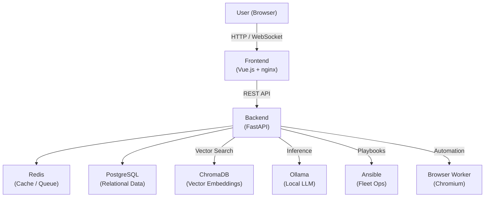
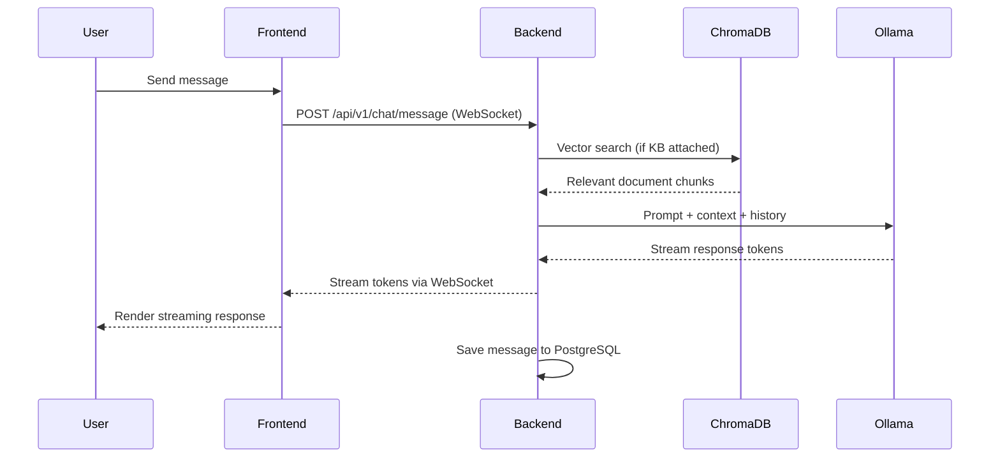
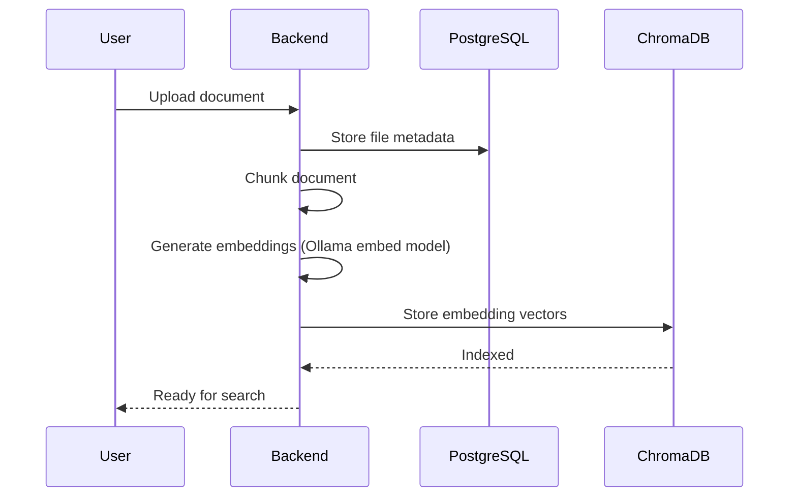
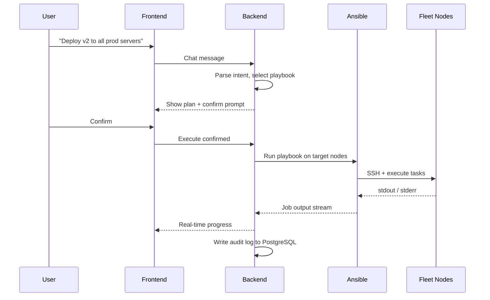
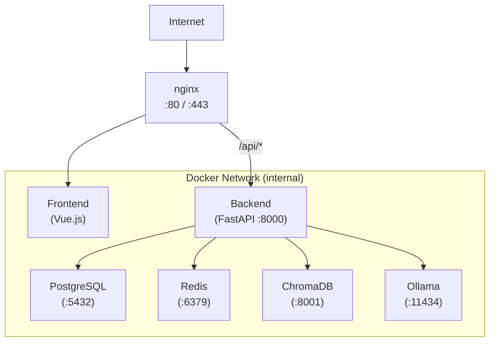
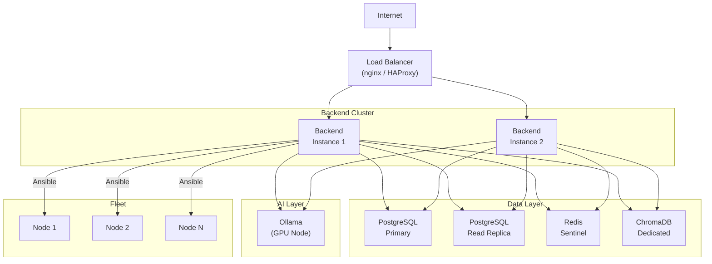

# AutoBot System Diagrams

> **Freshness:** current — 2026-08-30. Structural description of the system as built; classified and location-reviewed under #15192, not re-verified claim-by-claim.

A reference for AutoBot's architecture, data flows, and deployment topologies using Mermaid diagrams.

---

## System Overview

---

## Chat Request Data Flow

---

## Knowledge Base Indexing Flow

---

## Fleet Operation Flow

---

## Deployment Topology (Single Node)

---

## Deployment Topology (Multi-Node HA)

---

## Component Responsibilities

| Component | Technology | Responsibility |
|-----------|-----------|----------------|
| Frontend | Vue.js 3, nginx | UI, TLS termination, static assets |
| Backend | FastAPI, Python | Business logic, auth, orchestration |
| PostgreSQL | PostgreSQL 15+ | Users, sessions, fleet inventory, audit logs |
| Redis | Redis 7+ | Task queue, caching, session state |
| ChromaDB | ChromaDB | Vector embeddings for RAG search |
| Ollama | Ollama | Local LLM inference and embeddings |
| Ansible | Ansible | Fleet playbook execution |
| Browser Worker | Chromium | Browser automation, screenshots, scraping |
