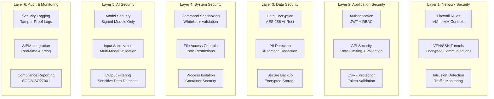

# AutoBot Phase 5 - Security Implementation Guide
**Enterprise Security for Distributed Multi-Modal AI System**

Generated: `2025-09-10`  
Security Level: **Enterprise Grade** - Multi-layer defense system operational

## Security Architecture Overview

AutoBot Phase 5 implements defense-in-depth security across its distributed 6-VM architecture, with specialized security controls for multi-modal AI processing, system automation, and sensitive data handling.

### Security Threat Model

**High-Risk Areas**:
- 🎯 **System Command Execution**: Terminal access and automation commands
- 🖼️ **Multi-Modal Data Processing**: Screenshots, voice recordings, sensitive documents
- 🌐 **Distributed Network Communications**: Inter-VM traffic and external APIs
- 🔐 **Privileged Access**: Desktop automation and file system access
- 📊 **Knowledge Base**: 13,383 vectors containing potentially sensitive information
- 🤖 **AI Model Access**: LLM APIs and local model inference

### Security Layers



## Authentication & Authorization

### Multi-Factor Authentication System

**JWT-Based Authentication with Role-Based Access Control**:
```python
# Advanced authentication system
class SecurityManager:
    def __init__(self):
        self.jwt_secret = self._load_jwt_secret()
        self.session_store = RedisSessionStore()
        self.rbac_engine = RBACEngine()
        
    async def authenticate_user(self, credentials: dict) -> AuthResult:
        """
        Multi-factor authentication with security controls.
        
        Supports:
        - Username/password + TOTP
        - API key authentication  
        - Certificate-based auth
        - Session token refresh
        """
        auth_method = credentials.get("method", "password")
        
        if auth_method == "password":
            return await self._password_auth(credentials)
        elif auth_method == "api_key":
            return await self._api_key_auth(credentials)
        elif auth_method == "certificate":
            return await self._certificate_auth(credentials)
        else:
            raise SecurityError("Unsupported authentication method")
    
    async def _password_auth(self, creds: dict) -> AuthResult:
        # Rate limiting - max 5 attempts per 15 minutes
        await self._check_rate_limit(creds["username"], "auth_attempt")
        
        # Verify password hash with bcrypt + salt
        user = await self.user_store.get_user(creds["username"])
        if not user or not self._verify_password(creds["password"], user.password_hash):
            await self._log_security_event("failed_auth", creds["username"])
            raise AuthenticationError("Invalid credentials")
        
        # TOTP verification (if enabled)
        if user.totp_enabled and not self._verify_totp(creds.get("totp_code"), user.totp_secret):
            raise AuthenticationError("Invalid TOTP code")
        
        # Generate JWT with claims
        token = await self._generate_jwt({
            "user_id": user.id,
            "username": user.username,
            "roles": user.roles,
            "permissions": await self.rbac_engine.get_permissions(user.roles),
            "session_id": str(uuid.uuid4()),
            "iat": int(time.time()),
            "exp": int(time.time()) + 3600  # 1 hour expiry
        })
        
        return AuthResult(token=token, user=user, expires_in=3600)
```

### Role-Based Access Control (RBAC)

**Security Roles & Permissions**:
```yaml
# RBAC Configuration
roles:
  admin:
    description: "System administrator with full access"
    permissions:
      - "system:*"           # All system operations
      - "multimodal:*"       # All AI processing
      - "knowledge:*"        # Knowledge base management
      - "workflow:*"         # Workflow creation/execution
      - "security:*"         # Security configuration
      - "audit:read"         # Security audit access
    
  operator:
    description: "Operational user with automation access"  
    permissions:
      - "system:read"        # System monitoring
      - "system:execute"     # Command execution (limited)
      - "multimodal:process" # AI processing
      - "knowledge:read"     # Knowledge base access
      - "knowledge:search"   # Knowledge search
      - "workflow:execute"   # Workflow execution
      - "files:upload"       # File operations
    
  analyst:
    description: "Read-only analyst with monitoring access"
    permissions:
      - "system:read"        # System monitoring only
      - "knowledge:read"     # Knowledge base read-only
      - "knowledge:search"   # Knowledge search
      - "multimodal:read"    # View AI results
      - "audit:read"         # Security audit read-only
    
  api_service:
    description: "Service account for API integrations"
    permissions:
      - "multimodal:process" # AI processing only
      - "knowledge:search"   # Knowledge search only
      - "system:health"      # Health checks only

# Permission validation example
permission_matrix:
  "/api/terminal/execute":
    required_permissions: ["system:execute"]
    additional_checks: ["command_whitelist", "working_directory_restriction"]
    
  "/api/multimodal/process":
    required_permissions: ["multimodal:process"]
    additional_checks: ["input_validation", "pii_detection"]
    
  "/api/knowledge_base/upload":
    required_permissions: ["knowledge:write"]
    additional_checks: ["file_size_limit", "virus_scan", "content_filter"]
```

### API Security Implementation

**Request Validation & Rate Limiting**:
```python
# API security middleware
class APISecurityMiddleware:
    def __init__(self):
        self.rate_limiter = RedisRateLimiter()
        self.input_validator = InputValidator()
        self.pii_detector = PIIDetector()
        
    async def __call__(self, request: Request, call_next):
        # 1. Rate limiting check
        client_id = self._get_client_id(request)
        endpoint = request.url.path
        
        rate_limit_key = f"rate_limit:{client_id}:{endpoint}"
        if not await self.rate_limiter.allow_request(rate_limit_key):
            raise HTTPException(
                status_code=429,
                detail="Rate limit exceeded",
                headers={"Retry-After": "60"}
            )
        
        # 2. Input validation
        if request.method in ["POST", "PUT", "PATCH"]:
            body = await request.body()
            validation_result = await self.input_validator.validate(
                endpoint=endpoint,
                content_type=request.headers.get("content-type"),
                body=body
            )
            
            if not validation_result.valid:
                await self._log_security_event("invalid_input", {
                    "endpoint": endpoint,
                    "client_id": client_id,
                    "errors": validation_result.errors
                })
                raise HTTPException(status_code=400, detail=validation_result.errors)
        
        # 3. PII detection for sensitive endpoints
        if endpoint.startswith(("/api/multimodal", "/api/knowledge")):
            pii_result = await self.pii_detector.scan_request(request)
            if pii_result.has_sensitive_data:
                # Automatic redaction or rejection based on policy
                if self.config.pii_policy == "reject":
                    raise HTTPException(
                        status_code=400, 
                        detail="Request contains sensitive personal information"
                    )
                elif self.config.pii_policy == "redact":
                    request = await self._redact_pii(request, pii_result)
        
        # 4. Process request
        response = await call_next(request)
        
        # 5. Output filtering
        if hasattr(response, "body"):
            filtered_response = await self._filter_sensitive_output(response)
            return filtered_response
            
        return response
```

## Network Security

### Inter-VM Communication Security

**Firewall Configuration**:
```bash
#!/bin/bash
# AutoBot Phase 5 Firewall Rules

# Default policies - deny all, allow specific
iptables -P INPUT DROP
iptables -P FORWARD DROP  
iptables -P OUTPUT ACCEPT

# Allow loopback
iptables -A INPUT -i lo -j ACCEPT

# Allow established connections
iptables -A INPUT -m conntrack --ctstate ESTABLISHED,RELATED -j ACCEPT

# Main Host (172.16.168.20) - Backend API
iptables -A INPUT -s 172.16.168.21 -p tcp --dport 8001 -j ACCEPT  # Frontend → Backend
iptables -A INPUT -s 172.16.168.22 -p tcp --dport 8001 -j ACCEPT  # NPU → Backend
iptables -A INPUT -s 172.16.168.24 -p tcp --dport 8001 -j ACCEPT  # AI Stack → Backend
iptables -A INPUT -s 172.16.168.25 -p tcp --dport 8001 -j ACCEPT  # Browser → Backend

# VNC Access (admin only, with IP restriction)
iptables -A INPUT -s 192.168.1.0/24 -p tcp --dport 6080 -j ACCEPT  # Admin network only

# VM1 - Frontend (172.16.168.21) 
iptables -A INPUT -p tcp --dport 80 -j ACCEPT   # HTTP (redirect to HTTPS)
iptables -A INPUT -p tcp --dport 443 -j ACCEPT  # HTTPS
iptables -A INPUT -s 172.16.168.20 -p tcp --dport 5173 -j ACCEPT  # Dev server

# VM2 - NPU Worker (172.16.168.22) - Internal only
iptables -A INPUT -s 172.16.168.20 -p tcp --dport 8081 -j ACCEPT  # Backend → NPU

# VM3 - Redis Stack (172.16.168.23) - Internal only
iptables -A INPUT -s 172.16.168.20 -p tcp --dport 6379 -j ACCEPT  # Backend → Redis
iptables -A INPUT -s 172.16.168.22 -p tcp --dport 6379 -j ACCEPT  # NPU → Redis
iptables -A INPUT -s 172.16.168.24 -p tcp --dport 6379 -j ACCEPT  # AI Stack → Redis
iptables -A INPUT -s 172.16.168.25 -p tcp --dport 6379 -j ACCEPT  # Browser → Redis

# RedisInsight (admin access only)
iptables -A INPUT -s 192.168.1.0/24 -p tcp --dport 8002 -j ACCEPT

# VM4 - AI Stack (172.16.168.24) - Internal only  
iptables -A INPUT -s 172.16.168.20 -p tcp --dport 8080 -j ACCEPT  # Backend → AI Stack

# VM5 - Browser Service (172.16.168.25) - Internal only
iptables -A INPUT -s 172.16.168.20 -p tcp --dport 3000 -j ACCEPT  # Backend → Browser

# SSH access (key-based only)
iptables -A INPUT -s 192.168.1.0/24 -p tcp --dport 22 -j ACCEPT

# Log dropped packets for monitoring
iptables -A INPUT -j LOG --log-prefix "DROPPED: "
```

**SSH Hardening**:
```bash
# /etc/ssh/sshd_config - Hardened SSH configuration
Protocol 2
Port 22
PermitRootLogin no
PasswordAuthentication no
PubkeyAuthentication yes
AuthorizedKeysFile .ssh/authorized_keys
ChallengeResponseAuthentication no
UsePAM no
X11Forwarding no
PrintMotd no
ClientAliveInterval 300
ClientAliveCountMax 2
MaxAuthTries 3
MaxStartups 5:30:10

# Only allow specific users
AllowUsers autobot-admin autobot-service

# Strong ciphers only
Ciphers aes256-gcm@openssh.com,aes128-gcm@openssh.com,aes256-ctr,aes128-ctr
MACs hmac-sha2-256-etm@openssh.com,hmac-sha2-512-etm@openssh.com
KexAlgorithms curve25519-sha256@libssh.org,diffie-hellman-group16-sha512
```

### TLS/SSL Configuration

**HTTPS Certificate Management**:
```python
# Automated certificate management with Let's Encrypt
class CertificateManager:
    def __init__(self):
        self.acme_client = acme.client.ClientV2(
            net=acme.client.ClientNetwork(self._get_user_agent()),
            directory=LETSENCRYPT_DIRECTORY_URL
        )
        
    async def ensure_certificates(self):
        """Ensure all services have valid TLS certificates."""
        domains = [
            "autobot-frontend.yourdomain.com",     # VM1 - Frontend
            "autobot-api.yourdomain.com",          # Main Host - API  
            "autobot-admin.yourdomain.com"         # Admin interface
        ]
        
        for domain in domains:
            cert_path = f"/etc/letsencrypt/live/{domain}/fullchain.pem"
            key_path = f"/etc/letsencrypt/live/{domain}/privkey.pem"
            
            if not self._certificate_valid(cert_path):
                await self._obtain_certificate(domain)
                await self._reload_web_server(domain)
    
    async def _obtain_certificate(self, domain: str):
        """Obtain certificate using DNS challenge."""
        # DNS challenge for wildcard certificates
        challenge = self._create_dns_challenge(domain)
        await self._update_dns_record(domain, challenge.validation)
        
        # Wait for DNS propagation
        await asyncio.sleep(60)
        
        # Complete ACME challenge
        cert_response = await self.acme_client.answer_challenge(challenge)
        
        # Save certificate files
        await self._save_certificate(domain, cert_response)
```

## Data Security & Privacy

### Encryption Implementation

**Data-at-Rest Encryption**:
```python
# AES-256 encryption for sensitive data
class DataEncryption:
    def __init__(self):
        self.master_key = self._load_master_key()
        self.cipher_suite = Fernet(self.master_key)
        
    async def encrypt_sensitive_data(self, data: Union[str, bytes]) -> str:
        """
        Encrypt sensitive data with AES-256.
        Used for: API keys, user credentials, PII in knowledge base
        """
        if isinstance(data, str):
            data = data.encode('utf-8')
            
        encrypted_data = self.cipher_suite.encrypt(data)
        return base64.b64encode(encrypted_data).decode('utf-8')
    
    async def decrypt_sensitive_data(self, encrypted_data: str) -> str:
        """Decrypt AES-256 encrypted data."""
        try:
            encrypted_bytes = base64.b64decode(encrypted_data.encode('utf-8'))
            decrypted_data = self.cipher_suite.decrypt(encrypted_bytes)
            return decrypted_data.decode('utf-8')
        except Exception as e:
            raise DecryptionError(f"Failed to decrypt data: {e}")
    
    def _load_master_key(self) -> bytes:
        """Load encryption key from secure key management system."""
        key_path = os.getenv("AUTOBOT_ENCRYPTION_KEY_PATH", "/etc/autobot/encryption.key")
        
        if not os.path.exists(key_path):
            # Generate new key on first run
            key = Fernet.generate_key()
            with open(key_path, 'wb') as f:
                f.write(key)
            os.chmod(key_path, 0o600)  # Read-only for owner
            return key
        else:
            with open(key_path, 'rb') as f:
                return f.read()

# Knowledge base encryption
class EncryptedKnowledgeBase(KnowledgeBase):
    def __init__(self):
        super().__init__()
        self.encryptor = DataEncryption()
        
    async def store_document(self, document: Document) -> str:
        """Store document with automatic PII encryption."""
        # Detect and encrypt PII
        pii_fields = await self._detect_pii(document.content)
        
        encrypted_content = document.content
        for pii_field in pii_fields:
            encrypted_value = await self.encryptor.encrypt_sensitive_data(pii_field.value)
            encrypted_content = encrypted_content.replace(
                pii_field.value, 
                f"[ENCRYPTED:{encrypted_value}]"
            )
        
        # Store with encrypted PII
        encrypted_document = Document(
            content=encrypted_content,
            metadata={
                **document.metadata,
                "has_encrypted_pii": len(pii_fields) > 0,
                "pii_fields": [field.type for field in pii_fields]
            }
        )
        
        return await super().store_document(encrypted_document)
```

### PII Detection & Protection

**Automated PII Detection**:
```python
# Advanced PII detection for multi-modal data
class PIIDetector:
    def __init__(self):
        self.patterns = {
            "ssn": r"\b\d{3}-\d{2}-\d{4}\b",
            "credit_card": r"\b\d{4}[-\s]?\d{4}[-\s]?\d{4}[-\s]?\d{4}\b",
            "email": r"\b[A-Za-z0-9._%+-]+@[A-Za-z0-9.-]+\.[A-Z|a-z]{2,}\b",
            "phone": r"\b\d{3}[-.]?\d{3}[-.]?\d{4}\b",
            "ip_address": r"\b\d{1,3}\.\d{1,3}\.\d{1,3}\.\d{1,3}\b",
            "api_key": r"\b[A-Za-z0-9]{32,}\b"
        }
        self.ml_classifier = self._load_pii_classifier()
        
    async def scan_multimodal_input(self, input_data: dict) -> PIIResult:
        """Scan all modalities for PII."""
        pii_findings = []
        
        # Text PII detection
        if "text" in input_data:
            text_pii = await self._scan_text_pii(input_data["text"])
            pii_findings.extend(text_pii)
        
        # Image PII detection (OCR + analysis)
        if "image" in input_data:
            image_pii = await self._scan_image_pii(input_data["image"])
            pii_findings.extend(image_pii)
            
        # Audio PII detection (transcription + analysis)
        if "audio" in input_data:
            audio_pii = await self._scan_audio_pii(input_data["audio"])
            pii_findings.extend(audio_pii)
        
        return PIIResult(
            has_pii=len(pii_findings) > 0,
            findings=pii_findings,
            risk_level=self._calculate_risk_level(pii_findings)
        )
    
    async def _scan_image_pii(self, image_data: str) -> List[PIIFinding]:
        """Detect PII in images through OCR."""
        # Extract text from image
        ocr_text = await self.ocr_service.extract_text(image_data)
        
        # Scan extracted text for PII
        text_pii = await self._scan_text_pii(ocr_text)
        
        # Add image-specific context
        for finding in text_pii:
            finding.source = "image_ocr"
            finding.confidence *= 0.9  # Slightly lower confidence for OCR
            
        return text_pii
    
    async def _scan_audio_pii(self, audio_data: str) -> List[PIIFinding]:
        """Detect PII in audio through transcription."""
        # Transcribe audio to text
        transcript = await self.speech_service.transcribe(audio_data)
        
        # Scan transcript for PII
        text_pii = await self._scan_text_pii(transcript.text)
        
        # Add audio-specific context
        for finding in text_pii:
            finding.source = "audio_transcript"
            finding.timestamp = transcript.find_timestamp(finding.value)
            
        return text_pii
```

## System Security

### Command Execution Security

**Safe Command Execution Framework**:
```python
# Secure command execution with multiple safety layers
class SecureCommandExecutor:
    def __init__(self):
        self.command_whitelist = self._load_command_whitelist()
        self.dangerous_patterns = self._load_dangerous_patterns()
        self.sandbox_config = self._load_sandbox_config()
        
    async def execute_command(
        self,
        command: str,
        user: User,
        context: ExecutionContext
    ) -> ExecutionResult:
        """
        Execute system command with comprehensive security checks.
        
        Security layers:
        1. User permission validation
        2. Command whitelist checking
        3. Dangerous pattern detection  
        4. Sandboxed execution
        5. Output filtering
        6. Audit logging
        """
        
        # 1. Permission check
        if not await self._check_user_permissions(user, command, context):
            raise PermissionError("Insufficient permissions for command execution")
        
        # 2. Command validation
        validation_result = await self._validate_command(command)
        if not validation_result.safe:
            await self._log_security_event("blocked_command", {
                "user": user.username,
                "command": command,
                "reason": validation_result.reason
            })
            raise SecurityError(f"Command blocked: {validation_result.reason}")
        
        # 3. Sandbox preparation
        sandbox = await self._create_sandbox(user, context)
        
        # 4. Execute in sandbox
        try:
            result = await sandbox.execute(
                command=validation_result.sanitized_command,
                timeout=context.timeout or 30,
                capture_output=True
            )
            
            # 5. Output filtering
            filtered_result = await self._filter_sensitive_output(result)
            
            # 6. Audit logging
            await self._log_command_execution(user, command, filtered_result)
            
            return filtered_result
            
        except Exception as e:
            await self._log_security_event("command_execution_error", {
                "user": user.username,
                "command": command,
                "error": str(e)
            })
            raise
        finally:
            await sandbox.cleanup()
    
    async def _validate_command(self, command: str) -> ValidationResult:
        """Multi-layer command validation."""
        
        # Basic syntax validation
        if not self._valid_shell_syntax(command):
            return ValidationResult(safe=False, reason="Invalid shell syntax")
        
        # Whitelist check
        base_command = command.split()[0]
        if base_command not in self.command_whitelist:
            return ValidationResult(safe=False, reason=f"Command '{base_command}' not in whitelist")
        
        # Dangerous pattern detection
        for pattern in self.dangerous_patterns:
            if re.search(pattern, command, re.IGNORECASE):
                return ValidationResult(safe=False, reason=f"Dangerous pattern detected: {pattern}")
        
        # Path traversal prevention
        if "../" in command or command.contains("..\\"):
            return ValidationResult(safe=False, reason="Path traversal attempt detected")
        
        # Command injection prevention  
        injection_patterns = [";", "&&", "||", "|", "`", "$"]
        for pattern in injection_patterns:
            if pattern in command and not self._pattern_allowed_in_context(pattern, command):
                return ValidationResult(safe=False, reason=f"Command injection pattern: {pattern}")
        
        # Sanitize command
        sanitized = self._sanitize_command(command)
        
        return ValidationResult(safe=True, sanitized_command=sanitized)

# Command whitelist configuration
COMMAND_WHITELIST = {
    # File operations
    "ls", "dir", "cat", "head", "tail", "less", "more",
    "find", "locate", "which", "file", "stat",
    "cp", "mv", "rm", "mkdir", "rmdir", "touch",
    
    # System information
    "ps", "top", "htop", "df", "du", "free", "uptime",
    "uname", "whoami", "id", "groups", "lscpu", "lsmem",
    
    # Network (limited)
    "ping", "nslookup", "dig", "curl", "wget",
    
    # Development tools
    "git", "python3", "node", "npm", "pip3",
    "docker", "docker-compose",
    
    # AutoBot specific
    "autobot-cli", "autobot-health", "autobot-status"
}

DANGEROUS_PATTERNS = [
    r"rm\s+-rf\s+/",           # Dangerous rm commands
    r">\s*/dev/sd[a-z]",       # Direct disk writes
    r"dd\s+if=.*of=/dev",      # Disk imaging to devices
    r"chmod\s+777",            # Overly permissive permissions
    r"chown\s+.*\s+/",         # Root ownership changes
    r"su\s+.*",               # User switching
    r"sudo\s+.*",             # Privilege escalation
    r"fork\(\)",              # Fork bombs
    r":\s*\(\)\s*\{.*\}\s*;", # Bash fork bombs
]
```

### File System Security

**Secure File Access Controls**:
```python
# File system access with path restrictions
class SecureFileManager:
    def __init__(self):
        self.allowed_paths = self._get_allowed_paths()
        self.restricted_paths = self._get_restricted_paths()
        self.file_scanner = VirusScanner()
        
    def _get_allowed_paths(self) -> List[str]:
        """Define allowed file system paths for AutoBot operations."""
        return [
            "/home/*/autobot/",           # User AutoBot directories
            "/tmp/autobot/",              # Temporary files
            "/var/log/autobot/",          # Log files
            "/opt/autobot/",              # Application files
            "/data/autobot/",             # Data directory
            "/uploads/",                  # Upload directory
            "/home/*/Documents/",         # User documents
            "/home/*/Downloads/"          # User downloads
        ]
    
    def _get_restricted_paths(self) -> List[str]:
        """Define restricted paths that should never be accessible."""
        return [
            "/etc/passwd",                # System password file
            "/etc/shadow",                # Shadow passwords
            "/etc/sudoers",               # Sudo configuration
            "/root/",                     # Root home directory
            "/boot/",                     # Boot partition
            "/proc/",                     # Process information
            "/sys/",                      # System information
            "/dev/",                      # Device files
            "/home/*/.ssh/",              # SSH keys
            "/etc/ssl/private/",          # Private certificates
            "/var/lib/docker/",           # Docker system files
        ]
    
    async def secure_file_operation(
        self,
        operation: str,
        file_path: str,
        user: User,
        **kwargs
    ) -> FileOperationResult:
        """
        Execute file operation with security checks.
        
        Operations: read, write, delete, upload, download
        """
        
        # 1. Path validation
        resolved_path = os.path.realpath(file_path)
        if not self._path_allowed(resolved_path, user):
            raise SecurityError(f"Access denied to path: {resolved_path}")
        
        # 2. Operation-specific validation
        if operation == "upload":
            return await self._secure_upload(file_path, user, **kwargs)
        elif operation == "download":
            return await self._secure_download(file_path, user)
        elif operation == "write":
            return await self._secure_write(file_path, user, **kwargs)
        elif operation == "delete":
            return await self._secure_delete(file_path, user)
        else:
            raise ValueError(f"Unsupported operation: {operation}")
    
    async def _secure_upload(
        self,
        file_path: str,
        user: User,
        file_content: bytes,
        **kwargs
    ) -> FileOperationResult:
        """Secure file upload with virus scanning and content validation."""
        
        # File size limits
        max_size = self._get_max_upload_size(user)
        if len(file_content) > max_size:
            raise SecurityError(f"File size exceeds limit: {len(file_content)} > {max_size}")
        
        # File type validation
        file_type = magic.from_buffer(file_content, mime=True)
        if not self._file_type_allowed(file_type, user):
            raise SecurityError(f"File type not allowed: {file_type}")
        
        # Virus scanning
        scan_result = await self.file_scanner.scan_bytes(file_content)
        if scan_result.threat_found:
            await self._log_security_event("malware_detected", {
                "user": user.username,
                "file_path": file_path,
                "threat": scan_result.threat_name
            })
            raise SecurityError(f"Malware detected: {scan_result.threat_name}")
        
        # Content filtering for sensitive data
        if self._requires_pii_scan(file_type):
            pii_result = await self.pii_detector.scan_file_content(file_content)
            if pii_result.has_sensitive_data:
                # Handle based on policy
                if self.config.pii_upload_policy == "block":
                    raise SecurityError("File contains sensitive personal information")
                elif self.config.pii_upload_policy == "encrypt":
                    file_content = await self._encrypt_pii_in_file(file_content, pii_result)
        
        # Safe file write with atomic operation
        temp_path = f"{file_path}.tmp.{uuid.uuid4()}"
        try:
            with open(temp_path, 'wb') as f:
                f.write(file_content)
            os.chmod(temp_path, 0o644)  # Secure permissions
            os.rename(temp_path, file_path)  # Atomic move
            
            return FileOperationResult(
                success=True,
                file_path=file_path,
                file_size=len(file_content),
                security_checks_passed=True
            )
        except Exception as e:
            if os.path.exists(temp_path):
                os.unlink(temp_path)
            raise
```

## AI Security

### Model Security & Validation

**AI Model Integrity Protection**:
```python
# Secure AI model management
class AIModelSecurity:
    def __init__(self):
        self.model_signatures = self._load_model_signatures()
        self.trusted_sources = self._get_trusted_model_sources()
        self.model_scanner = ModelScanner()
        
    async def validate_model_integrity(self, model_path: str) -> ModelValidationResult:
        """
        Comprehensive AI model security validation.
        
        Checks:
        - Digital signature verification
        - Source authenticity
        - Model content scanning
        - Backdoor detection
        """
        
        # 1. Digital signature verification
        signature_valid = await self._verify_model_signature(model_path)
        if not signature_valid:
            return ModelValidationResult(
                valid=False,
                reason="Model signature verification failed"
            )
        
        # 2. Source authenticity check
        model_metadata = await self._extract_model_metadata(model_path)
        if model_metadata.source not in self.trusted_sources:
            return ModelValidationResult(
                valid=False,
                reason=f"Untrusted model source: {model_metadata.source}"
            )
        
        # 3. Model content scanning
        scan_result = await self.model_scanner.scan_model(model_path)
        if scan_result.threats_found:
            return ModelValidationResult(
                valid=False,
                reason=f"Security threats detected: {scan_result.threats}"
            )
        
        # 4. Backdoor detection (advanced)
        backdoor_result = await self._detect_model_backdoors(model_path)
        if backdoor_result.suspicious:
            return ModelValidationResult(
                valid=False,
                reason="Potential backdoor detected in model"
            )
        
        return ModelValidationResult(
            valid=True,
            signature_verified=True,
            source_trusted=True,
            scan_clean=True
        )
    
    async def secure_model_loading(self, model_name: str) -> SecureModel:
        """Load AI model with security controls."""
        model_path = self._get_model_path(model_name)
        
        # Validate model integrity
        validation_result = await self.validate_model_integrity(model_path)
        if not validation_result.valid:
            raise ModelSecurityError(f"Model validation failed: {validation_result.reason}")
        
        # Load model in secure context
        model = await self._load_model_secure(model_path)
        
        # Wrap with security monitoring
        secure_model = SecureModelWrapper(
            model=model,
            security_monitor=self._create_security_monitor(model_name)
        )
        
        return secure_model

class SecureModelWrapper:
    """Wrapper for AI models with security monitoring."""
    
    def __init__(self, model, security_monitor):
        self.model = model
        self.security_monitor = security_monitor
        
    async def predict(self, input_data, **kwargs):
        """Secure prediction with input/output monitoring."""
        
        # 1. Input validation
        input_validation = await self.security_monitor.validate_input(input_data)
        if not input_validation.safe:
            raise SecurityError(f"Unsafe model input: {input_validation.reason}")
        
        # 2. Execute prediction
        prediction = await self.model.predict(input_data, **kwargs)
        
        # 3. Output filtering
        filtered_prediction = await self.security_monitor.filter_output(prediction)
        
        # 4. Anomaly detection
        anomaly_result = await self.security_monitor.detect_anomalies(
            input_data, filtered_prediction
        )
        if anomaly_result.anomaly_detected:
            await self._log_model_anomaly(anomaly_result)
        
        return filtered_prediction
```

### Multi-Modal Input Validation

**Secure Multi-Modal Processing**:
```python
# Security for multi-modal AI inputs
class MultiModalSecurityValidator:
    def __init__(self):
        self.image_validator = ImageSecurityValidator()
        self.audio_validator = AudioSecurityValidator() 
        self.text_validator = TextSecurityValidator()
        
    async def validate_multimodal_input(self, input_data: dict) -> ValidationResult:
        """Comprehensive security validation for multi-modal inputs."""
        validation_results = []
        
        # Text validation
        if "text" in input_data:
            text_result = await self.text_validator.validate(input_data["text"])
            validation_results.append(("text", text_result))
        
        # Image validation
        if "image" in input_data:
            image_result = await self.image_validator.validate(input_data["image"])
            validation_results.append(("image", image_result))
        
        # Audio validation
        if "audio" in input_data:
            audio_result = await self.audio_validator.validate(input_data["audio"])
            validation_results.append(("audio", audio_result))
        
        # Check if any validation failed
        failed_validations = [
            (modality, result) for modality, result in validation_results
            if not result.valid
        ]
        
        if failed_validations:
            return ValidationResult(
                valid=False,
                failed_modalities={
                    modality: result.reason 
                    for modality, result in failed_validations
                }
            )
        
        return ValidationResult(valid=True)

class ImageSecurityValidator:
    """Security validation for image inputs."""
    
    async def validate(self, image_data: str) -> ValidationResult:
        """Validate image data for security threats."""
        
        # 1. Format validation
        try:
            image_bytes = base64.b64decode(image_data.split(",")[1])
        except Exception:
            return ValidationResult(valid=False, reason="Invalid image format")
        
        # 2. File size check
        if len(image_bytes) > self.MAX_IMAGE_SIZE:
            return ValidationResult(valid=False, reason="Image size exceeds limit")
        
        # 3. Image type validation
        image_type = magic.from_buffer(image_bytes, mime=True)
        if image_type not in self.ALLOWED_IMAGE_TYPES:
            return ValidationResult(valid=False, reason=f"Unsupported image type: {image_type}")
        
        # 4. Malware scanning
        scan_result = await self.virus_scanner.scan_bytes(image_bytes)
        if scan_result.threat_found:
            return ValidationResult(valid=False, reason="Malware detected in image")
        
        # 5. Steganography detection
        stego_result = await self._detect_steganography(image_bytes)
        if stego_result.suspicious:
            return ValidationResult(valid=False, reason="Potential steganography detected")
        
        # 6. EXIF data privacy check
        exif_result = await self._scan_exif_privacy(image_bytes)
        if exif_result.privacy_risk:
            # Clean EXIF data automatically
            cleaned_image = await self._clean_exif_data(image_bytes)
            return ValidationResult(
                valid=True, 
                cleaned_data=base64.b64encode(cleaned_image).decode(),
                warnings=["EXIF data cleaned for privacy"]
            )
        
        return ValidationResult(valid=True)
```

## Audit & Compliance

### Security Event Logging

**Comprehensive Security Audit System**:
```python
# Advanced security logging and SIEM integration
class SecurityAuditSystem:
    def __init__(self):
        self.log_encryption = DataEncryption()
        self.siem_client = SIEMClient()
        self.log_storage = TamperProofLogStorage()
        
    async def log_security_event(
        self,
        event_type: str,
        details: dict,
        severity: str = "INFO",
        user: Optional[User] = None
    ):
        """Log security event with comprehensive context."""
        
        event = SecurityEvent(
            timestamp=datetime.utcnow().isoformat(),
            event_type=event_type,
            severity=severity,
            details=details,
            user_id=user.id if user else None,
            username=user.username if user else None,
            source_ip=self._get_source_ip(),
            user_agent=self._get_user_agent(),
            session_id=self._get_session_id(),
            correlation_id=str(uuid.uuid4())
        )
        
        # Add contextual information
        event.system_context = {
            "hostname": socket.gethostname(),
            "process_id": os.getpid(),
            "python_version": sys.version,
            "autobot_version": self._get_autobot_version()
        }
        
        # Encrypt sensitive details
        if self._contains_sensitive_data(details):
            event.details = await self.log_encryption.encrypt_sensitive_data(
                json.dumps(details)
            )
            event.encrypted = True
        
        # Store in tamper-proof log
        await self.log_storage.store_event(event)
        
        # Send to SIEM for real-time monitoring
        if severity in ["WARNING", "ERROR", "CRITICAL"]:
            await self.siem_client.send_alert(event)
        
        # Trigger additional actions for critical events
        if severity == "CRITICAL":
            await self._handle_critical_security_event(event)

# Security event types
SECURITY_EVENT_TYPES = {
    "authentication_success": {"severity": "INFO", "retention_days": 90},
    "authentication_failure": {"severity": "WARNING", "retention_days": 365},
    "authorization_denied": {"severity": "WARNING", "retention_days": 365},
    "command_blocked": {"severity": "WARNING", "retention_days": 180},
    "malware_detected": {"severity": "CRITICAL", "retention_days": 2555}, # 7 years
    "pii_detected": {"severity": "WARNING", "retention_days": 365},
    "model_anomaly": {"severity": "WARNING", "retention_days": 180},
    "data_breach_attempt": {"severity": "CRITICAL", "retention_days": 2555},
    "privilege_escalation": {"severity": "CRITICAL", "retention_days": 2555},
    "configuration_changed": {"severity": "INFO", "retention_days": 365},
    "backup_failure": {"severity": "ERROR", "retention_days": 90},
    "certificate_expiry": {"severity": "WARNING", "retention_days": 30},
}
```

### Compliance Reporting

**Automated Compliance Reports**:
```python
# SOC2, ISO27001, GDPR compliance reporting
class ComplianceReporter:
    def __init__(self):
        self.audit_system = SecurityAuditSystem()
        self.report_generator = ComplianceReportGenerator()
        
    async def generate_soc2_report(self, period_start: datetime, period_end: datetime) -> SOC2Report:
        """Generate SOC2 Type II compliance report."""
        
        # Security controls evidence
        security_events = await self.audit_system.get_events(
            start_date=period_start,
            end_date=period_end,
            categories=["authentication", "authorization", "data_access"]
        )
        
        # Access control effectiveness
        access_controls = await self._evaluate_access_controls(security_events)
        
        # Data encryption compliance  
        encryption_status = await self._verify_encryption_compliance()
        
        # Incident response effectiveness
        incident_metrics = await self._analyze_incident_response(security_events)
        
        # Monitoring and logging compliance
        monitoring_coverage = await self._assess_monitoring_coverage()
        
        return SOC2Report(
            period_start=period_start,
            period_end=period_end,
            security_controls=access_controls,
            encryption_compliance=encryption_status,
            incident_response=incident_metrics,
            monitoring_coverage=monitoring_coverage,
            overall_compliance_score=self._calculate_compliance_score({
                "access_controls": access_controls.score,
                "encryption": encryption_status.score,
                "incident_response": incident_metrics.score,
                "monitoring": monitoring_coverage.score
            })
        )
    
    async def generate_gdpr_privacy_report(self) -> GDPRReport:
        """Generate GDPR privacy compliance report."""
        
        # Data processing activities
        processing_activities = await self._inventory_data_processing()
        
        # PII handling compliance
        pii_events = await self.audit_system.get_events(
            event_types=["pii_detected", "pii_encrypted", "pii_deleted"],
            timeframe="last_year"
        )
        
        # Data subject rights compliance
        rights_requests = await self._analyze_data_subject_rights()
        
        # Consent management
        consent_status = await self._verify_consent_mechanisms()
        
        # Data breach notifications
        breach_incidents = await self._get_breach_incidents()
        
        return GDPRReport(
            processing_activities=processing_activities,
            pii_handling_compliance=self._evaluate_pii_compliance(pii_events),
            data_subject_rights=rights_requests,
            consent_compliance=consent_status,
            breach_notifications=breach_incidents,
            recommendations=self._generate_gdpr_recommendations()
        )
```

## Security Monitoring & Alerting

### Real-Time Security Dashboard

**Security Operations Center (SOC) Integration**:
```python
# Real-time security monitoring dashboard
class SecurityDashboard:
    def __init__(self):
        self.metrics_collector = SecurityMetricsCollector()
        self.alert_manager = SecurityAlertManager()
        self.threat_intelligence = ThreatIntelligenceClient()
        
    async def get_security_overview(self) -> SecurityOverview:
        """Get real-time security status overview."""
        
        # Current threat level
        threat_level = await self._calculate_current_threat_level()
        
        # Active security incidents
        active_incidents = await self._get_active_incidents()
        
        # Security metrics
        metrics = await self.metrics_collector.collect_current_metrics()
        
        # Recent security events
        recent_events = await self.audit_system.get_recent_events(limit=50)
        
        # System security health
        security_health = await self._assess_security_health()
        
        return SecurityOverview(
            threat_level=threat_level,
            active_incidents=len(active_incidents),
            security_score=security_health.overall_score,
            metrics=metrics,
            recent_events=recent_events,
            recommendations=security_health.recommendations
        )
    
    async def _calculate_current_threat_level(self) -> ThreatLevel:
        """Calculate current threat level based on multiple factors."""
        
        factors = {
            "failed_auth_rate": await self._get_failed_auth_rate(),
            "blocked_commands": await self._get_blocked_commands_rate(), 
            "malware_detections": await self._get_malware_detection_rate(),
            "external_threat_intel": await self.threat_intelligence.get_current_threat_level(),
            "system_vulnerabilities": await self._scan_system_vulnerabilities(),
            "network_anomalies": await self._detect_network_anomalies()
        }
        
        # Weighted threat level calculation
        threat_score = (
            factors["failed_auth_rate"] * 0.15 +
            factors["blocked_commands"] * 0.10 +
            factors["malware_detections"] * 0.25 +
            factors["external_threat_intel"] * 0.20 +
            factors["system_vulnerabilities"] * 0.20 +
            factors["network_anomalies"] * 0.10
        )
        
        if threat_score >= 0.8:
            return ThreatLevel.CRITICAL
        elif threat_score >= 0.6:
            return ThreatLevel.HIGH
        elif threat_score >= 0.4:
            return ThreatLevel.MEDIUM
        else:
            return ThreatLevel.LOW

# Security metrics collection
SECURITY_METRICS = {
    "authentication_metrics": {
        "successful_logins": "counter",
        "failed_login_attempts": "counter", 
        "mfa_challenges": "counter",
        "session_duration": "histogram"
    },
    "authorization_metrics": {
        "permission_grants": "counter",
        "permission_denials": "counter",
        "privilege_escalations": "counter"
    },
    "data_protection_metrics": {
        "files_encrypted": "counter",
        "pii_detections": "counter",
        "data_breaches_prevented": "counter"
    },
    "threat_detection_metrics": {
        "malware_blocked": "counter",
        "suspicious_commands": "counter",
        "network_intrusions": "counter"
    }
}
```

---

**Security Contact Information**:
- **Security Team**: security@autobot.com
- **Incident Response**: incidents@autobot.com  
- **Vulnerability Reports**: security-reports@autobot.com
- **24/7 Security Hotline**: +1-800-AUTOBOT-SEC

**Security Documentation**:
- [Security Incident Response Plan](INCIDENT_RESPONSE_PLAN.md)
- [Vulnerability Management Process](VULNERABILITY_MANAGEMENT.md)
- [Security Training Materials](SECURITY_TRAINING.md)
- [Compliance Audit Results](COMPLIANCE_AUDITS.md)

**Next Steps**:
- 🔒 Review [Security Configuration Checklist](SECURITY_CHECKLIST.md)
- 🚨 Set up [Security Monitoring Alerts](MONITORING_SETUP.md) 
- 📋 Complete [Security Assessment](SECURITY_ASSESSMENT.md)
- 🎓 Take [Security Training Course](SECURITY_TRAINING.md)