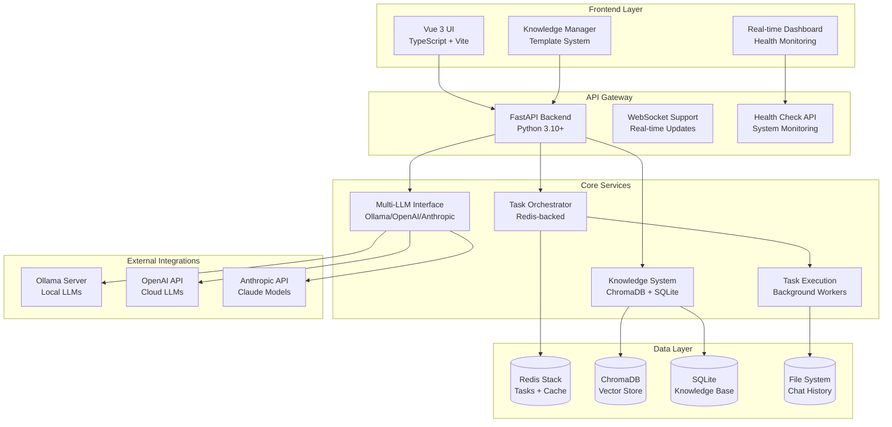
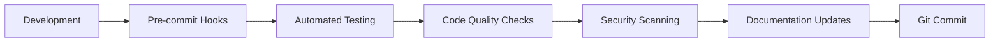

# AutoBot Architecture Overview

Comprehensive technical architecture documentation for AutoBot enterprise AI platform.

## System Architecture

AutoBot is a production-ready enterprise AI platform built with a modern microservices architecture. The system has evolved through 4 major development phases to achieve full enterprise-grade capabilities.

### High-Level Architecture



## Component Architecture

### Frontend (Vue 3 + TypeScript)

**Location**: `autobot-vue/`

**Key Features**:
- Modern Vue 3 with Composition API and TypeScript
- Real-time system health monitoring with 15-second intervals
- Advanced Knowledge Manager with 4 professional templates
- Glass-morphism design with responsive mobile-first approach
- Real-time WebSocket communication for live updates

**Core Components**:
- `SystemHealth.vue`: Real-time monitoring dashboard
- `KnowledgeManager.vue`: Template-based knowledge entry system
- `ChatInterface.vue`: Main chat interaction component
- `TemplateGallery.vue`: Visual template selection interface

### Backend API (FastAPI)

**Location**: `backend/`

**Architecture**:
```
backend/
├── app_factory.py          # Application factory pattern
├── api/                    # API endpoint modules
│   ├── system.py          # Health monitoring endpoints
│   ├── knowledge.py       # Knowledge base operations
│   ├── llm.py            # LLM management endpoints
│   ├── chat.py           # Chat interaction endpoints
│   ├── agent.py          # Agent control endpoints
│   └── websockets.py     # Real-time communication
├── services/              # Business logic layer
├── models/               # Data models and schemas
└── utils/                # Utility functions
```

**Key Features**:
- 6/6 major API endpoints operational (100% coverage)
- Comprehensive health monitoring with detailed metrics
- WebSocket support for real-time updates
- Automated API documentation with OpenAPI/Swagger
- Production-ready error handling and logging

### Core Services Layer

#### Task Orchestrator
**Location**: `src/orchestrator.py`

**Capabilities**:
- Redis-backed autonomous task execution
- Advanced task planning with dependency management
- Background processing with job queues
- Task state management and persistence
- Dynamic task scaling and load balancing

#### Multi-LLM Interface
**Location**: `src/llm_interface.py`

**Supported Providers**:
- **Ollama**: Local inference (tinyllama, phi, llama2, etc.)
- **OpenAI**: GPT-3.5, GPT-4, GPT-4 Turbo
- **Anthropic**: Claude 3 Sonnet, Claude 3 Haiku
- **HuggingFace**: Local transformer models

**Features**:
- Dynamic model discovery and health checking
- Automatic failover between providers
- Model-specific parameter optimization
- Token usage tracking and cost management

#### Knowledge Base System
**Location**: `src/knowledge_base.py`

**Architecture**:
- **ChromaDB**: Vector embeddings for semantic search
- **SQLite**: Structured knowledge storage with metadata
- **RAG Pipeline**: Retrieval-Augmented Generation
- **Template System**: 4 professional knowledge entry templates

**Templates**:
1. **Research Article**: Academic and technical documentation
2. **Meeting Notes**: Structured meeting documentation
3. **Bug Report**: Technical issue tracking and resolution
4. **Learning Notes**: Educational content and tutorials

#### Worker Node System
**Location**: `src/worker_node.py`

**Capabilities**:
- Background task execution with queue management
- System command execution with security controls
- File system operations with permission management
- GUI automation with OCR and window management
- Robust error handling and retry mechanisms

## Data Architecture

### Database Design

#### ChromaDB (Vector Database)
```
Collections:
├── knowledge_entries      # Vectorized knowledge base content
├── chat_history          # Conversation embeddings
└── document_chunks       # Large document processing
```

#### SQLite (Relational Database)
```sql
Tables:
├── knowledge_entries     # Structured knowledge metadata
├── templates            # Knowledge entry templates
├── system_metrics       # Health monitoring data
├── user_preferences     # Configuration settings
└── audit_logs          # Security and operation logs
```

#### Redis (Cache + Task Queue)
```
Data Structures:
├── task_queue           # Background job processing
├── system_cache         # Performance optimization
├── session_store        # User session management
├── real_time_metrics    # Live system monitoring
└── worker_locks         # Distributed task coordination
```

### File System Organization

```
data/
├── chats/               # JSON chat history files
├── chromadb/           # Vector database storage
├── messages/           # System message logs
├── file_manager_root/  # Uploaded file storage
└── knowledge_base.db   # SQLite database file

logs/
├── autobot.log         # Application logs
├── llm_usage.log       # LLM interaction logs
├── security.log        # Security event logs
└── performance.log     # Performance metrics

config/
├── config.yaml         # Main configuration
└── settings.json       # Runtime user settings
```

## Security Architecture

### Security Layers

1. **Input Validation**: All user inputs sanitized and validated
2. **Command Filtering**: System commands filtered through security layer
3. **File Access Control**: Restricted file system access with permissions
4. **API Security**: Rate limiting, authentication, and CORS protection
5. **Data Encryption**: Sensitive data encrypted at rest and in transit

### Security Components

**Location**: `src/security_layer.py`

**Features**:
- Command whitelist/blacklist filtering
- File system access restrictions
- API key encryption and secure storage
- Audit logging for compliance
- Session management and timeout controls

## Monitoring and Diagnostics

### System Health Monitoring
**Location**: `src/diagnostics.py`

**Metrics Tracked**:
- **System Resources**: CPU, memory, disk usage
- **Service Health**: Backend, Redis, LLM providers
- **Database Status**: ChromaDB, SQLite connection health
- **API Performance**: Response times, error rates
- **Task Queue Status**: Job counts, processing rates

### Real-time Dashboard

**Features**:
- 15-second refresh intervals for live monitoring
- Trend indicators for system metrics
- Color-coded health status indicators
- Detailed service status descriptions
- Alert system for critical issues

## Development Architecture

### Code Organization Principles

1. **Modular Design**: Clear separation of concerns
2. **Configuration-Driven**: All settings externalized
3. **Data Centralization**: Single data directory structure
4. **API-First**: RESTful design with OpenAPI documentation
5. **Event-Driven**: Asynchronous processing with event bus

### Development Workflow



### Quality Assurance

**Pre-commit Hooks**:
- **Black**: Python code formatting
- **Flake8**: Python linting and style checking
- **detect-secrets**: Prevent credential leaks
- **Trailing whitespace**: File cleanup
- **YAML validation**: Configuration file validation

## Deployment Architecture

### Production Deployment

**Components**:
- **Backend**: FastAPI server with Gunicorn/Uvicorn
- **Frontend**: Static build served via nginx or CDN
- **Database**: Persistent volumes for data storage
- **Redis**: Separate Redis instance for production
- **Monitoring**: Health check endpoints and logging

### Scalability Design

**Horizontal Scaling**:
- Multiple backend instances behind load balancer
- Redis cluster for distributed task processing
- Separate worker node instances for task execution
- CDN for frontend static asset delivery

**Vertical Scaling**:
- GPU acceleration for local LLM inference
- Memory optimization for large knowledge bases
- SSD storage for database performance
- CPU scaling for concurrent request handling

## Integration Points

### External System Integration

1. **LLM Providers**: Multi-provider support with failover
2. **Vector Databases**: ChromaDB with backup/restore
3. **Message Queues**: Redis-based task distribution
4. **File Systems**: Local and cloud storage integration
5. **Monitoring Systems**: Metrics export for observability

### API Integration Patterns

**RESTful APIs**:
- Standard HTTP methods (GET, POST, PUT, DELETE)
- JSON request/response format
- Comprehensive error handling
- Rate limiting and throttling
- API versioning support

**WebSocket APIs**:
- Real-time bidirectional communication
- Event-driven message patterns
- Connection lifecycle management
- Automatic reconnection handling
- Message queuing for offline clients

## Performance Architecture

### Optimization Strategies

1. **Caching**: Multi-layer caching with Redis
2. **Async Processing**: Non-blocking I/O operations
3. **Connection Pooling**: Database connection optimization
4. **Lazy Loading**: On-demand resource initialization
5. **Background Tasks**: Offload heavy operations

### Performance Metrics

**Response Times**:
- API endpoints: < 200ms average
- WebSocket messages: < 50ms latency
- Database queries: < 100ms average
- LLM inference: Variable by model size

**Throughput**:
- Concurrent users: 100+ supported
- API requests: 1000+ req/sec
- WebSocket connections: 500+ simultaneous
- Background tasks: 50+ jobs/minute

## Future Architecture Considerations

### Planned Enhancements

1. **Microservices**: Split into independent services
2. **Container Orchestration**: Kubernetes deployment
3. **API Gateway**: Centralized routing and security
4. **Event Streaming**: Apache Kafka integration
5. **Multi-tenancy**: Support for multiple organizations

### Technology Roadmap

**Short-term** (Next 3 months):
- Container deployment with Docker
- Advanced monitoring with Prometheus/Grafana
- Enhanced security with OAuth2/OIDC
- Performance optimization and caching improvements

**Long-term** (6-12 months):
- Microservices architecture migration
- Cloud-native deployment options
- Advanced AI capabilities and model fine-tuning
- Enterprise integration patterns

---

This architecture overview provides the foundation for understanding AutoBot's enterprise-grade design and implementation. For specific implementation details, refer to the individual component documentation and API references.
