# AutoBot Process Flow Documentation

Comprehensive process flow documentation for AutoBot enterprise AI platform, detailing system interactions and data flow patterns.

## System Process Overview

AutoBot operates through a sophisticated multi-layer process flow that handles user interactions, task orchestration, and AI-powered responses. The system has evolved through 4 development phases to achieve processing capabilities.

## High-Level Process Flow

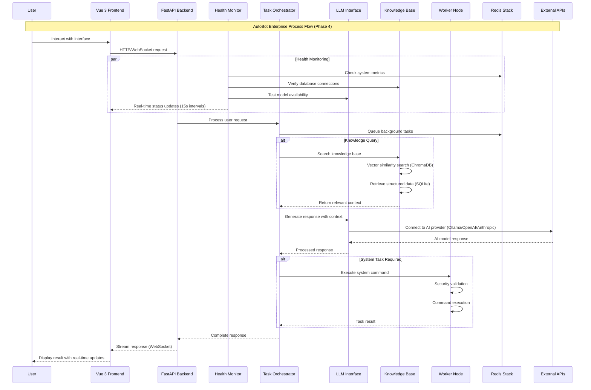
```mermaid
sequenceDiagram
    participant User as User
    participant Frontend as Vue 3 Frontend
    participant API as FastAPI Backend
    participant Health as Health Monitor
    participant Orchestrator as Task Orchestrator
    participant LLM as LLM Interface
    participant KB as Knowledge Base
    participant Worker as Worker Node
    participant Redis as Redis Stack
    participant External as External APIs

    Note over User,External: AutoBot Enterprise Process Flow (Phase 4)

    User->>Frontend: Interact with interface
    Frontend->>API: HTTP/WebSocket request

    par Health Monitoring
        Health->>Redis: Check system metrics
        Health->>KB: Verify database connections
        Health->>LLM: Test model availability
        Health-->>Frontend: Real-time status updates (15s intervals)
    end

    API->>Orchestrator: Process user request
    Orchestrator->>Redis: Queue background tasks

    alt Knowledge Query
        Orchestrator->>KB: Search knowledge base
        KB->>KB: Vector similarity search (ChromaDB)
        KB->>KB: Retrieve structured data (SQLite)
        KB-->>Orchestrator: Return relevant context
    end

    Orchestrator->>LLM: Generate response with context
    LLM->>External: Connect to AI provider (Ollama/OpenAI/Anthropic)
    External-->>LLM: AI model response
    LLM-->>Orchestrator: Processed response

    alt System Task Required
        Orchestrator->>Worker: Execute system command
        Worker->>Worker: Security validation
        Worker->>Worker: Command execution
        Worker-->>Orchestrator: Task result
    end

    Orchestrator-->>API: Complete response
    API-->>Frontend: Stream response (WebSocket)
    Frontend-->>User: Display result with real-time updates
```

## Detailed Process Flows

### 1. User Interaction Flow

#### Chat Interface Process

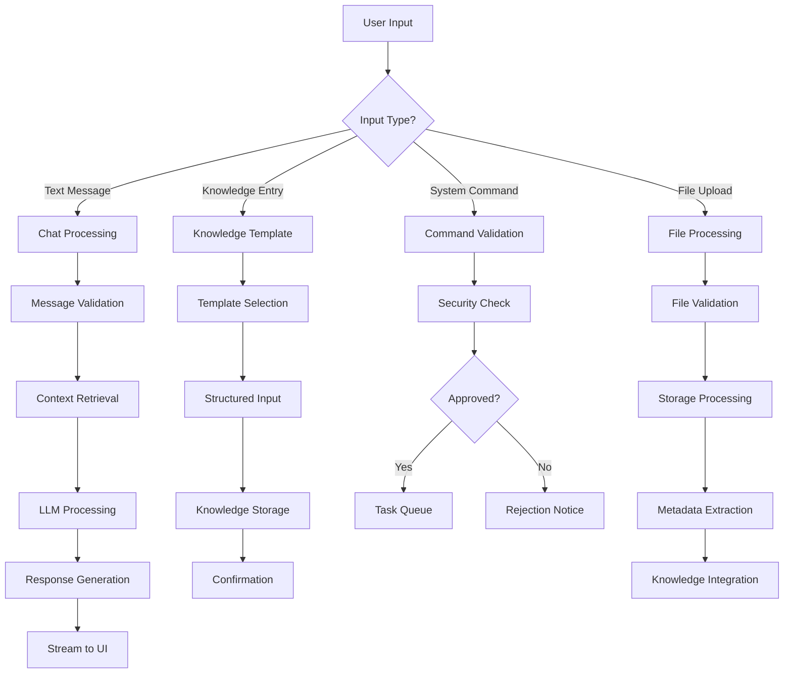
```mermaid
graph TD
    A[User Input] --> B{Input Type?}

    B -->|Text Message| C[Chat Processing]
    B -->|Knowledge Entry| D[Knowledge Template]
    B -->|System Command| E[Command Validation]
    B -->|File Upload| F[File Processing]

    C --> G[Message Validation]
    G --> H[Context Retrieval]
    H --> I[LLM Processing]
    I --> J[Response Generation]
    J --> K[Stream to UI]

    D --> L[Template Selection]
    L --> M[Structured Input]
    M --> N[Knowledge Storage]
    N --> O[Confirmation]

    E --> P[Security Check]
    P --> Q{Approved?}
    Q -->|Yes| R[Task Queue]
    Q -->|No| S[Rejection Notice]

    F --> T[File Validation]
    T --> U[Storage Processing]
    U --> V[Metadata Extraction]
    V --> W[Knowledge Integration]
```

#### Knowledge Management Flow

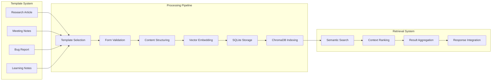
```mermaid
graph LR
    subgraph "Template System"
        A[Research Article]
        B[Meeting Notes]
        C[Bug Report]
        D[Learning Notes]
    end

    subgraph "Processing Pipeline"
        E[Template Selection] --> F[Form Validation]
        F --> G[Content Structuring]
        G --> H[Vector Embedding]
        H --> I[SQLite Storage]
        I --> J[ChromaDB Indexing]
    end

    subgraph "Retrieval System"
        K[Semantic Search] --> L[Context Ranking]
        L --> M[Result Aggregation]
        M --> N[Response Integration]
    end

    A --> E
    B --> E
    C --> E
    D --> E

    J --> K
```

### 2. Backend API Processing

#### Request Processing Pipeline

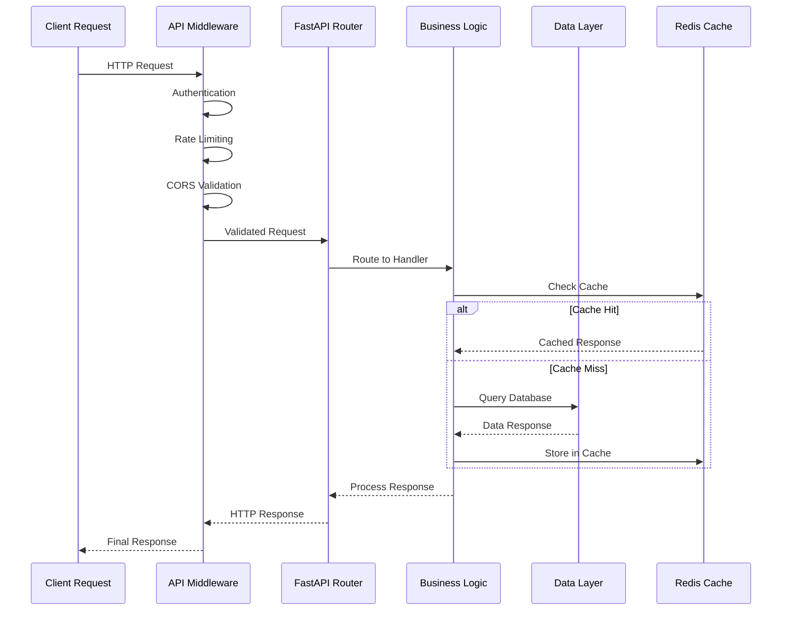
```mermaid
sequenceDiagram
    participant Client as Client Request
    participant Middleware as API Middleware
    participant Router as FastAPI Router
    participant Service as Business Logic
    participant Data as Data Layer
    participant Cache as Redis Cache

    Client->>Middleware: HTTP Request
    Middleware->>Middleware: Authentication
    Middleware->>Middleware: Rate Limiting
    Middleware->>Middleware: CORS Validation
    Middleware->>Router: Validated Request

    Router->>Service: Route to Handler
    Service->>Cache: Check Cache

    alt Cache Hit
        Cache-->>Service: Cached Response
    else Cache Miss
        Service->>Data: Query Database
        Data-->>Service: Data Response
        Service->>Cache: Store in Cache
    end

    Service-->>Router: Process Response
    Router-->>Middleware: HTTP Response
    Middleware-->>Client: Final Response
```

#### WebSocket Communication Flow

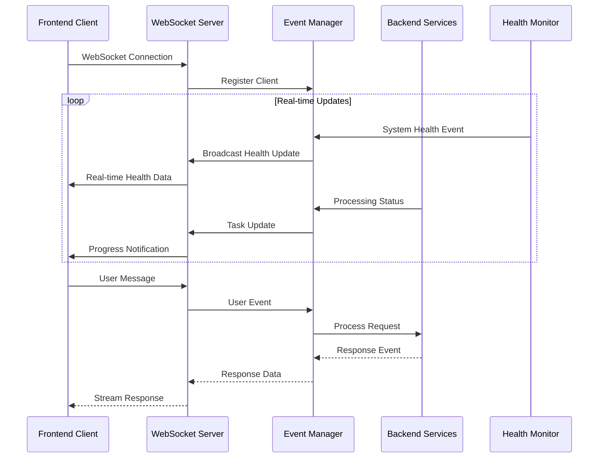
```mermaid
sequenceDiagram
    participant Client as Frontend Client
    participant WS as WebSocket Server
    participant EventBus as Event Manager
    participant Services as Backend Services
    participant Monitor as Health Monitor

    Client->>WS: WebSocket Connection
    WS->>EventBus: Register Client

    loop Real-time Updates
        Monitor->>EventBus: System Health Event
        EventBus->>WS: Broadcast Health Update
        WS->>Client: Real-time Health Data

        Services->>EventBus: Processing Status
        EventBus->>WS: Task Update
        WS->>Client: Progress Notification
    end

    Client->>WS: User Message
    WS->>EventBus: User Event
    EventBus->>Services: Process Request
    Services-->>EventBus: Response Event
    EventBus-->>WS: Response Data
    WS-->>Client: Stream Response
```

### 3. Task Orchestration Flow

#### Autonomous Task Processing

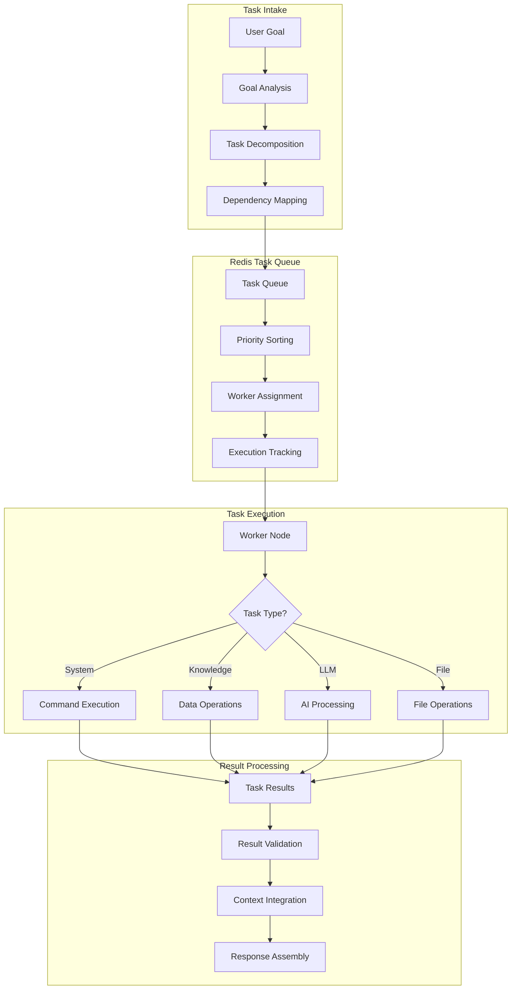
```mermaid
graph TB
    subgraph "Task Intake"
        A[User Goal] --> B[Goal Analysis]
        B --> C[Task Decomposition]
        C --> D[Dependency Mapping]
    end

    subgraph "Redis Task Queue"
        E[Task Queue] --> F[Priority Sorting]
        F --> G[Worker Assignment]
        G --> H[Execution Tracking]
    end

    subgraph "Task Execution"
        I[Worker Node] --> J{Task Type?}
        J -->|System| K[Command Execution]
        J -->|Knowledge| L[Data Operations]
        J -->|LLM| M[AI Processing]
        J -->|File| N[File Operations]
    end

    subgraph "Result Processing"
        O[Task Results] --> P[Result Validation]
        P --> Q[Context Integration]
        Q --> R[Response Assembly]
    end

    D --> E
    H --> I
    K --> O
    L --> O
    M --> O
    N --> O
```

#### Redis Background Processing

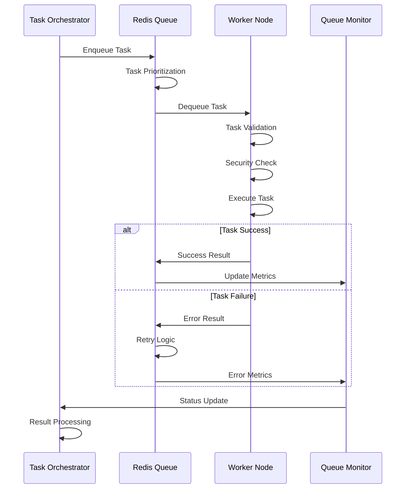
```mermaid
sequenceDiagram
    participant Orchestrator as Task Orchestrator
    participant Redis as Redis Queue
    participant Worker as Worker Node
    participant Monitor as Queue Monitor

    Orchestrator->>Redis: Enqueue Task
    Redis->>Redis: Task Prioritization
    Redis->>Worker: Dequeue Task

    Worker->>Worker: Task Validation
    Worker->>Worker: Security Check
    Worker->>Worker: Execute Task

    alt Task Success
        Worker->>Redis: Success Result
        Redis->>Monitor: Update Metrics
    else Task Failure
        Worker->>Redis: Error Result
        Redis->>Redis: Retry Logic
        Redis->>Monitor: Error Metrics
    end

    Monitor->>Orchestrator: Status Update
    Orchestrator->>Orchestrator: Result Processing
```

### 4. LLM Interface Processing

#### Multi-Provider LLM Flow

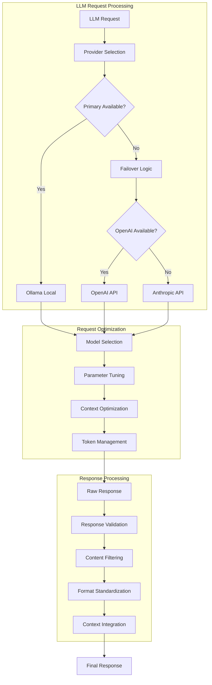
```mermaid
graph TD
    subgraph "LLM Request Processing"
        A[LLM Request] --> B[Provider Selection]
        B --> C{Primary Available?}
        C -->|Yes| D[Ollama Local]
        C -->|No| E[Failover Logic]
        E --> F{OpenAI Available?}
        F -->|Yes| G[OpenAI API]
        F -->|No| H[Anthropic API]
    end

    subgraph "Request Optimization"
        I[Model Selection] --> J[Parameter Tuning]
        J --> K[Context Optimization]
        K --> L[Token Management]
    end

    subgraph "Response Processing"
        M[Raw Response] --> N[Response Validation]
        N --> O[Content Filtering]
        O --> P[Format Standardization]
        P --> Q[Context Integration]
    end

    D --> I
    G --> I
    H --> I
    L --> M
    Q --> R[Final Response]
```

#### Model Health Monitoring

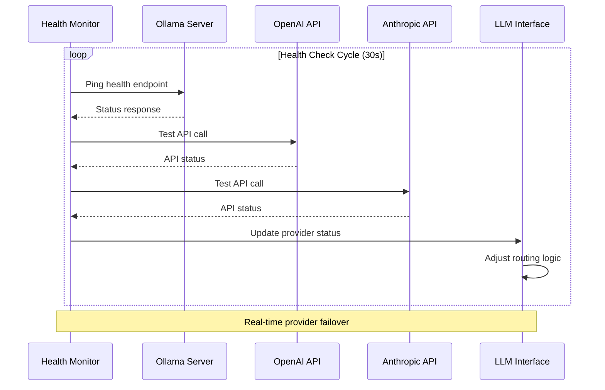
```mermaid
sequenceDiagram
    participant Health as Health Monitor
    participant Ollama as Ollama Server
    participant OpenAI as OpenAI API
    participant Anthropic as Anthropic API
    participant LLM as LLM Interface

    loop Health Check Cycle (30s)
        Health->>Ollama: Ping health endpoint
        Ollama-->>Health: Status response

        Health->>OpenAI: Test API call
        OpenAI-->>Health: API status

        Health->>Anthropic: Test API call
        Anthropic-->>Health: API status

        Health->>LLM: Update provider status
        LLM->>LLM: Adjust routing logic
    end

    Note over Health,LLM: Real-time provider failover
```

### 5. Knowledge Base Processing

#### Knowledge Entry Workflow

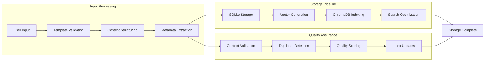
```mermaid
graph LR
    subgraph "Input Processing"
        A[User Input] --> B[Template Validation]
        B --> C[Content Structuring]
        C --> D[Metadata Extraction]
    end

    subgraph "Storage Pipeline"
        E[SQLite Storage] --> F[Vector Generation]
        F --> G[ChromaDB Indexing]
        G --> H[Search Optimization]
    end

    subgraph "Quality Assurance"
        I[Content Validation] --> J[Duplicate Detection]
        J --> K[Quality Scoring]
        K --> L[Index Updates]
    end

    D --> E
    D --> I
    H --> M[Storage Complete]
    L --> M
```

#### Knowledge Retrieval Process

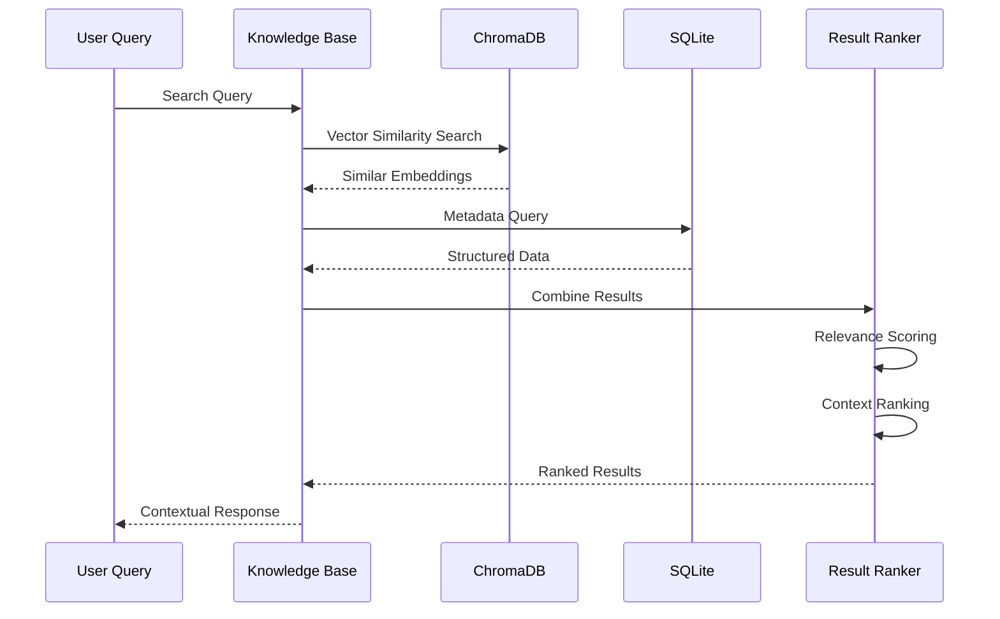
```mermaid
sequenceDiagram
    participant User as User Query
    participant KB as Knowledge Base
    participant Vector as ChromaDB
    participant SQL as SQLite
    participant Ranker as Result Ranker

    User->>KB: Search Query
    KB->>Vector: Vector Similarity Search
    Vector-->>KB: Similar Embeddings

    KB->>SQL: Metadata Query
    SQL-->>KB: Structured Data

    KB->>Ranker: Combine Results
    Ranker->>Ranker: Relevance Scoring
    Ranker->>Ranker: Context Ranking
    Ranker-->>KB: Ranked Results

    KB-->>User: Contextual Response
```

### 6. System Monitoring Flow

#### Real-time Health Monitoring

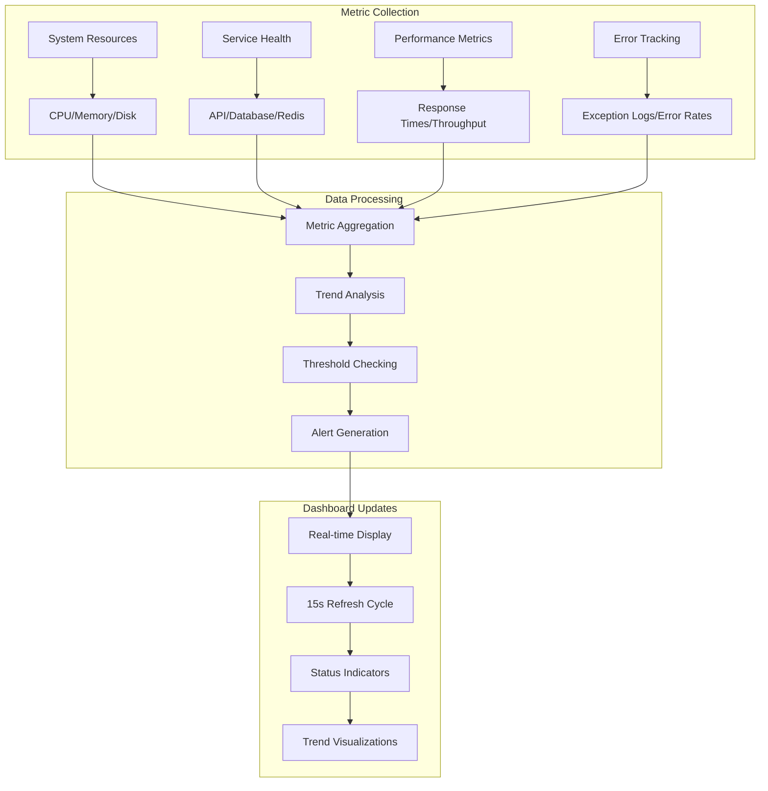
```mermaid
graph TB
    subgraph "Metric Collection"
        A[System Resources] --> B[CPU/Memory/Disk]
        C[Service Health] --> D[API/Database/Redis]
        E[Performance Metrics] --> F[Response Times/Throughput]
        G[Error Tracking] --> H[Exception Logs/Error Rates]
    end

    subgraph "Data Processing"
        I[Metric Aggregation] --> J[Trend Analysis]
        J --> K[Threshold Checking]
        K --> L[Alert Generation]
    end

    subgraph "Dashboard Updates"
        M[Real-time Display] --> N[15s Refresh Cycle]
        N --> O[Status Indicators]
        O --> P[Trend Visualizations]
    end

    B --> I
    D --> I
    F --> I
    H --> I
    L --> M
```

#### Performance Optimization Flow

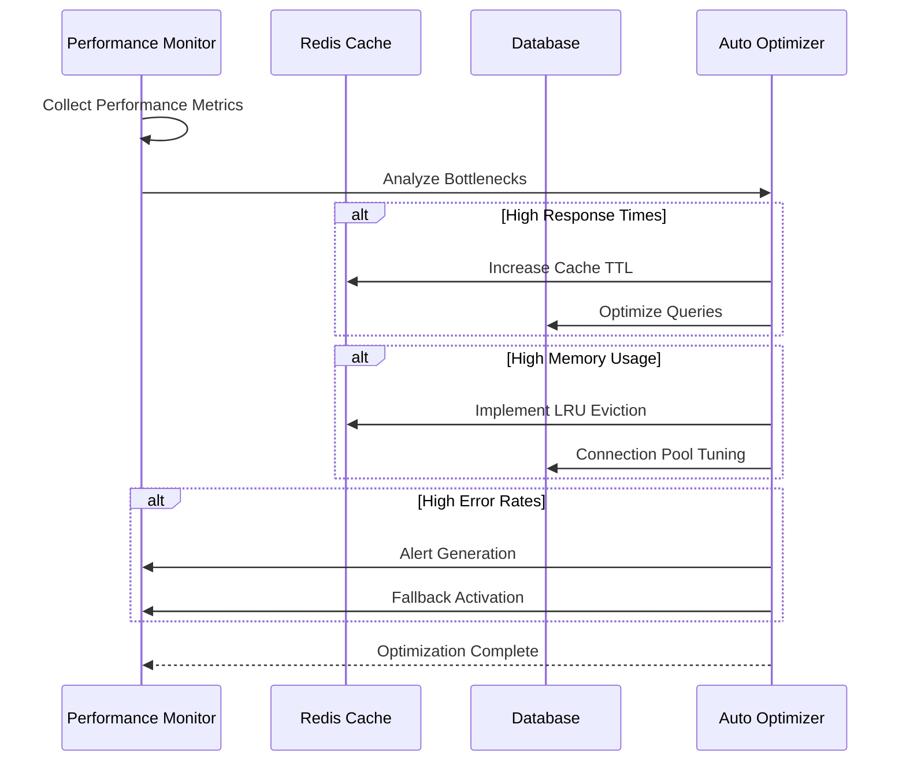
```mermaid
sequenceDiagram
    participant Monitor as Performance Monitor
    participant Cache as Redis Cache
    participant DB as Database
    participant Optimizer as Auto Optimizer

    Monitor->>Monitor: Collect Performance Metrics
    Monitor->>Optimizer: Analyze Bottlenecks

    alt High Response Times
        Optimizer->>Cache: Increase Cache TTL
        Optimizer->>DB: Optimize Queries
    end

    alt High Memory Usage
        Optimizer->>Cache: Implement LRU Eviction
        Optimizer->>DB: Connection Pool Tuning
    end

    alt High Error Rates
        Optimizer->>Monitor: Alert Generation
        Optimizer->>Monitor: Fallback Activation
    end

    Optimizer-->>Monitor: Optimization Complete
```

## Data Flow Patterns

### 1. Request-Response Pattern

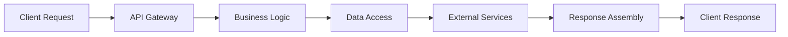
```mermaid
graph LR
    A[Client Request] --> B[API Gateway]
    B --> C[Business Logic]
    C --> D[Data Access]
    D --> E[External Services]
    E --> F[Response Assembly]
    F --> G[Client Response]
```

### 2. Event-Driven Pattern

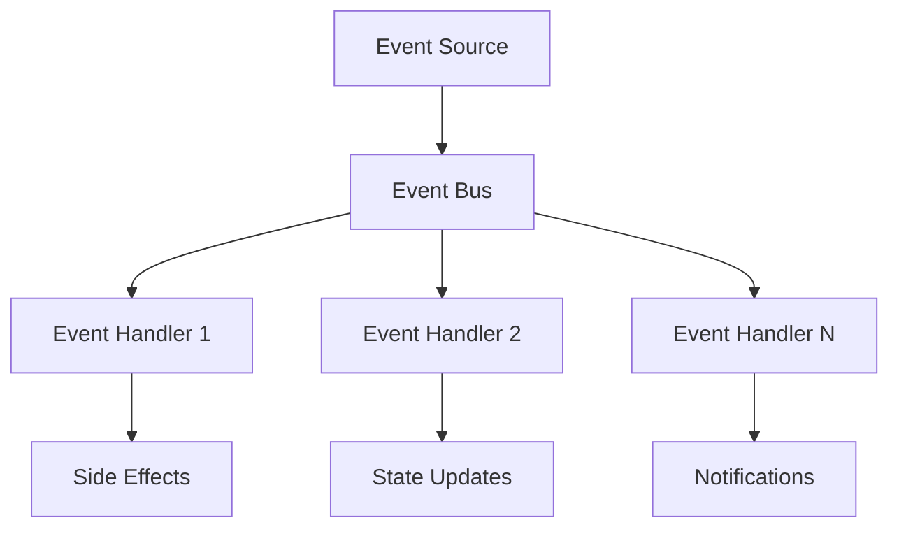
```mermaid
graph TD
    A[Event Source] --> B[Event Bus]
    B --> C[Event Handler 1]
    B --> D[Event Handler 2]
    B --> E[Event Handler N]
    C --> F[Side Effects]
    D --> G[State Updates]
    E --> H[Notifications]
```

### 3. Pub/Sub Pattern

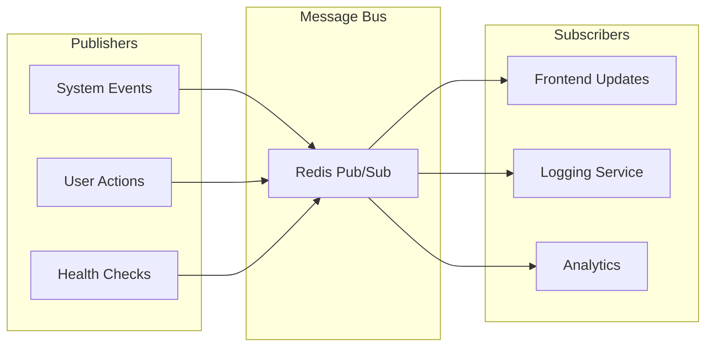
```mermaid
graph LR
    subgraph "Publishers"
        A[System Events]
        B[User Actions]
        C[Health Checks]
    end

    subgraph "Message Bus"
        D[Redis Pub/Sub]
    end

    subgraph "Subscribers"
        E[Frontend Updates]
        F[Logging Service]
        G[Analytics]
    end

    A --> D
    B --> D
    C --> D
    D --> E
    D --> F
    D --> G
```

## Error Handling Flows

### 1. API Error Processing

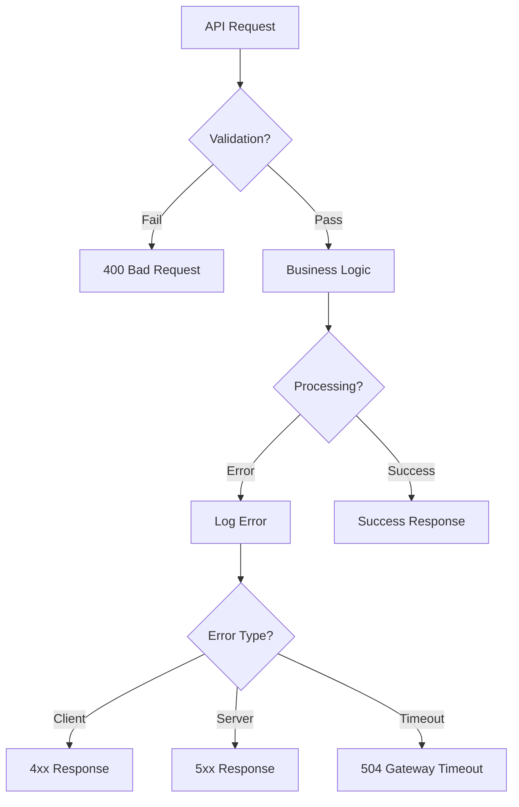
```mermaid
graph TD
    A[API Request] --> B{Validation?}
    B -->|Fail| C[400 Bad Request]
    B -->|Pass| D[Business Logic]
    D --> E{Processing?}
    E -->|Error| F[Log Error]
    E -->|Success| G[Success Response]
    F --> H{Error Type?}
    H -->|Client| I[4xx Response]
    H -->|Server| J[5xx Response]
    H -->|Timeout| K[504 Gateway Timeout]
```

### 2. LLM Fallback Processing

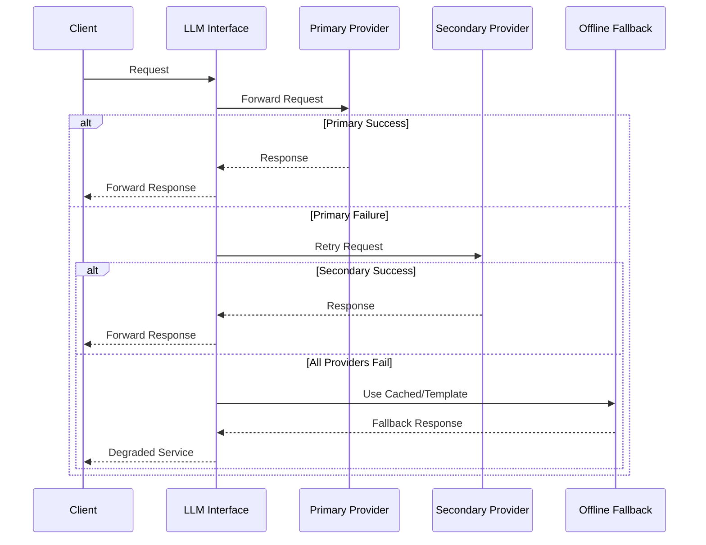
```mermaid
sequenceDiagram
    participant Client as Client
    participant LLM as LLM Interface
    participant Primary as Primary Provider
    participant Secondary as Secondary Provider
    participant Fallback as Offline Fallback

    Client->>LLM: Request
    LLM->>Primary: Forward Request

    alt Primary Success
        Primary-->>LLM: Response
        LLM-->>Client: Forward Response
    else Primary Failure
        LLM->>Secondary: Retry Request
        alt Secondary Success
            Secondary-->>LLM: Response
            LLM-->>Client: Forward Response
        else All Providers Fail
            LLM->>Fallback: Use Cached/Template
            Fallback-->>LLM: Fallback Response
            LLM-->>Client: Degraded Service
        end
    end
```

## Performance Optimization Patterns

### 1. Caching Strategy

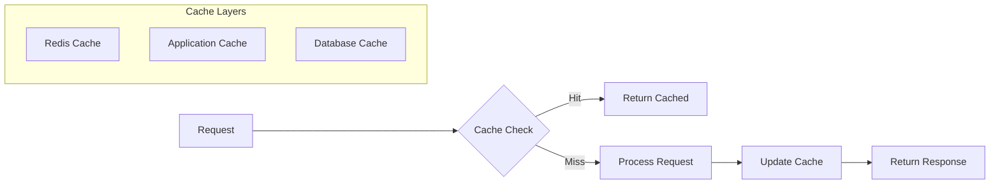
```mermaid
graph LR
    A[Request] --> B{Cache Check}
    B -->|Hit| C[Return Cached]
    B -->|Miss| D[Process Request]
    D --> E[Update Cache]
    E --> F[Return Response]

    subgraph "Cache Layers"
        G[Redis Cache]
        H[Application Cache]
        I[Database Cache]
    end
```

### 2. Database Optimization

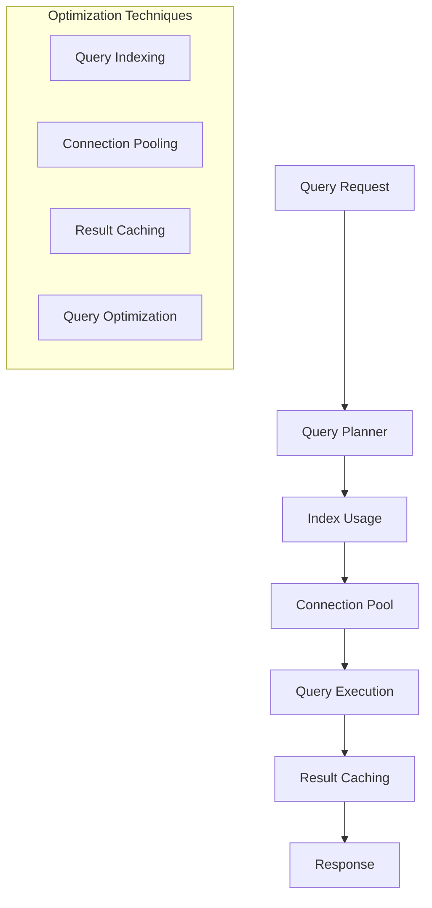
```mermaid
graph TD
    A[Query Request] --> B[Query Planner]
    B --> C[Index Usage]
    C --> D[Connection Pool]
    D --> E[Query Execution]
    E --> F[Result Caching]
    F --> G[Response]

    subgraph "Optimization Techniques"
        H[Query Indexing]
        I[Connection Pooling]
        J[Result Caching]
        K[Query Optimization]
    end
```

## Security Process Flow

### 1. Authentication Flow

```mermaid
sequenceDiagram
    participant Client as Client
    participant Auth as Auth Service
    participant API as API Gateway
    participant Service as Backend Service

    Client->>Auth: Login Request
    Auth->>Auth: Validate Credentials
    Auth-->>Client: JWT Token

    Client->>API: Request + JWT
    API->>API: Validate Token
    API->>Service: Authorized Request
    Service-->>API: Response
    API-->>Client: Final Response
```

### 2. Command Security Flow

```mermaid
graph TD
    A[System Command] --> B[Security Layer]
    B --> C{Command Validation}
    C -->|Approved| D[Sandbox Execution]
    C -->|Blocked| E[Security Alert]
    D --> F[Result Validation]
    F --> G[Audit Log]
    G --> H[Return Result]
    E --> I[Log Security Event]
```

---

This comprehensive process flow documentation provides detailed insights into AutoBot's processing architecture. Each flow represents real production patterns that have been tested and optimized through the 4-phase development cycle.
