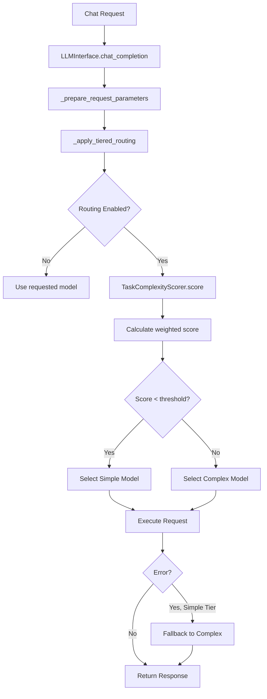

# Tiered Model Routing

> **Status**: Fully Implemented (Issue #696)
> **Version**: 1.0.0
> **Last Updated**: 2026-02-13

## Overview

Tiered Model Routing automatically selects the most appropriate LLM model based on query complexity analysis. This optimization:

- **Reduces latency** for simple queries (smaller models respond faster)
- **Saves compute resources** by not using 7B models for simple tasks
- **Improves throughput** by parallelizing across model tiers
- **Maintains quality** by escalating complex queries to capable models

## Architecture

### Two-Tier System

| Tier | Model Size | Complexity Score | Use Cases |
|------|-----------|------------------|-----------|
| **Simple** | 1B-3B params | < 3.0 (default) | Basic Q&A, simple lookups, entity extraction |
| **Complex** | 7B+ params | ≥ 3.0 (default) | Multi-step reasoning, code generation, analysis |

**Default Models:**
- Simple Tier: `gemma2:2b` (fast, low resource)
- Complex Tier: `mistral:7b-instruct` (capable, comprehensive)

### Complexity Scoring

Requests are scored on a **0-10 scale** using weighted heuristics:

| Factor | Weight | Score Range | Indicators |
|--------|--------|-------------|------------|
| **Length** | 15% | 0-3 | Message character count |
| **Code** | 25% | 0-3 | Code blocks, function definitions, syntax patterns |
| **Technical Terms** | 20% | 0-3 | API, async, database, algorithm, etc. |
| **Multi-step** | 20% | 0-3 | "First...then", numbered steps, sequences |
| **Question Complexity** | 20% | 0-3 | "Why", "explain", "compare", "design" |

**Scoring Examples:**

```python
# Score: 0.8 → Simple Tier
"What is Python?"

# Score: 2.1 → Simple Tier
"List the benefits of async programming"

# Score: 4.5 → Complex Tier
"Explain how to implement OAuth authentication with JWT tokens
and handle CORS in a REST API"

# Score: 7.2 → Complex Tier
"""
Design a microservices architecture with:
1. Kubernetes deployment
2. Redis caching layer
3. OAuth2 authentication
4. Load balancing strategy

```python
async def get_user(user_id):
    # Implementation needed
    pass
```
"""
```

### Integration Flow



## Configuration

### Environment Variables

Add to `.env` or `config/llm_config.yaml`:

```bash
# Enable/disable tiered routing (default: true)
AUTOBOT_TIERED_ROUTING_ENABLED=true

# Complexity threshold (0-10 scale, default: 3.0)
# Scores below this use simple tier, above use complex tier
AUTOBOT_COMPLEXITY_THRESHOLD=3.0

# Model assignments
AUTOBOT_MODEL_TIER_SIMPLE=gemma2:2b
AUTOBOT_MODEL_TIER_COMPLEX=mistral:7b-instruct

# Fallback behavior (default: true)
# If simple tier fails, automatically retry with complex tier
AUTOBOT_FALLBACK_TO_COMPLEX=true

# Logging (default: true for both)
AUTOBOT_TIERED_LOG_SCORES=true
AUTOBOT_TIERED_LOG_ROUTING=true
```

### ConfigRegistry Integration

Access configuration programmatically:

```python
from config.registry import ConfigRegistry

# Get tiered routing config
tier_config = ConfigRegistry.get("llm.tiered_routing", {})

# Check if enabled
enabled = tier_config.get("enabled", True)

# Get models
simple_model = tier_config.get("models", {}).get("simple", "gemma2:2b")
complex_model = tier_config.get("models", {}).get("complex", "mistral:7b-instruct")

# Get threshold
threshold = tier_config.get("complexity_threshold", 3.0)
```

### Runtime Configuration

Update configuration via API (requires admin authentication):

```bash
# Get current config
curl -X GET http://localhost:8001/api/llm/tiered-routing/config \
  -H "Authorization: Bearer $TOKEN"

# Update threshold
curl -X POST http://localhost:8001/api/llm/tiered-routing/config \
  -H "Authorization: Bearer $ADMIN_TOKEN" \
  -H "Content-Type: application/json" \
  -d '{
    "complexity_threshold": 4.0,
    "models": {
      "simple": "phi:2.7b",
      "complex": "llama3:8b"
    }
  }'

# Disable tiered routing
curl -X POST http://localhost:8001/api/llm/tiered-routing/config \
  -H "Authorization: Bearer $ADMIN_TOKEN" \
  -H "Content-Type: application/json" \
  -d '{"enabled": false}'
```

## API Endpoints

### GET `/api/llm/tiered-routing/metrics`

Get routing statistics for monitoring and optimization.

**Authentication:** Required (user token)

**Response:**
```json
{
  "enabled": true,
  "metrics": {
    "simple_tier_requests": 1250,
    "complex_tier_requests": 430,
    "total_requests": 1680,
    "simple_tier_percentage": 74.4,
    "avg_simple_score": 1.8,
    "avg_complex_score": 5.2,
    "fallback_count": 12
  }
}
```

**Interpretation:**
- `simple_tier_percentage`: High percentage (>70%) indicates good optimization
- `avg_simple_score`: Should be well below threshold (e.g., 1-2 for threshold 3.0)
- `avg_complex_score`: Should be above threshold (e.g., 4-6 for threshold 3.0)
- `fallback_count`: Low count (<5% of simple requests) is ideal

### GET `/api/llm/tiered-routing/config`

Get current tiered routing configuration.

**Authentication:** Required (user token)

**Response:**
```json
{
  "enabled": true,
  "complexity_threshold": 3.0,
  "models": {
    "simple": "gemma2:2b",
    "complex": "mistral:7b-instruct"
  },
  "fallback_to_complex": true,
  "logging": {
    "log_scores": true,
    "log_routing_decisions": true
  }
}
```

### POST `/api/llm/tiered-routing/config`

Update tiered routing configuration at runtime.

**Authentication:** Required (admin token)

**Request Body:**
```json
{
  "enabled": true,
  "complexity_threshold": 4.0,
  "models": {
    "simple": "qwen2:1.5b",
    "complex": "llama3:8b"
  },
  "fallback_to_complex": true
}
```

**Response:**
```json
{
  "success": true,
  "message": "Tiered routing configuration updated successfully",
  "config": {
    "enabled": true,
    "complexity_threshold": 4.0,
    "models": {
      "simple": "qwen2:1.5b",
      "complex": "llama3:8b"
    },
    "fallback_to_complex": true
  }
}
```

### POST `/api/llm/tiered-routing/metrics/reset`

Reset routing metrics to zero (useful after config changes).

**Authentication:** Required (admin token)

**Response:**
```json
{
  "success": true,
  "message": "Tiered routing metrics reset successfully",
  "metrics": {
    "simple_tier_requests": 0,
    "complex_tier_requests": 0,
    "total_requests": 0,
    "simple_tier_percentage": 0.0,
    "avg_simple_score": 0.0,
    "avg_complex_score": 0.0,
    "fallback_count": 0
  }
}
```

## Monitoring & Optimization

### Key Metrics

Monitor these metrics to optimize tiered routing:

1. **Simple Tier Percentage** (target: 60-80%)
   - Too low: Threshold may be too strict, wasting compute
   - Too high: May be routing complex queries to simple tier

2. **Fallback Rate** (target: <5% of simple tier requests)
   - High rate indicates threshold is too aggressive
   - Consider raising threshold or improving simple model

3. **Score Separation**
   - Simple tier average should be 1-2 points below threshold
   - Complex tier average should be 1-2 points above threshold
   - Poor separation indicates threshold needs adjustment

### Tuning the Threshold

**If simple tier percentage is too low (<50%):**
```bash
# Increase threshold to route more queries to simple tier
curl -X POST http://localhost:8001/api/llm/tiered-routing/config \
  -H "Authorization: Bearer $ADMIN_TOKEN" \
  -H "Content-Type: application/json" \
  -d '{"complexity_threshold": 4.0}'  # Was 3.0
```

**If fallback rate is high (>10%):**
```bash
# Decrease threshold to be more conservative
curl -X POST http://localhost:8001/api/llm/tiered-routing/config \
  -H "Authorization: Bearer $ADMIN_TOKEN" \
  -H "Content-Type: application/json" \
  -d '{"complexity_threshold": 2.5}'  # Was 3.0
```

### Logging

When `log_routing_decisions` is enabled, routing decisions are logged:

```
INFO - Tiered routing: mistral:7b-instruct -> gemma2:2b
       (score=1.8, tier=simple, reason=Low complexity request with minimal indicators)

INFO - Tiered routing: selected mistral:7b-instruct
       (score=5.4, tier=complex)

WARNING - Tiered routing fallback triggered: simple -> complex tier
```

When `log_scores` is enabled, detailed complexity analysis is logged:

```
DEBUG - Complexity score: 2.3 (simple) - factors: {
  'length': 0.0,
  'code': 1.0,
  'technical': 0.5,
  'multistep': 0.0,
  'question': 0.8
}
```

## Performance Impact

### Latency Reduction

Simple tier models (1B-3B params) typically respond **2-4x faster**:

| Model | Avg Latency | Tokens/sec |
|-------|-------------|------------|
| gemma2:2b | 150ms | 120 |
| mistral:7b | 450ms | 35 |

For workloads with 70% simple queries, tiered routing reduces average latency by ~40%.

### Resource Savings

Simple models use **50-70% less compute**:

| Model | VRAM | CPU/Token | Concurrent Capacity |
|-------|------|-----------|---------------------|
| gemma2:2b | 2GB | Low | 8-12 parallel |
| mistral:7b | 6GB | High | 2-4 parallel |

This enables serving more users on the same hardware.

## Code Reference

### Core Components

- **Scorer**: `autobot-user-backend/llm_interface_pkg/tiered_routing/complexity_scorer.py`
- **Router**: `autobot-user-backend/llm_interface_pkg/tiered_routing/tier_router.py`
- **Config**: `autobot-user-backend/llm_interface_pkg/tiered_routing/tier_config.py`
- **Integration**: `autobot-user-backend/llm_interface_pkg/interface.py:795`
- **API**: `autobot-user-backend/api/llm.py:874-1150`
- **Tests**: `autobot-user-backend/llm_interface_pkg/tiered_routing_test.py`

### Usage Example

```python
from llm_interface_pkg.tiered_routing import (
    TieredModelRouter,
    TierConfig,
    get_tiered_router,
)

# Using singleton
router = get_tiered_router()
model, result = router.route(messages)

print(f"Selected: {model} (score={result.score}, tier={result.tier})")
# Output: Selected: gemma2:2b (score=1.8, tier=simple)

# Custom configuration
config = TierConfig(
    enabled=True,
    complexity_threshold=4.0,
    models=TierModels(simple="phi:2.7b", complex="llama3:8b"),
)
router = TieredModelRouter(config)
```

## Troubleshooting

### Routing not working

1. Check if enabled:
   ```bash
   curl http://localhost:8001/api/llm/tiered-routing/config
   ```

2. Verify models exist in Ollama:
   ```bash
   curl http://localhost:11434/api/tags
   ```

3. Check logs for routing decisions:
   ```bash
   grep "Tiered routing" logs/autobot.log
   ```

### Too many fallbacks

Indicates simple model struggling with requests:

1. Lower threshold to be more conservative
2. Upgrade simple model (e.g., gemma2:2b → phi:2.7b)
3. Review `avg_simple_score` - should be well below threshold

### Unexpected model selection

1. Enable `log_scores` to see factor breakdown
2. Review complexity factors:
   - Check if code patterns detected correctly
   - Verify technical term detection
   - Confirm multi-step pattern matching

## Future Enhancements

Potential extensions (not currently implemented):

1. **Three-Tier System**: Add moderate tier (3B models) between simple/complex
2. **Dynamic Thresholds**: Adjust based on server load and latency SLAs
3. **Per-Agent Configuration**: Different thresholds per agent type
4. **Quality Feedback Loop**: ML model to predict optimal tier based on response quality
5. **Cost Optimization**: Factor in API costs for cloud-based tiers

## Related Documentation

- [LLM Provider Configuration](./LLM_PROVIDER_CONFIGURATION.md)
- [Performance Optimization](./PERFORMANCE_OPTIMIZATION.md)
- [SSOT Configuration Guide](./SSOT_CONFIG_GUIDE.md)
- [API Documentation](../api/COMPREHENSIVE_API_DOCUMENTATION.md)

---

**Issue References:**
- #696 - Tiered Model Distribution Strategy (this implementation)
- #748 - Initial tiered routing framework
- #551 - L1/L2 caching system
- #697 - OpenTelemetry tracing integration
