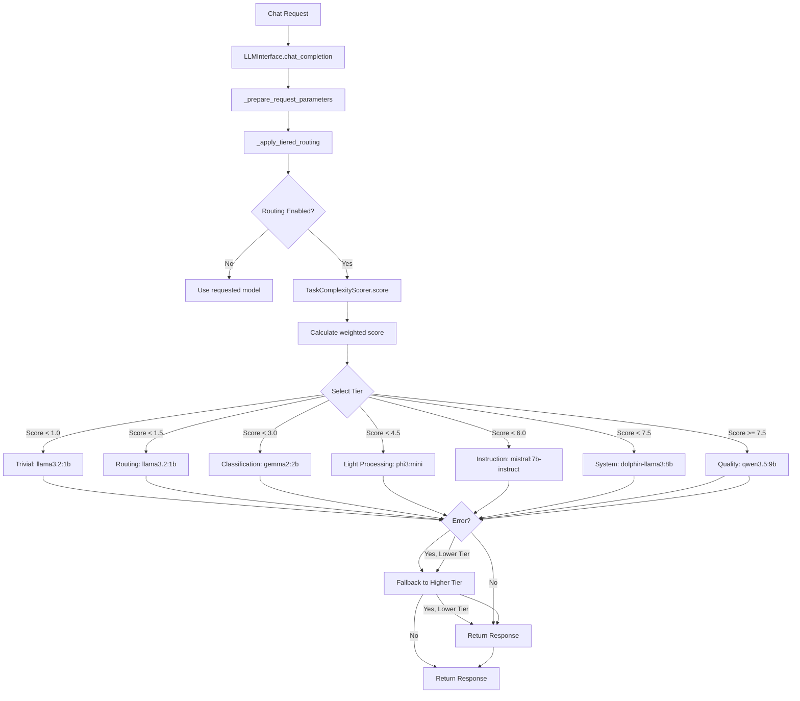

# Tiered Model Routing

> **Status**: Fully Implemented (Issue #696, updated by #2553, trivial tier added by #9050)
> **Version**: 2.1.0 (7-tier architecture with trivial tier)
> **Last Updated**: 2026-06-01

## Overview

Tiered Model Routing automatically selects the most appropriate LLM model based on query complexity analysis. This optimization:

- **Reduces latency** for simple queries (smaller models respond faster)
- **Saves compute resources** by not using large models for simple tasks
- **Improves throughput** by parallelizing across model tiers
- **Maintains quality** by escalating complex queries to capable models

## Architecture

### Seven-Tier System

| Tier | Model | Purpose | Use Cases |
|------|-------|---------|-----------|
| **Trivial** | `llama3.2:1b` | Lightweight inference | Simplest queries with no tools/RAG/memory (GH#9050) |
| **Routing** | `llama3.2:1b` | Orchestrator | Request classification, routing decisions |
| **Classification** | `gemma2:2b` | Classification | Intent detection, category assignment |
| **Light Processing** | `phi3:mini` | Extraction, formatting | Simple extraction, text formatting, templates |
| **Instruction** | `mistral:7b-instruct` | RAG, step execution | Multi-step reasoning, document synthesis, RAG |
| **System** | `dolphin-llama3:8b` | Commands, security | System commands, security analysis, validation |
| **Quality** | `qwen3.5:9b` | Chat, research, code | Complex chat, research, code generation |

**New in v2.1.0:** The **Trivial** tier (GH#9050) is the fastest tier for the simplest queries that don't require tool use, RAG, or memory context. It uses the same lightweight model as the Routing tier but is optimized for direct question-answer scenarios with minimal overhead.

### Complexity Scoring

Requests are scored on a **0-10 scale** using weighted heuristics:

| Factor | Weight | Score Range | Indicators |
|--------|--------|-------------|------------|
| **Length** | 15% | 0-3 | Message character count |
| **Code** | 25% | 0-3 | Code blocks, function definitions, syntax patterns |
| **Technical Terms** | 20% | 0-3 | API, async, database, algorithm, etc. |
| **Multi-step** | 20% | 0-3 | "First...then", numbered steps, sequences |
| **Question Complexity** | 20% | 0-3 | "Why", "explain", "compare", "design" |

**Scoring Examples:**

```python
# Score: 0.5 -> Trivial tier (llama3.2:1b) - NEW in v2.1.0
"What is Python?"

# Score: 1.5 -> Routing tier (llama3.2:1b)
"Should I use sync or async here?"

# Score: 2.1 -> Classification tier (gemma2:2b)
"List the benefits of async programming"

# Score: 4.5 -> Instruction tier (mistral:7b-instruct)
"Explain how to implement OAuth authentication with JWT tokens
and handle CORS in a REST API"

# Score: 7.2 -> Quality tier (qwen3.5:9b)
"""
Design a microservices architecture with:
1. Kubernetes deployment
2. Redis caching layer
3. OAuth2 authentication
4. Load balancing strategy

```python
async def get_user(user_id):
    # Implementation needed
    pass
```
"""
```

### Integration Flow


```mermaid
graph TD
    A[Chat Request] --> B[LLMInterface.chat_completion]
    B --> C[_prepare_request_parameters]
    C --> D[_apply_tiered_routing]
    D --> E{Routing Enabled?}
    E -->|No| F[Use requested model]
    E -->|Yes| G[TaskComplexityScorer.score]
    G --> H[Calculate weighted score]
    H --> I{Select Tier}
    I -->|Score < 1.0| J[Trivial: llama3.2:1b]
    I -->|Score < 1.5| K[Routing: llama3.2:1b]
    I -->|Score < 3.0| L[Classification: gemma2:2b]
    I -->|Score < 4.5| M[Light Processing: phi3:mini]
    I -->|Score < 6.0| N[Instruction: mistral:7b-instruct]
    I -->|Score < 7.5| O[System: dolphin-llama3:8b]
    I -->|Score >= 7.5| P[Quality: qwen3.5:9b]
    J --> Q[Execute Request]
    K --> Q
    L --> Q
    M --> Q
    N --> Q
    O --> Q
    P --> Q
    Q --> R{Error?}
    R -->|Yes, Lower Tier| S[Fallback to Higher Tier]
    R -->|No| T[Return Response]
    S --> T
    P --> Q{Error?}
    Q -->|Yes, Lower Tier| R[Fallback to Higher Tier]
    Q -->|No| S[Return Response]
    R --> S
```

## Configuration

### Environment Variables

Add to `.env` or `config/llm_config.yaml`:

```bash
# Enable/disable tiered routing (default: true)
AUTOBOT_TIERED_ROUTING_ENABLED=true

# Model assignments per tier (v2.1.0 includes trivial tier)
AUTOBOT_MODEL_TIER_TRIVIAL=llama3.2:1b       # NEW in v2.1.0 (GH#9050)
AUTOBOT_MODEL_TIER_ROUTING=llama3.2:1b
AUTOBOT_MODEL_TIER_CLASSIFICATION=gemma2:2b
AUTOBOT_MODEL_TIER_LIGHT=phi3:mini
AUTOBOT_MODEL_TIER_INSTRUCTION=mistral:7b-instruct
AUTOBOT_MODEL_TIER_SYSTEM=dolphin-llama3:8b
AUTOBOT_MODEL_TIER_QUALITY=qwen3.5:9b

# Fallback behavior (default: true)
# If a lower tier fails, automatically retry with a higher tier
AUTOBOT_FALLBACK_TO_HIGHER_TIER=true

# Logging (default: true for both)
AUTOBOT_TIERED_LOG_SCORES=true
AUTOBOT_TIERED_LOG_ROUTING=true
```

### ConfigRegistry Integration

Access configuration programmatically:

```python
from config.registry import ConfigRegistry

# Get tiered routing config
tier_config = ConfigRegistry.get("llm.tiered_routing", {})

# Check if enabled
enabled = tier_config.get("enabled", True)

# Get models per tier
models = tier_config.get("models", {})
trivial_model = models.get("trivial", "llama3.2:1b")        # NEW in v2.1.0
routing_model = models.get("routing", "llama3.2:1b")
classification_model = models.get("classification", "gemma2:2b")
light_model = models.get("light", "phi3:mini")
instruction_model = models.get("instruction", "mistral:7b-instruct")
system_model = models.get("system", "dolphin-llama3:8b")
quality_model = models.get("quality", "qwen3.5:9b")
```

### Runtime Configuration

Update configuration via API (requires admin authentication):

```bash
# Get current config
curl -X GET http://localhost:8001/api/llm/tiered-routing/config \
  -H "Authorization: Bearer $TOKEN"

# Update tier models
curl -X POST http://localhost:8001/api/llm/tiered-routing/config \
  -H "Authorization: Bearer $ADMIN_TOKEN" \
  -H "Content-Type: application/json" \
  -d '{
    "models": {
      "trivial": "llama3.2:1b",
      "routing": "llama3.2:1b",
      "classification": "gemma2:2b",
      "light": "phi3:mini",
      "instruction": "mistral:7b-instruct",
      "system": "dolphin-llama3:8b",
      "quality": "qwen3.5:9b"
    }
  }'

# Disable tiered routing
curl -X POST http://localhost:8001/api/llm/tiered-routing/config \
  -H "Authorization: Bearer $ADMIN_TOKEN" \
  -H "Content-Type: application/json" \
  -d '{"enabled": false}'
```

## API Endpoints

### GET `/api/llm/tiered-routing/metrics`

Get routing statistics for monitoring and optimization.

**Authentication:** Required (user token)

**Response:**
```json
{
  "enabled": true,
  "metrics": {
    "trivial_tier_requests": 450,
    "routing_tier_requests": 500,
    "classification_tier_requests": 350,
    "light_tier_requests": 280,
    "instruction_tier_requests": 300,
    "system_tier_requests": 120,
    "quality_tier_requests": 130,
    "total_requests": 2130,
    "fallback_count": 12
  }
}
```

### GET `/api/llm/tiered-routing/config`

Get current tiered routing configuration.

**Authentication:** Required (user token)

**Response:**
```json
{
  "enabled": true,
  "models": {
    "trivial": "llama3.2:1b",
    "routing": "llama3.2:1b",
    "classification": "gemma2:2b",
    "light": "phi3:mini",
    "instruction": "mistral:7b-instruct",
    "system": "dolphin-llama3:8b",
    "quality": "qwen3.5:9b"
  },
  "fallback_to_higher_tier": true,
  "logging": {
    "log_scores": true,
    "log_routing_decisions": true
  }
}
```

### POST `/api/llm/tiered-routing/config`

Update tiered routing configuration at runtime.

**Authentication:** Required (admin token)

**Request Body:**
```json
{
  "enabled": true,
  "models": {
    "routing": "llama3.2:1b",
    "classification": "gemma2:2b",
    "light": "phi3:mini",
    "instruction": "mistral:7b-instruct",
    "system": "dolphin-llama3:8b",
    "quality": "qwen3.5:9b"
  },
  "fallback_to_higher_tier": true
}
```

**Response:**
```json
{
  "success": true,
  "message": "Tiered routing configuration updated successfully",
  "config": {
    "enabled": true,
    "models": {
      "trivial": "llama3.2:1b",
      "routing": "llama3.2:1b",
      "classification": "gemma2:2b",
      "light": "phi3:mini",
      "instruction": "mistral:7b-instruct",
      "system": "dolphin-llama3:8b",
      "quality": "qwen3.5:9b"
    },
    "fallback_to_higher_tier": true
  }
}
```

### POST `/api/llm/tiered-routing/metrics/reset`

Reset routing metrics to zero (useful after config changes).

**Authentication:** Required (admin token)

**Response:**
```json
{
  "success": true,
  "message": "Tiered routing metrics reset successfully",
  "metrics": {
    "trivial_tier_requests": 0,
    "routing_tier_requests": 0,
    "classification_tier_requests": 0,
    "light_tier_requests": 0,
    "instruction_tier_requests": 0,
    "system_tier_requests": 0,
    "quality_tier_requests": 0,
    "total_requests": 0,
    "fallback_count": 0
  }
}
```

## Monitoring & Optimization

### Key Metrics

Monitor these metrics to optimize tiered routing:

1. **Tier Distribution** (target: majority in lower tiers)
   - Trivial + Routing + Classification should handle 50-70% of requests
   - Quality tier should handle <15% of requests

2. **Fallback Rate** (target: <5% of lower tier requests)
   - High rate indicates tier boundaries need adjustment
   - Consider adjusting scoring weights

3. **Latency per Tier**
   - Lower tiers should be 2-5x faster than higher tiers
   - If not, check model loading and concurrency settings

### Logging

When `log_routing_decisions` is enabled, routing decisions are logged:

```
INFO - Tiered routing: selected llama3.2:1b
       (score=0.8, tier=routing, reason=Simple query with minimal indicators)

INFO - Tiered routing: selected mistral:7b-instruct
       (score=4.5, tier=instruction, reason=Multi-step reasoning required)

INFO - Tiered routing: selected qwen3.5:9b
       (score=7.8, tier=quality, reason=Complex code generation task)

WARNING - Tiered routing fallback triggered: classification -> instruction tier
```

When `log_scores` is enabled, detailed complexity analysis is logged:

```
DEBUG - Complexity score: 2.3 (classification) - factors: {
  'length': 0.0,
  'code': 1.0,
  'technical': 0.5,
  'multistep': 0.0,
  'question': 0.8
}
```

## Performance Impact

### Latency by Tier

| Model | Tier | Avg Latency | Tokens/sec |
|-------|------|-------------|------------|
| llama3.2:1b | Routing | 80ms | 200 |
| gemma2:2b | Classification | 150ms | 120 |
| phi3:mini | Light Processing | 200ms | 90 |
| mistral:7b-instruct | Instruction | 450ms | 35 |
| dolphin-llama3:8b | System | 550ms | 30 |
| qwen3.5:9b | Quality | 700ms | 25 |

For workloads with 60% simple queries, tiered routing reduces average latency by ~50%.

### Resource Savings

Lower-tier models use significantly less compute:

| Model | VRAM | CPU/Token | Concurrent Capacity |
|-------|------|-----------|---------------------|
| llama3.2:1b | 1GB | Very Low | 12-16 parallel |
| gemma2:2b | 2GB | Low | 8-12 parallel |
| phi3:mini | 3GB | Low | 6-8 parallel |
| mistral:7b-instruct | 6GB | High | 2-4 parallel |
| dolphin-llama3:8b | 7GB | High | 2-3 parallel |
| qwen3.5:9b | 8GB | Very High | 1-2 parallel |

This enables serving more users on the same hardware.

## Code Reference

### Core Components

- **Scorer**: `autobot-backend/llm_interface_pkg/tiered_routing/complexity_scorer.py`
- **Router**: `autobot-backend/llm_interface_pkg/tiered_routing/tier_router.py`
- **Config**: `autobot-backend/llm_interface_pkg/tiered_routing/tier_config.py`
- **Integration**: `autobot-backend/llm_interface_pkg/interface.py:795`
- **API**: `autobot-backend/api/llm.py:874-1150`
- **Tests**: `autobot-backend/llm_interface_pkg/tiered_routing_test.py`

### Usage Example

```python
from llm_interface_pkg.tiered_routing import (
    TieredModelRouter,
    TierConfig,
    get_tiered_router,
)

# Using singleton
router = get_tiered_router()
model, result = router.route(messages)

print(f"Selected: {model} (score={result.score}, tier={result.tier})")
# Output: Selected: gemma2:2b (score=1.8, tier=classification)

# Custom configuration
config = TierConfig(
    enabled=True,
    models=TierModels(
        trivial="llama3.2:1b",          # NEW in v2.1.0
        routing="llama3.2:1b",
        classification="gemma2:2b",
        light="phi3:mini",
        instruction="mistral:7b-instruct",
        system="dolphin-llama3:8b",
        quality="qwen3.5:9b",
    ),
)
router = TieredModelRouter(config)
```

## Troubleshooting

### Routing not working

1. Check if enabled:
   ```bash
   curl http://localhost:8001/api/llm/tiered-routing/config
   ```

2. Verify models exist in Ollama:
   ```bash
   curl http://localhost:11434/api/tags
   ```

3. Check logs for routing decisions:
   ```bash
   grep "Tiered routing" logs/autobot.log
   ```

### Too many fallbacks

Indicates lower-tier models struggling with requests:

1. Review tier boundaries and scoring weights
2. Upgrade the struggling tier model
3. Review score distributions to identify misclassified requests

### Unexpected model selection

1. Enable `log_scores` to see factor breakdown
2. Review complexity factors:
   - Check if code patterns detected correctly
   - Verify technical term detection
   - Confirm multi-step pattern matching

## Related Documentation

- [LLM Provider Configuration](./LLM_PROVIDER_CONFIGURATION.md)
- [Performance Optimization](./PERFORMANCE_OPTIMIZATION.md)
- [SSOT Configuration Guide](./SSOT_CONFIG_GUIDE.md)
- [API Documentation](../api/COMPREHENSIVE_API_DOCUMENTATION.md)

---

**Issue References:**
- #696 - Tiered Model Distribution Strategy (original implementation)
- #2553 - 6-tier model architecture migration
- #748 - Initial tiered routing framework
- #9050 - Trivial complexity tier for lightweight inference
- MVA-1991 - Configure lightweight model in LLM gateway for trivial tier
- #551 - L1/L2 caching system
- #697 - OpenTelemetry tracing integration
