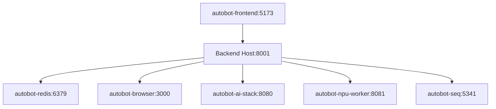

# AutoBot Docker Architecture

## Overview
AutoBot uses a hybrid architecture where the backend runs on the host system while supporting services run in Docker containers. This design provides system access for the backend while maintaining isolation and portability for supporting services.

## Service Architecture

### Backend (Host)
- **Location**: Runs directly on host system
- **Port**: 8001
- **Purpose**: Core API, system access, file operations
- **Configuration**: `backend/fast_app_factory_fix.py`

### Frontend (Container)
- **Container**: `autobot-frontend`
- **Port**: 5173 (mapped to host)
- **Image**: Node.js with Vue 3
- **Purpose**: Web UI, user interface
- **Network**: Connects to backend via `host.docker.internal:8001`

### Supporting Services (Containers)

| Service | Container | Port | Purpose | Health Check |
|---------|-----------|------|---------|--------------|
| Redis | `autobot-redis` | 6379, 8002 | Database, caching | `redis-cli ping` |
| Browser | `autobot-browser` | 3000 | Playwright automation | HTTP GET /health |
| AI Stack | `autobot-ai-stack` | 8080 | ML processing | HTTP GET /health |
| NPU Worker | `autobot-npu-worker` | 8081 | GPU acceleration | HTTP GET /status |
| Seq Logging | `autobot-seq` | 5341, 5342 | Log aggregation | HTTP GET / |

## Docker Compose Configuration

```yaml
version: '3.8'
services:
  frontend:
    build: 
      context: ./autobot-vue
      dockerfile: Dockerfile
    container_name: autobot-frontend
    ports:
      - "5173:5173"
    environment:
      - NODE_ENV=${NODE_ENV:-production}
      - VITE_API_BASE_URL=${VITE_API_BASE_URL:-http://host.docker.internal:8001}
      - VITE_WS_BASE_URL=${VITE_WS_BASE_URL:-ws://host.docker.internal:8001/ws}
    networks:
      - autobot-network
    extra_hosts:
      - "host.docker.internal:host-gateway"
    restart: unless-stopped

  redis:
    image: redis/redis-stack:latest
    container_name: autobot-redis
    ports:
      - "6379:6379"
      - "8002:8001"
    volumes:
      - redis_data:/data
    networks:
      - autobot-network
    restart: unless-stopped

  browser:
    build: ./docker/browser
    container_name: autobot-browser
    ports:
      - "3000:3000"
    volumes:
      - /dev/shm:/dev/shm
    environment:
      - DISPLAY=:99
    networks:
      - autobot-network
    restart: unless-stopped

  ai-stack:
    build: ./docker/ai-stack
    container_name: autobot-ai-stack
    ports:
      - "8080:8080"
    environment:
      - CUDA_VISIBLE_DEVICES=0
    runtime: nvidia
    networks:
      - autobot-network
    restart: unless-stopped

  npu-worker:
    build: ./docker/npu-worker
    container_name: autobot-npu-worker
    ports:
      - "8081:8081"
    volumes:
      - ./data:/app/data
    networks:
      - autobot-network
    restart: unless-stopped

  seq:
    image: datalust/seq:latest
    container_name: autobot-seq
    ports:
      - "5341:80"
      - "5342:5341"
    environment:
      - ACCEPT_EULA=Y
    volumes:
      - seq_data:/data
    networks:
      - autobot-network
    restart: unless-stopped

networks:
  autobot-network:
    name: autobot-network
    driver: bridge

volumes:
  redis_data:
  seq_data:
```

## Network Configuration

### DNS Resolution Patterns

#### Container → Host
```bash
# Backend API access from containers
host.docker.internal:8001    # Standard Docker internal hostname
api.autobot:8001              # Custom alias (requires /etc/hosts)
backend.autobot:8001          # Custom alias (requires /etc/hosts)
```

#### Host → Container
```bash
# Direct container access from host
localhost:6379                # Redis database
localhost:5173                # Frontend dev server
autobot-redis:6379           # Container name (requires /etc/hosts)
redis.autobot:6379           # Custom alias (requires /etc/hosts)
```

#### Container → Container
```bash
# Service-to-service communication
redis:6379                   # Redis from other containers
autobot-redis:6379           # Full container name
frontend:5173                # Frontend from other containers
```

### Bidirectional DNS Setup

The project includes scripts for DNS optimization:

1. **`show-dns-entries.sh`** - Displays current container IPs
2. **`test-dns-resolution.sh`** - Tests connectivity patterns
3. **`bidirectional-dns-setup.sh`** - Configures host DNS entries

```bash
# Apply DNS optimizations
./show-dns-entries.sh                # Show current mappings
sudo ./bidirectional-dns-setup.sh    # Configure host DNS
./test-dns-resolution.sh             # Verify connectivity
```

## Development vs Production

### Development Mode (`--dev`)
```bash
# Start in development mode
./run_agent_unified.sh --dev

# Configuration differences:
- Backend runs with --reload (auto-restart)
- Frontend runs with hot reload (npm run dev)
- Browser auto-launches with DevTools
- Enhanced logging and debugging
- VITE_API_BASE_URL=http://host.docker.internal:8001
```

### Production Mode
```bash
# Start in production mode  
./run_agent_unified.sh

# Configuration differences:
- Backend runs optimized (no reload)
- Frontend serves built assets
- No browser auto-launch
- Minimal logging
- VITE_API_BASE_URL configured for production domain
```

## Container Lifecycle Management

### Startup Sequence
1. **Network Creation**: Create `autobot-network` bridge
2. **Volume Initialization**: Create persistent volumes
3. **Service Startup**: Start containers in dependency order
4. **Health Checks**: Wait for service readiness
5. **Backend Launch**: Start host-based backend
6. **Browser Launch**: Open frontend (dev mode only)

### Shutdown Behavior
```bash
# Graceful shutdown (preserves containers)
docker-compose stop

# Full cleanup (removes containers)  
docker-compose down

# Clean slate (removes containers + volumes)
docker-compose down -v
```

### Container Persistence
By default, containers are preserved on shutdown for faster restarts:
```yaml
# docker-compose.yml
restart: unless-stopped  # Containers persist across system reboots
```

## Health Monitoring

### Container Health Checks
```bash
# Check all container statuses
docker ps --format "table {{.Names}}\t{{.Status}}\t{{.Ports}}"

# Individual health checks
docker exec autobot-redis redis-cli ping
curl http://localhost:3000/health
curl http://localhost:8080/health  
curl http://localhost:8081/status
```

### Service Dependencies


## Volume Management

### Persistent Data
```bash
# Redis data persistence
redis_data:/data              # Database files and snapshots

# Seq logging data  
seq_data:/data                # Log aggregation data

# Host-mounted volumes
./data:/app/data              # NPU worker data access
/dev/shm:/dev/shm            # Browser shared memory
```

### Backup Strategy
```bash
# Backup Redis data
docker exec autobot-redis redis-cli bgsave
docker cp autobot-redis:/data/dump.rdb ./backups/

# Backup Seq logs
docker exec autobot-seq tar -czf /tmp/seq-backup.tar.gz /data
docker cp autobot-seq:/tmp/seq-backup.tar.gz ./backups/
```

## Performance Optimization

### Resource Allocation
```yaml
# Production resource limits
services:
  frontend:
    deploy:
      resources:
        limits:
          memory: 512M
          cpus: '0.5'
  
  redis:
    deploy:
      resources:
        limits:
          memory: 1G
          cpus: '1.0'
```

### GPU Acceleration
```yaml
# NPU/GPU access for AI workloads
ai-stack:
  runtime: nvidia  # NVIDIA GPU access
  environment:
    - CUDA_VISIBLE_DEVICES=0
  
npu-worker:
  devices:
    - /dev/dri    # Intel GPU/NPU access
  environment:
    - INTEL_DEVICE=GPU
```

## Troubleshooting

### Common Issues

1. **Port Conflicts**
   ```bash
   # Check port usage
   sudo netstat -tulpn | grep :8001
   
   # Kill conflicting processes
   sudo fuser -k 8001/tcp
   ```

2. **Container Communication**
   ```bash
   # Test container networking
   docker exec autobot-frontend ping host.docker.internal
   docker exec autobot-frontend curl http://host.docker.internal:8001/api/health
   ```

3. **DNS Resolution**
   ```bash
   # Verify DNS from containers
   docker exec autobot-frontend nslookup host.docker.internal
   docker exec autobot-frontend cat /etc/hosts
   ```

4. **Volume Permissions**
   ```bash
   # Fix volume ownership
   sudo chown -R $(id -u):$(id -g) ./data
   sudo chmod -R 755 ./data
   ```

### Debugging Commands
```bash
# Container logs
docker-compose logs -f [service_name]

# Container inspection
docker inspect autobot-redis

# Network analysis  
docker network ls
docker network inspect autobot-network

# Resource usage
docker stats

# Execute commands in containers
docker exec -it autobot-redis redis-cli
docker exec -it autobot-frontend sh
```

## Security Considerations

1. **Network Isolation**: Services isolated in Docker network
2. **Host Access**: Backend has controlled host system access
3. **Volume Security**: Bind mounts use specific directories only
4. **Port Exposure**: Only necessary ports exposed to host
5. **Container Updates**: Regular image updates for security patches