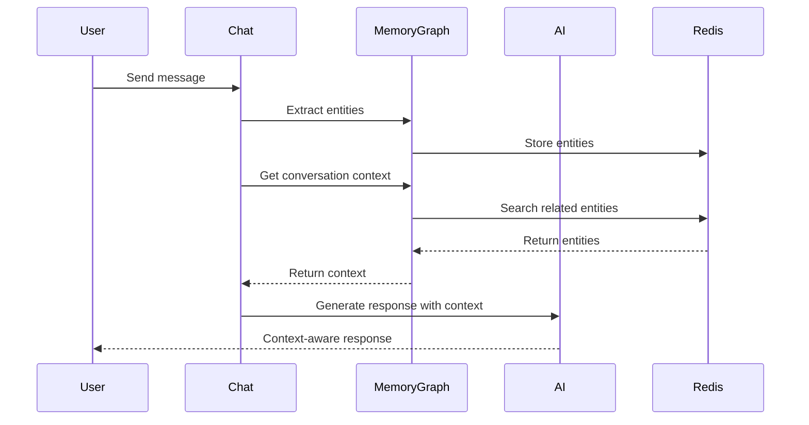

# Memory Graph Chat Integration Guide

**Version:** 1.0
**Last Updated:** 2025-10-03
**Status:** Production Ready
**Audience:** AutoBot Users, Developers

---

## Table of Contents

1. [Overview](#overview)
2. [How It Works](#how-it-works)
3. [Automatic Entity Creation](#automatic-entity-creation)
4. [Querying Conversation History](#querying-conversation-history)
5. [Linking Bugs and Features](#linking-bugs-and-features)
6. [Multi-Conversation Queries](#multi-conversation-queries)
7. [Chat Commands](#chat-commands)
8. [Integration Examples](#integration-examples)
9. [Best Practices](#best-practices)

---

## Overview

### What is Memory Graph Chat Integration?

The **Memory Graph Chat Integration** seamlessly combines AutoBot's conversational AI with the Memory Graph knowledge system, enabling:

- **Automatic Knowledge Capture**: Important information from conversations automatically becomes searchable entities
- **Cross-Conversation Context**: Ask questions about previous conversations naturally
- **Intelligent Linking**: Bugs, features, and decisions automatically linked to relevant conversations
- **Historical Awareness**: AI responses enriched with context from your entire project history
- **Natural Language Queries**: Find anything using conversational questions

### Why This Matters

**Before Memory Graph Integration:**
```
You: "Why did we choose Redis?"
AutoBot: "I don't have that information in my current context."
```

**With Memory Graph Integration:**
```
You: "Why did we choose Redis?"
AutoBot: "Based on our conversation from 2025-09-28, we chose Redis Stack for the
Memory Graph implementation because:
1. RedisGraph provides native graph operations
2. RedisJSON enables fast entity storage
3. RediSearch allows full-text and semantic search
This decision is documented in entity 'Use Redis Stack for Memory Graph' with
3 related conversations."
```

---

## How It Works

### Architecture Overview



### Integration Points

1. **Message Processing**: Every chat message analyzed for entity extraction
2. **Context Retrieval**: Before AI response, relevant entities retrieved
3. **Entity Creation**: Significant conversations become searchable entities
4. **Relationship Building**: Conversations linked to related bugs, features, decisions

---

## Automatic Entity Creation

### What Triggers Entity Creation?

Memory Graph automatically creates entities when it detects:

| Conversation Pattern | Entity Type Created | Example Trigger |
|---------------------|--------------------|-----------------|
| **Decisions** | `decision` | "We decided to...", "Let's use...", "After evaluation..." |
| **Bug Reports** | `bug_fix` | "There's a bug in...", "Error when...", "Not working..." |
| **Feature Discussions** | `feature` | "New feature idea:", "We should implement...", "Add support for..." |
| **Task Planning** | `task` | "TODO:", "Next step:", "Need to implement..." |
| **Lessons Learned** | `learning` | "Lesson learned:", "We discovered...", "Important to note..." |
| **Context Snippets** | `context` | "Background:", "Context:", "For reference..." |

### Example: Automatic Decision Entity

**Your Conversation:**
```
User: "After analyzing the options, we decided to use PostgreSQL for the main database
because it has better support for complex queries and ACID compliance. Redis will be
used for caching only."

AutoBot: "Understood. I've documented this decision and will keep it in mind for
future database-related questions."
```

**What Memory Graph Created Automatically:**
```json
{
  "entity_id": "auto-decision-20251003-143022",
  "entity_type": "decision",
  "name": "Use PostgreSQL for Main Database, Redis for Caching",
  "observations": [
    "PostgreSQL chosen for main database storage",
    "Key reasons: complex query support, ACID compliance",
    "Redis designated for caching layer only",
    "Decision made during conversation on 2025-10-03"
  ],
  "tags": ["database", "architecture", "decision"],
  "metadata": {
    "source_conversation_id": "chat-1696345822-abc123",
    "source_message_timestamp": "2025-10-03T14:30:22Z",
    "confidence_score": 0.92,
    "auto_extracted": true,
    "priority": "high",
    "status": "active"
  },
  "relations": [
    {
      "to_entity": "Conversation: Database Architecture Discussion",
      "relation_type": "extracted_from"
    }
  ]
}
```

### Viewing Auto-Created Entities

**Ask AutoBot:**
```
User: "What entities were created from our last conversation?"
```

**AutoBot Response:**
```
I've created 2 entities from our last conversation:

1. Decision: "Use PostgreSQL for Main Database, Redis for Caching"
   - Type: decision
   - Tags: database, architecture
   - 4 observations captured

2. Task: "Set Up PostgreSQL Production Database"
   - Type: task
   - Status: pending
   - Dependencies: 0

Would you like to see the full details of any entity?
```

---

## Querying Conversation History

### Natural Language Queries

Simply ask AutoBot questions about past conversations using natural language:

#### Find Past Decisions

**Examples:**
```
User: "Why did we choose Redis?"
User: "What did we decide about authentication?"
User: "Remind me why we went with FastAPI"
User: "What was our rationale for using Docker?"
```

**Sample Response:**
```
AutoBot: "Based on our conversation from 2025-09-28 (2 weeks ago), we chose
Redis Stack for the Memory Graph implementation for these reasons:

1. RedisGraph provides native graph operations for relationship tracking
2. RedisJSON enables fast entity storage with native JSON support
3. RediSearch allows full-text and semantic search capabilities
4. High performance: <50ms entity operations, <200ms search queries

This decision is documented in entity 'Use Redis Stack for Memory Graph'
and is referenced by 5 related conversations and 3 implementation tasks.

Related entities:
- Feature: 'Memory Graph Implementation' (implements this decision)
- Task: 'Setup Redis Stack on VM3' (depends on this decision)
- Learning: 'Redis Performance Optimization' (relates to this decision)
```

#### Find Related Conversations

**Examples:**
```
User: "What other conversations have we had about authentication?"
User: "Show me all discussions about the database"
User: "Find conversations related to performance optimization"
```

**Sample Response:**
```
AutoBot: "I found 7 conversations related to authentication:

Recent Conversations (last 30 days):
1. "JWT Implementation Discussion" - 2025-10-01
   - Discussed token format, expiration, refresh mechanism
   - Created 2 decisions, 4 tasks

2. "OAuth Integration Planning" - 2025-09-28
   - Evaluated OAuth providers (Google, GitHub, Auth0)
   - Created 1 decision, 3 tasks

3. "Password Security Best Practices" - 2025-09-25
   - Decided on bcrypt with cost factor 12
   - Created 1 decision, 2 learning entities

[View all 7 conversations] | [Export as timeline]
```

#### Find Implementation Status

**Examples:**
```
User: "What's the status of the authentication feature?"
User: "How far along is the database migration?"
User: "Show me all pending tasks for the Memory Graph implementation"
```

---

## Linking Bugs and Features

### Automatic Bug-Conversation Linking

When you report a bug in chat, Memory Graph automatically:

1. Creates a `bug_fix` entity
2. Links it to the current conversation
3. Associates it with related features/decisions
4. Tracks the resolution progress

#### Example: Bug Report

**Your Report:**
```
User: "There's a bug in the login system. Users are getting timeout errors
after 30 seconds when the server is under load. This is blocking the
authentication feature we're working on."
```

**AutoBot's Response:**
```
AutoBot: "I've documented this bug. Let me analyze...

Bug Report Created:
- Entity: "Login Timeout Under Load"
- Severity: High (blocking)
- Related Feature: "Authentication Feature Implementation"
- Related Conversation: Current (chat-1696345900-xyz789)

Context from Memory Graph:
- Related Decision: "Use Redis for Session Storage" (2025-09-28)
- Possibly related to Redis timeout settings
- Similar bug resolved: "Database Connection Timeout" (2025-09-15)

Would you like me to:
1. Search for similar issues in conversation history?
2. Check if we've documented solutions for timeout problems?
3. Create tasks for investigation and resolution?
```

**What Memory Graph Created:**
```json
{
  "entity_id": "bug-20251003-login-timeout",
  "entity_type": "bug_fix",
  "name": "Login Timeout Under Load",
  "observations": [
    "Users experience timeout after 30 seconds under high load",
    "Affects login system functionality",
    "Blocks authentication feature implementation",
    "Reported in conversation chat-1696345900-xyz789"
  ],
  "tags": ["bug", "authentication", "performance", "timeout"],
  "metadata": {
    "severity": "high",
    "status": "open",
    "blocking_features": ["authentication-feature-impl"],
    "reported_date": "2025-10-03T15:25:00Z",
    "assigned_to": null
  },
  "relations": [
    {
      "from_entity": "Login Timeout Under Load",
      "to_entity": "Authentication Feature Implementation",
      "relation_type": "blocks"
    },
    {
      "from_entity": "Login Timeout Under Load",
      "to_entity": "Conversation: Bug Investigation Session",
      "relation_type": "reported_in"
    },
    {
      "from_entity": "Login Timeout Under Load",
      "to_entity": "Use Redis for Session Storage",
      "relation_type": "relates_to"
    }
  ]
}
```

### Feature-Conversation Linking

Track features from ideation to deployment through conversations:

**Feature Discussion:**
```
User: "Let's implement a dark mode for the UI. Users have been requesting
this feature frequently."

AutoBot: "Great idea! I've created a feature entity for dark mode implementation.

Feature Entity Created:
- Name: "Dark Mode UI Implementation"
- Status: Planning
- Priority: Medium
- User-requested feature

Based on our previous work:
- We have a theming system already (from conversation 2025-09-20)
- CSS variables are used for colors (decision from 2025-09-15)
- This builds on: 'Implement Customizable Theme System'

Recommended next steps:
1. Define color palette for dark theme
2. Create theme toggle component
3. Persist user preference in localStorage

Shall I create tasks for these steps?
```

### Viewing Linked Entities

**Query Examples:**
```
User: "Show me all bugs linked to the authentication feature"
User: "What features are blocked by open bugs?"
User: "List all conversations about the Memory Graph feature"
User: "Show the complete timeline for the database migration"
```

---

## Multi-Conversation Queries

### Cross-Conversation Analysis

Memory Graph enables intelligent queries that span multiple conversations:

#### Pattern 1: Evolution Tracking

**Query:**
```
User: "How has our approach to caching evolved over time?"
```

**Response:**
```
AutoBot: "I've traced our caching strategy evolution across 8 conversations:

Phase 1: Initial Approach (2025-08-15)
- Decision: "Use Simple In-Memory Caching"
- Conversation: "Initial Architecture Planning"
- Rationale: Simplicity, fast development

Phase 2: Scaling Concerns (2025-09-01)
- Learning: "In-Memory Cache Doesn't Scale Across Instances"
- Conversation: "Production Deployment Issues"
- Problem: Cache inconsistency in multi-instance deployment

Phase 3: Redis Integration (2025-09-15)
- Decision: "Migrate to Redis for Distributed Caching"
- Conversation: "Scaling Architecture Discussion"
- Implementation: 3 tasks created, completed 2025-09-20

Current State (2025-10-03):
- Active: Redis-based distributed caching
- Performance: <10ms cache hits, 95% hit rate
- Related Entities: 12 decisions, 8 implementations, 4 learnings

[View detailed timeline] | [Export evolution report]
```

#### Pattern 2: Dependency Analysis

**Query:**
```
User: "What needs to be completed before we can launch the authentication feature?"
```

**Response:**
```
AutoBot: "Analyzing dependency chain for 'Authentication Feature Implementation'...

Dependency Tree:
━━━━━━━━━━━━━━━━━━━━━━━━━━━━━━━━━━━━━━━━━━━━
✅ Database Schema Design (completed 2025-09-28)
   └── Discussed in: "Database Architecture Planning"

⚠️  Redis Session Storage Setup (in progress)
   └── Blocked by: "Fix Redis Connection Timeout" (bug)
   └── Discussed in: "Session Management Implementation"
   └── ETA: 2025-10-05

❌ OAuth Provider Integration (not started)
   └── Depends on: Redis Session Storage Setup
   └── Discussed in: "Third-Party Auth Planning"

❌ Security Audit (not started)
   └── Depends on: OAuth Provider Integration
   └── Discussed in: "Security Requirements Review"

Summary:
- Total blocking dependencies: 3
- Critical path blocker: Redis connection timeout bug
- Estimated completion: 2025-10-12 (if resolved today)

Recommendation: Focus on resolving the Redis timeout bug first.
```

#### Pattern 3: Knowledge Aggregation

**Query:**
```
User: "What have we learned about Redis performance optimization?"
```

**Response:**
```
AutoBot: "Aggregating learnings from 6 conversations about Redis performance:

Key Learnings (by date):

1. Connection Pooling (2025-09-15)
   - Source: "Database Performance Optimization"
   - Learning: "Use connection pooling to reduce overhead"
   - Impact: 40% latency reduction

2. Pipelining (2025-09-20)
   - Source: "Redis Performance Tuning"
   - Learning: "Batch commands with pipelining for 10x speedup"
   - Implementation: Applied to bulk operations

3. Timeout Configuration (2025-09-28)
   - Source: "Production Incident Analysis"
   - Learning: "Default 30s timeout too short under load"
   - Solution: Increased to 60s, added retry logic

4. Key Expiration (2025-10-01)
   - Source: "Memory Usage Optimization"
   - Learning: "Set appropriate TTLs to prevent memory bloat"
   - Best Practice: Session data 24h, cache data 1h

5. Monitoring (2025-10-03)
   - Source: "Infrastructure Monitoring Setup"
   - Learning: "Track hit rate, latency, memory usage"
   - Tools: Redis Insight, Grafana dashboards

Applied Best Practices:
✅ Connection pool size: 50 (CPU cores * 2)
✅ Socket timeout: 60s with retry
✅ Pipeline batch size: 100 commands
✅ TTL strategy: Session 24h, Cache 1h
✅ Monitoring: Real-time dashboards

[View detailed analysis] | [Export best practices guide]
```

---

## Chat Commands

### Special Commands for Memory Graph

Use these commands to directly interact with the Memory Graph:

#### Entity Management Commands

```
/memory create decision "Use GraphQL for API" tags:api,architecture
/memory create bug "Login form validation error" severity:high
/memory create feature "Real-time notifications" status:planning
/memory create task "Write unit tests" priority:medium
```

#### Search Commands

```
/memory search "Redis performance"
/memory search type:decision tag:architecture
/memory search bug severity:high status:open
/memory search conversation date:2025-10
```

#### Relationship Commands

```
/memory link "Task A" depends-on "Task B"
/memory link "Bug Fix" fixes "Login Error"
/memory show-relations "Authentication Feature"
/memory timeline "Memory Graph Implementation"
```

#### Query Commands

```
/memory stats
/memory recent entities limit:10
/memory conversation-summary
/memory export entities format:json
```

---

## Integration Examples

### Example 1: Research to Implementation Workflow

**Step 1: Research Phase**

```
User: "I'm researching options for real-time notifications. WebSockets vs Server-Sent
Events vs Long Polling. Need to decide soon."

AutoBot: "I've created a research entity. Let me help analyze...

Entity Created: "Real-Time Notifications Research"
Type: context
Tags: research, notifications, real-time

Based on previous work:
- We use WebSockets for terminal communication (decision: 2025-09-10)
- Our infrastructure supports WebSocket connections
- Current stack: FastAPI (supports WebSockets natively)

Recommendation: WebSockets would be consistent with existing architecture.
```

**Step 2: Decision Phase**

```
User: "After testing, WebSockets are the best fit. They integrate well with our
FastAPI backend and provide bi-directional communication we need."

AutoBot: "Excellent. I've documented this decision.

Decision Entity Created: "Use WebSockets for Real-Time Notifications"
Relations:
- Informs: "Real-Time Notifications Research" (your earlier research)
- Builds-on: "WebSocket Terminal Communication" (existing implementation)

This decision is now part of your project knowledge and will inform future
notification-related questions.
```

**Step 3: Implementation Phase**

```
User: "Let's create tasks for implementing the WebSocket notification system."

AutoBot: "Tasks created and linked:

1. Task: "Design WebSocket Notification Protocol"
   - Depends on: "Use WebSockets for Real-Time Notifications" (decision)
   - Status: ready to start

2. Task: "Implement Server-Side WebSocket Handler"
   - Depends on: Task #1
   - Status: blocked

3. Task: "Create Frontend WebSocket Client"
   - Depends on: Task #2
   - Status: blocked

4. Task: "Add Notification Persistence Layer"
   - Depends on: Task #2
   - Status: blocked

5. Task: "Write Integration Tests"
   - Depends on: Tasks #2, #3, #4
   - Status: blocked

Dependency graph created. All tasks linked to the original decision and research.
```

**Step 4: Later Query**

```
User: "Why are we using WebSockets for notifications?"

AutoBot: "Based on your decision from 2025-10-03:

We chose WebSockets for real-time notifications because:
1. Bi-directional communication capability
2. Integration with existing FastAPI backend
3. Consistency with WebSocket terminal communication (implemented 2025-09-10)
4. Low latency for real-time updates

This decision was informed by research you conducted comparing WebSockets,
Server-Sent Events, and Long Polling.

Related:
- Research: "Real-Time Notifications Research"
- Implementation Tasks: 5 tasks (2 completed, 3 in progress)
- Related Feature: "Real-Time User Notifications"
```

### Example 2: Bug Investigation with Historical Context

**Bug Report:**

```
User: "Users are reporting that sometimes notifications don't appear. Seems random."

AutoBot: "I've created a bug entity and searched for related context...

Bug Created: "Intermittent Notification Delivery Failure"
Type: bug_fix
Severity: Medium
Tags: notifications, websocket, reliability

Historical Context Found:
━━━━━━━━━━━━━━━━━━━━━━━━━━━━━━━━━━━━━━━━━━━━
1. Similar Issue (2025-09-25):
   - Bug: "WebSocket Connection Drops Under Load"
   - Solution: Implemented reconnection logic
   - May be related to current issue

2. Related Decision (2025-10-03):
   - "Use WebSockets for Real-Time Notifications"
   - No mention of persistence layer at decision time

3. Conversation (2025-10-01):
   - Discussed notification reliability requirements
   - User mentioned need for guaranteed delivery

Analysis:
Possible root cause: Notifications sent over WebSocket when client disconnected
Recommended solution: Add notification persistence + retry mechanism

Would you like me to:
1. Create a task for implementing notification persistence?
2. Search for similar reliability patterns in other features?
3. Review the WebSocket reconnection implementation?
```

### Example 3: Feature Status Dashboard

**Query:**

```
User: "Give me a complete status update on all active features"

AutoBot: "Scanning Memory Graph for all active features...

═══════════════════════════════════════════════════
ACTIVE FEATURES DASHBOARD (as of 2025-10-03)
═══════════════════════════════════════════════════

1. Real-Time Notifications System
   Status: 40% complete (2/5 tasks done)
   Last Activity: Today (Task #2 completed)
   Blockers: None
   ETA: 2025-10-08
   Related Conversations: 4
   Related Decisions: 2
   [View Details]

2. User Authentication System
   Status: 75% complete (6/8 tasks done)
   Last Activity: Yesterday
   Blockers: 1 critical bug (Redis timeout)
   ETA: 2025-10-12 (blocked)
   Related Conversations: 12
   Related Decisions: 5
   [View Details]

3. Memory Graph Integration
   Status: 90% complete (18/20 tasks done)
   Last Activity: Today
   Blockers: None
   ETA: 2025-10-05
   Related Conversations: 8
   Related Decisions: 3
   [View Details]

Summary:
- Total Active Features: 3
- On Track: 2 features
- Blocked: 1 feature (Authentication - Redis timeout bug)
- Average Completion: 68%
- Total Related Conversations: 24
- Total Decisions Made: 10

[Export detailed report] | [View dependency graph] | [Timeline view]
```

---

## Best Practices

### 1. Provide Context in Conversations

**Good:**
```
User: "We decided to use PostgreSQL for the main database because it provides
better support for complex queries, ACID compliance, and has excellent
performance for our read-heavy workload. This was after evaluating MySQL
and MongoDB alternatives."
```

**Why:** More context = richer entities with better search relevance

**Poor:**
```
User: "Let's use PostgreSQL"
```

**Why:** Minimal context = shallow entity with limited usefulness

### 2. Be Specific in Queries

**Good:**
```
User: "What did we decide about database choice for the user authentication system?"
```

**Why:** Specific queries return focused, relevant results

**Poor:**
```
User: "Database?"
```

**Why:** Vague queries may return too many unrelated results

### 3. Use Tags and Categories

When creating manual entities, use consistent tags:

**Good Practice:**
```
/memory create decision "Use JWT for Authentication" tags:security,auth,api
```

**Consistent Vocabulary:**
- Use project-standard terminology
- Maintain tag hierarchy (e.g., `backend:api`, `frontend:ui`)
- Be consistent across conversations

### 4. Link Related Concepts

Help Memory Graph build connections:

```
User: "This new caching strategy relates to our earlier performance optimization
discussion from last week where we identified database query bottlenecks."
```

AutoBot will automatically:
- Link current conversation to the earlier one
- Connect caching strategy to performance optimization
- Associate with database discussions

### 5. Regular Knowledge Reviews

Periodically review and organize:

```
User: "Show me all decisions from the last month"
User: "List all open bugs by priority"
User: "What learnings did we capture about performance?"
```

This helps:
- Identify knowledge gaps
- Update outdated information
- Archive completed items

### 6. Explicit Entity Creation for Critical Items

For critical decisions, explicitly request entity creation:

```
User: "This is a critical architecture decision: We will NOT support IE11
browser. Please create a decision entity and tag it as 'browser-support'
and 'critical-decision'."
```

Ensures important decisions are properly documented even if automatic
extraction doesn't trigger.

---

## Troubleshooting

### Problem: AutoBot Doesn't Remember Previous Conversation

**Symptoms:**
- AutoBot can't recall decisions from earlier conversations
- Responses lack historical context

**Solutions:**

1. **Check Entity Creation:**
```
User: "What entities exist for our authentication discussions?"
```

2. **Manually Create Entity:**
```
User: "Please create a decision entity for our earlier discussion about
using JWT authentication. Include all the reasons we discussed."
```

3. **Verify Conversation Linking:**
```
User: "Link this conversation to our previous authentication planning discussion"
```

### Problem: Too Many Irrelevant Results

**Symptoms:**
- Search returns many unrelated entities
- Context includes irrelevant information

**Solutions:**

1. **Use More Specific Queries:**
```
Bad:  "database"
Good: "why did we choose PostgreSQL for user authentication database?"
```

2. **Filter by Entity Type:**
```
User: "Search for decisions only: database choice"
```

3. **Use Date Filters:**
```
User: "Find database decisions from the last 30 days"
```

### Problem: Missing Relationships Between Entities

**Symptoms:**
- Related entities not appearing in searches
- Broken dependency chains

**Solutions:**

1. **Manually Create Relationships:**
```
User: "Link 'Authentication Feature' to 'Database Schema Design' with
depends-on relationship"
```

2. **Rebuild Connections:**
```
User: "Analyze and link all authentication-related entities"
```

---

## Advanced Usage

### Custom Entity Extraction Patterns

Configure AutoBot to recognize project-specific patterns:

```python
# In backend configuration
CUSTOM_ENTITY_PATTERNS = {
    "adr": {  # Architecture Decision Records
        "pattern": r"ADR-\d+:",
        "entity_type": "decision",
        "tags": ["adr", "architecture"]
    },
    "ticket": {
        "pattern": r"TICKET-\d+:",
        "entity_type": "task",
        "tags": ["ticket", "tracking"]
    }
}
```

**Usage:**
```
User: "ADR-042: We will use event sourcing for audit logs because it provides
complete history and enables event replay for debugging."

AutoBot: [Automatically creates decision entity with tag 'adr']
```

### Webhook Integration

Trigger external systems when entities are created:

```python
# Configuration
MEMORY_GRAPH_WEBHOOKS = {
    "bug_created": "https://your-tracker.com/webhook/bug",
    "feature_created": "https://your-pm-tool.com/webhook/feature"
}
```

When a bug entity is created in chat, it automatically creates a ticket in your
issue tracker.

---

## Conclusion

Memory Graph Chat Integration transforms AutoBot from a conversational AI into an
intelligent project knowledge system that:

✅ **Never Forgets**: Every important conversation becomes searchable knowledge
✅ **Connects Context**: Automatically links related discussions, decisions, and implementations
✅ **Accelerates Development**: Instant access to project history and rationale
✅ **Reduces Repetition**: Decisions documented once, referenced forever
✅ **Improves Onboarding**: New team members can query entire project history

**Key Takeaways:**

1. 🔄 **Automatic**: Entity extraction happens transparently during conversations
2. 🔍 **Searchable**: Natural language queries find anything from project history
3. 🔗 **Connected**: Bugs, features, and decisions automatically linked
4. 📊 **Comprehensive**: Cross-conversation analysis and timeline tracking
5. 🚀 **Productive**: Context-aware responses accelerate development

**Next Steps:**

- Start chatting - Memory Graph is already working in the background
- Ask questions about past decisions to see historical context
- Review `/memory stats` to see what knowledge has been captured
- Explore [API Reference](../api/COMPREHENSIVE_API_DOCUMENTATION.md#memory-graph-api) for advanced usage

---

**Document Version:** 1.0
**Last Updated:** 2025-10-03
**Related Documentation:**
- [Memory Graph User Guide](AUTOBOT_MEMORY_GRAPH_USER_GUIDE.md)
- [Memory Graph Architecture](../architecture/AUTOBOT_MEMORY_GRAPH_ARCHITECTURE.md)
- [API Documentation](../api/COMPREHENSIVE_API_DOCUMENTATION.md#memory-graph-api)
