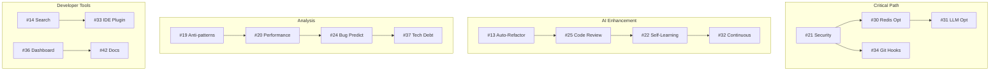

# AutoBot Advanced Code Intelligence - 30 Methods Issue Breakdown

**GitHub Issue:** [#217 (Epic)](https://github.com/mrveiss/AutoBot-AI/issues/217)
**Sub-Issues:** #219-#248 (28 implementation tasks)
**Status:** Planning

## 🚀 Main Epic Issue
**Title**: [EPIC] Implement Advanced Code Intelligence Methods - 30 Integrations
**Labels**: `epic`, `enhancement`, `ai-powered`, `code-intelligence`
**Description**: Extend AutoBot's code analysis capabilities with 30 advanced methods including AI/ML-powered analysis, predictive analytics, behavioral mining, and continuous learning systems.

---

## 📊 Issue Categories & Structure

### Category A: AI/ML-Powered Methods (Issues #13-#15)
### Category B: Advanced Flow Analysis (Issues #16-#18)
### Category C: Specialized Pattern Detection (Issues #19-#21)
### Category D: Continuous Learning Systems (Issues #22-#23)
### Category E: Predictive Analytics (Issues #24-#25)
### Category F: Code DNA & Architecture (Issues #26-#27)
### Category G: Behavioral Mining (Issues #28-#29)
### Category H: AutoBot-Specific Optimizations (Issues #30-#32)
### Category I: Developer Experience Tools (Issues #33-#35)
### Category J: Advanced Metrics & Monitoring (Issues #36-#42)

---

## 🎯 Detailed Sub-Issues

### Category A: AI/ML-Powered Methods

#### Issue #13: Implement Code Generation & Auto-Refactoring
**Title**: Add LLM-Powered Code Generation and Auto-Refactoring
**Labels**: `ai`, `code-generation`, `refactoring`, `llm`
**Priority**: P1 - High
**Size**: Large
**Dependencies**: Core Pattern Detection (#3)

```markdown
## Description
Implement LLM-powered code generation that learns from the codebase to automatically refactor detected patterns.

## Technical Requirements
- Integrate CodeLlama-13B or GPT-4 for code generation
- Fine-tune on AutoBot's coding patterns
- Generate refactored code following project conventions
- Validate generated code with AST parsing

## Tasks
- [ ] Setup LLM infrastructure (local or API)
- [ ] Create prompt templates for refactoring
- [ ] Implement code validation pipeline
- [ ] Build feedback loop for generated code
- [ ] Create rollback mechanism for failed refactoring
- [ ] Add configuration for generation parameters

## Acceptance Criteria
- Can generate valid Python code
- Follows AutoBot's coding standards
- Passes existing tests after refactoring
- Provides before/after comparison
- Rollback capability for rejected changes

## Example Use Case
```python
# Input: Duplicate Redis pattern
# Output: Generated @cache_aside decorator with proper error handling
```
```

---

#### Issue #14: Build Semantic Code Search with Natural Language
**Title**: Implement Natural Language Code Search
**Labels**: `search`, `nlp`, `developer-experience`
**Priority**: P2 - Medium
**Size**: Medium
**Dependencies**: ChromaDB setup (#1)

```markdown
## Description
Enable developers to search the codebase using natural language queries like "Where do we handle authentication?" or "Show me all Redis cache invalidation logic."

## Technical Requirements
- Natural language to code embedding translation
- Semantic similarity search in ChromaDB
- LLM-powered result explanation
- Query intent classification

## Tasks
- [ ] Implement query embedding pipeline
- [ ] Create query intent classifier
- [ ] Build semantic search interface
- [ ] Add result ranking algorithm
- [ ] Generate code explanations
- [ ] Create query suggestion system

## Acceptance Criteria
- Responds to natural language queries
- Returns relevant code snippets
- Explains code context and purpose
- Handles ambiguous queries gracefully
- Sub-second response time for most queries

## Example Queries
- "Where do we handle user logout?"
- "Find all error handling for Redis timeouts"
- "Show me the conversation flow initialization"
```

---

#### Issue #15: Create Code Evolution Mining System
**Title**: Mine Code Evolution Patterns from Git History
**Labels**: `git`, `evolution`, `patterns`, `analytics`
**Priority**: P3 - Nice to Have
**Size**: Large
**Dependencies**: Pattern Detection (#3), Git access

```markdown
## Description
Analyze git history to understand how code patterns evolve, identify emerging patterns, and detect deprecated practices.

## Technical Requirements
- Git history parsing and analysis
- Temporal pattern tracking
- Pattern lifecycle identification
- Refactoring detection

## Tasks
- [ ] Implement git history crawler
- [ ] Create temporal embedding system
- [ ] Build pattern evolution tracker
- [ ] Identify pattern lifecycles
- [ ] Detect major refactoring events
- [ ] Generate evolution reports

## Acceptance Criteria
- Processes entire git history
- Identifies emerging/declining patterns
- Tracks pattern adoption rates
- Detects successful refactorings
- Generates timeline visualizations

## Metrics to Track
- Pattern emergence rate
- Pattern deprecation timeline
- Refactoring success rate
- Code quality evolution
```

---

### Category B: Advanced Flow Analysis

#### Issue #16: Implement Control Flow Graph Analysis
**Title**: Build Control Flow Graph Analyzer
**Labels**: `analysis`, `control-flow`, `optimization`
**Priority**: P2 - Medium
**Size**: Medium
**Dependencies**: AST Parser (#2)

```markdown
## Description
Analyze control flow to detect unreachable code, infinite loops, and complex conditionals.

## Technical Requirements
- CFG construction from AST
- Path analysis algorithms
- Loop detection
- Branch complexity analysis

## Tasks
- [ ] Build CFG from Python AST
- [ ] Implement unreachable code detection
- [ ] Add infinite loop detection
- [ ] Analyze branch complexity
- [ ] Identify test coverage gaps
- [ ] Generate flow visualizations

## Acceptance Criteria
- Accurate CFG generation
- Detects all unreachable code
- Identifies infinite loops
- Calculates path complexity
- Exports to standard graph formats

## Deliverables
- CFG visualization tool
- Unreachable code report
- Complexity metrics dashboard
```

---

#### Issue #17: Build Data Flow Analysis Engine
**Title**: Implement Data Flow Tracking and Analysis
**Labels**: `data-flow`, `security`, `analysis`
**Priority**: P2 - Medium
**Size**: Large
**Dependencies**: CFG Analysis (#16)

```markdown
## Description
Track how data flows through the application to identify security issues, data leaks, and optimization opportunities.

## Technical Requirements
- Variable tracking across functions
- Taint analysis for security
- Data transformation tracking
- Sink and source identification

## Tasks
- [ ] Implement variable tracking
- [ ] Build data flow graph
- [ ] Add taint analysis
- [ ] Track data transformations
- [ ] Identify security vulnerabilities
- [ ] Generate data flow reports

## Acceptance Criteria
- Tracks variables across functions
- Identifies data sources and sinks
- Detects potential security issues
- Maps data transformations
- Provides flow visualization

## Security Focus
- SQL injection risks
- XSS vulnerabilities
- Data exposure risks
- Input validation gaps
```

---

#### Issue #18: Create Cross-Language Pattern Detector
**Title**: Detect Patterns Across Python Backend and JS Frontend
**Labels**: `polyglot`, `fullstack`, `patterns`
**Priority**: P3 - Nice to Have
**Size**: Large
**Dependencies**: Pattern Detection (#3)

```markdown
## Description
Analyze patterns across multiple languages in AutoBot's stack to find duplicated logic, API mismatches, and validation inconsistencies.

## Technical Requirements
- Multi-language AST parsing
- Cross-language embedding
- API contract validation
- DTO consistency checking

## Tasks
- [ ] Add JavaScript/TypeScript parser
- [ ] Create unified embedding space
- [ ] Match API definitions
- [ ] Find DTO inconsistencies
- [ ] Detect duplicated validation
- [ ] Identify scattered business logic

## Acceptance Criteria
- Parses Python and JS/TS code
- Finds duplicated logic across languages
- Validates API contracts
- Identifies DTO mismatches
- Suggests consolidation opportunities

## Focus Areas
- API endpoint definitions
- Data validation rules
- Business logic duplication
- Error handling patterns
```

---

### Category C: Specialized Pattern Detection

#### Issue #19: Build Anti-Pattern Detection System
**Title**: Detect and Report Code Anti-Patterns
**Labels**: `anti-patterns`, `code-quality`, `smells`
**Priority**: P1 - High
**Size**: Medium
**Dependencies**: Pattern Detection (#3)

```markdown
## Description
Identify known anti-patterns and code smells like god classes, feature envy, and circular dependencies.

## Technical Requirements
- Anti-pattern rule engine
- Code smell detection algorithms
- Circular dependency detection
- Coupling metrics

## Tasks
- [ ] Implement god class detection
- [ ] Add feature envy detection
- [ ] Build circular dependency finder
- [ ] Detect shotgun surgery
- [ ] Find speculative generality
- [ ] Create smell severity scoring

## Acceptance Criteria
- Detects all major anti-patterns
- Provides severity scores
- Suggests refactoring approaches
- Tracks anti-pattern trends
- Generates actionable reports

## Anti-Patterns to Detect
- God classes (>20 methods)
- Feature envy
- Circular dependencies
- Dead code
- Duplicate abstraction
- Long parameter lists
```

---

#### Issue #20: Implement Performance Pattern Analysis
**Title**: Detect Performance Bottlenecks Through Pattern Analysis
**Labels**: `performance`, `optimization`, `patterns`
**Priority**: P1 - High
**Size**: Medium
**Dependencies**: Pattern Detection (#3)

```markdown
## Description
Identify performance anti-patterns like N+1 queries, unnecessary loops, and blocking I/O in async contexts.

## Technical Requirements
- Query pattern analysis
- Loop complexity detection
- Async/await analysis
- Cache misuse detection

## Tasks
- [ ] Detect N+1 query patterns
- [ ] Find nested loop issues
- [ ] Identify cache invalidation problems
- [ ] Find sync operations in async context
- [ ] Detect memory leak patterns
- [ ] Analyze Redis operation efficiency

## Acceptance Criteria
- Identifies all N+1 patterns
- Detects inefficient loops
- Finds async/sync mismatches
- Calculates performance impact
- Provides optimization suggestions

## AutoBot Specific
- Redis pipeline opportunities
- LLM call optimization
- Conversation flow bottlenecks
- Session management efficiency
```

---

#### Issue #21: Create Security Pattern Analyzer
**Title**: Detect Security Vulnerabilities Through Pattern Matching
**Labels**: `security`, `vulnerability`, `critical`
**Priority**: P0 - Critical
**Size**: Large
**Dependencies**: Data Flow Analysis (#17)

```markdown
## Description
Detect security vulnerabilities like SQL injection, hardcoded secrets, and weak cryptography through pattern analysis.

## Technical Requirements
- Security rule engine
- Secret detection
- Crypto algorithm analysis
- Input validation checking

## Tasks
- [ ] Implement SQL injection detection
- [ ] Add hardcoded secret finder
- [ ] Detect weak crypto algorithms
- [ ] Find missing input validation
- [ ] Identify auth bypass risks
- [ ] Check JWT implementation

## Acceptance Criteria
- Zero false negatives for critical issues
- Low false positive rate (<5%)
- Provides OWASP mapping
- Suggests secure alternatives
- Generates security report

## Security Checks
- SQL injection patterns
- NoSQL injection risks
- XSS vulnerabilities
- CSRF protection gaps
- Insecure deserialization
- Broken authentication
```

---

### Category D: Continuous Learning Systems

#### Issue #22: Build Self-Improving Pattern Recognition
**Title**: Implement Adaptive Pattern Learning from Feedback
**Labels**: `ml`, `continuous-learning`, `feedback-loop`
**Priority**: P2 - Medium
**Size**: Large
**Dependencies**: Pattern Detection (#3), Feedback System

```markdown
## Description
Create a system that learns from developer feedback to improve pattern detection accuracy over time.

## Technical Requirements
- Feedback collection mechanism
- Model retraining pipeline
- Pattern confidence scoring
- Active learning

## Tasks
- [ ] Build feedback collection UI
- [ ] Implement feedback storage
- [ ] Create retraining pipeline
- [ ] Add active learning
- [ ] Build confidence scoring
- [ ] Generate learning reports

## Acceptance Criteria
- Collects developer feedback
- Improves accuracy over time
- Adapts to project patterns
- Tracks improvement metrics
- Handles contradictory feedback

## Learning Metrics
- Pattern precision/recall
- False positive reduction
- Developer satisfaction
- Adaptation speed
```

---

#### Issue #23: Create Test-Driven Pattern Discovery
**Title**: Discover Patterns from Test Coverage and Quality
**Labels**: `testing`, `patterns`, `quality`
**Priority**: P2 - Medium
**Size**: Medium
**Dependencies**: Test Framework Integration

```markdown
## Description
Analyze test patterns to identify missing tests, test smells, and flaky tests.

## Technical Requirements
- Test coverage analysis
- Test quality metrics
- Flaky test detection
- Test pattern mining

## Tasks
- [ ] Analyze test coverage gaps
- [ ] Detect test anti-patterns
- [ ] Identify flaky tests
- [ ] Find missing edge cases
- [ ] Analyze test data patterns
- [ ] Generate test suggestions

## Acceptance Criteria
- Maps code to test coverage
- Identifies test smells
- Detects flaky test patterns
- Suggests missing test cases
- Calculates test quality score

## Test Patterns
- Missing unit tests
- Integration test gaps
- Overly complex tests
- Test duplication
- Inadequate assertions
```

---

### Category E: Predictive Analytics

#### Issue #24: Implement Bug Prediction System
**Title**: Predict Bug-Prone Areas Using Historical Patterns
**Labels**: `prediction`, `bugs`, `ml`, `analytics`
**Priority**: P1 - High
**Size**: Large
**Dependencies**: Git History Analysis (#15)

```markdown
## Description
Use historical bug data and code patterns to predict where bugs are likely to occur.

## Technical Requirements
- Bug history analysis
- Pattern correlation
- ML prediction model
- Risk scoring system

## Tasks
- [ ] Analyze historical bug fixes
- [ ] Extract bug pattern features
- [ ] Train prediction model
- [ ] Build risk scoring system
- [ ] Create prevention suggestions
- [ ] Generate risk heatmap

## Acceptance Criteria
- >70% prediction accuracy
- Identifies high-risk areas
- Provides prevention tips
- Suggests targeted testing
- Tracks prediction accuracy

## Risk Factors
- Code complexity
- Change frequency
- Author experience
- Test coverage
- Historical bug density
```

---

#### Issue #25: Build Automated Code Review System
**Title**: AI-Powered Code Review Automation
**Labels**: `code-review`, `ai`, `automation`
**Priority**: P1 - High
**Size**: Large
**Dependencies**: Pattern Detection (#3), LLM Integration (#13)

```markdown
## Description
Automate code review with AI that learns from past reviews and project patterns.

## Technical Requirements
- PR diff analysis
- Review comment generation
- Pattern-based checking
- Context understanding

## Tasks
- [ ] Parse PR diffs
- [ ] Analyze code changes
- [ ] Generate review comments
- [ ] Check against patterns
- [ ] Learn from past reviews
- [ ] Prioritize findings

## Acceptance Criteria
- Reviews PRs automatically
- Generates helpful comments
- Low false positive rate
- Learns from feedback
- Integrates with GitHub

## Review Checks
- Pattern violations
- Security issues
- Performance problems
- Style consistency
- Test coverage
- Documentation gaps
```

---

### Category F: Code DNA & Architecture

#### Issue #26: Create Code Fingerprinting System
**Title**: Implement Code Fingerprinting for Clone Detection
**Labels**: `fingerprinting`, `clones`, `similarity`
**Priority**: P2 - Medium
**Size**: Medium
**Dependencies**: AST Parser (#2)

```markdown
## Description
Create unique fingerprints for code patterns to detect various types of code clones.

## Technical Requirements
- Multiple hashing strategies
- Fuzzy matching
- Clone type classification
- Similarity scoring

## Tasks
- [ ] Implement AST hashing
- [ ] Add semantic hashing
- [ ] Create fuzzy matching
- [ ] Build clone detector
- [ ] Classify clone types
- [ ] Generate clone reports

## Acceptance Criteria
- Detects Type 1-4 clones
- Accurate similarity scoring
- Fast fingerprint generation
- Handles large codebases
- Provides refactoring suggestions

## Clone Types
- Type 1: Exact clones
- Type 2: Renamed variables
- Type 3: Modified statements
- Type 4: Semantic clones
```

---

#### Issue #27: Build Architectural Pattern Recognition
**Title**: Detect High-Level Architectural Patterns
**Labels**: `architecture`, `design-patterns`, `analysis`
**Priority**: P2 - Medium
**Size**: Large
**Dependencies**: Dependency Graph (#6)

```markdown
## Description
Identify architectural patterns like MVC, Repository, Factory, and AutoBot-specific patterns.

## Technical Requirements
- Pattern template matching
- Structural analysis
- Pattern consistency checking
- Architecture visualization

## Tasks
- [ ] Define pattern templates
- [ ] Implement pattern matching
- [ ] Check pattern consistency
- [ ] Detect AutoBot patterns
- [ ] Suggest pattern refactoring
- [ ] Generate architecture diagrams

## Acceptance Criteria
- Identifies common patterns
- Detects AutoBot patterns
- Checks consistency
- Suggests improvements
- Visualizes architecture

## Patterns to Detect
- MVC/MVP/MVVM
- Repository pattern
- Factory pattern
- Observer pattern
- AutoBot workflow patterns
- Redis caching strategies
```

---

### Category G: Behavioral Mining

#### Issue #28: Implement Dynamic Pattern Mining from Logs
**Title**: Mine Runtime Patterns from Application Logs
**Labels**: `logs`, `runtime`, `patterns`, `monitoring`
**Priority**: P1 - High
**Size**: Large
**Dependencies**: Log Access

```markdown
## Description
Extract patterns from runtime logs to understand actual application behavior and identify issues.

## Technical Requirements
- Log parsing
- Pattern extraction
- Anomaly detection
- Performance analysis

## Tasks
- [ ] Build log parser
- [ ] Extract execution patterns
- [ ] Find error sequences
- [ ] Identify bottlenecks
- [ ] Map logs to code
- [ ] Generate insights

## Acceptance Criteria
- Parses all log formats
- Extracts user journeys
- Identifies error patterns
- Finds performance issues
- Maps patterns to code

## Mining Targets
- User flow patterns
- Error sequences
- Performance bottlenecks
- API usage patterns
- Redis operation patterns
```

---

#### Issue #29: Create Conversation Flow Analyzer
**Title**: Analyze AutoBot Conversation Patterns
**Labels**: `autobot-specific`, `conversation`, `flow-analysis`
**Priority**: P1 - High
**Size**: Medium
**Dependencies**: AutoBot Architecture Knowledge

```markdown
## Description
Analyze conversation flow patterns specific to AutoBot's chat system.

## Technical Requirements
- Flow extraction
- Pattern classification
- Performance analysis
- Optimization detection

## Tasks
- [ ] Extract conversation flows
- [ ] Classify user intents
- [ ] Analyze response patterns
- [ ] Find error recovery patterns
- [ ] Identify bottlenecks
- [ ] Suggest optimizations

## Acceptance Criteria
- Maps all conversation flows
- Classifies intents accurately
- Identifies common patterns
- Finds optimization opportunities
- Generates flow diagrams

## Analysis Areas
- Common conversation paths
- Error recovery strategies
- Context management
- Response generation patterns
- Cache opportunities
```

---

### Category H: AutoBot-Specific Optimizations

#### Issue #30: Build Redis Operation Optimizer
**Title**: Optimize Redis Usage Patterns in AutoBot
**Labels**: `redis`, `optimization`, `autobot-specific`, `performance`
**Priority**: P0 - Critical
**Size**: Medium
**Dependencies**: Redis Pattern Analysis (#4)

```markdown
## Description
Specifically optimize Redis operations in AutoBot for better performance and efficiency.

## Technical Requirements
- Pipeline detection
- Lua script opportunities
- Connection pooling analysis
- Data structure optimization

## Tasks
- [ ] Find pipeline opportunities
- [ ] Identify Lua script candidates
- [ ] Analyze cache invalidation
- [ ] Check connection management
- [ ] Suggest better data structures
- [ ] Generate optimized code

## Acceptance Criteria
- Identifies all optimization opportunities
- Generates valid optimized code
- Calculates performance gains
- Provides migration guide
- Maintains backward compatibility

## Optimization Areas
- Multi-get/set operations → Pipeline
- Complex operations → Lua scripts
- Connection pool configuration
- Cache invalidation strategies
- Data structure selection
```

---

#### Issue #31: Create LLM Integration Pattern Analyzer
**Title**: Analyze and Optimize LLM Integration Patterns
**Labels**: `llm`, `optimization`, `autobot-specific`, `cost-reduction`
**Priority**: P1 - High
**Size**: Medium
**Dependencies**: LLM Usage Data

```markdown
## Description
Analyze LLM usage patterns in AutoBot to optimize performance and reduce costs.

## Technical Requirements
- Prompt analysis
- Token usage tracking
- Caching opportunities
- Batch processing detection

## Tasks
- [ ] Extract prompt templates
- [ ] Analyze retry patterns
- [ ] Track token efficiency
- [ ] Find cacheable prompts
- [ ] Identify parallel calls
- [ ] Calculate cost savings

## Acceptance Criteria
- Maps all LLM usage
- Identifies inefficiencies
- Suggests optimizations
- Calculates cost savings
- Provides implementation guide

## Optimization Focus
- Prompt engineering
- Response caching
- Batch processing
- Fallback strategies
- Token optimization
```

---

#### Issue #32: Implement Continuous Pattern Learning
**Title**: Build Continuous Learning System for Pattern Detection
**Labels**: `continuous-learning`, `automation`, `ml`
**Priority**: P2 - Medium
**Size**: Large
**Dependencies**: All Pattern Detection Systems

```markdown
## Description
Create a system that continuously monitors, learns, and improves pattern detection.

## Technical Requirements
- Real-time monitoring
- Automated learning
- Model retraining
- Insight generation

## Tasks
- [ ] Setup continuous monitoring
- [ ] Build learning pipeline
- [ ] Implement auto-retraining
- [ ] Create feedback loop
- [ ] Generate insights
- [ ] Update dashboards

## Acceptance Criteria
- Runs continuously
- Improves automatically
- Generates insights
- Updates in real-time
- Handles scale

## Learning Areas
- New patterns
- Pattern evolution
- False positive reduction
- Performance optimization
- Developer preferences
```

---

### Category I: Developer Experience Tools

#### Issue #33: Create IDE Plugin for Real-time Detection
**Title**: Build VSCode/PyCharm Plugin for Pattern Detection
**Labels**: `ide`, `developer-tools`, `real-time`
**Priority**: P2 - Medium
**Size**: Large
**Dependencies**: Pattern Detection API

```markdown
## Description
Create IDE plugins that provide real-time pattern detection and suggestions.

## Technical Requirements
- IDE integration
- Real-time analysis
- Inline suggestions
- Quick fixes

## Tasks
- [ ] Build VSCode extension
- [ ] Create PyCharm plugin
- [ ] Implement real-time analysis
- [ ] Add inline warnings
- [ ] Create quick fixes
- [ ] Add configuration UI

## Acceptance Criteria
- Works in VSCode/PyCharm
- Real-time detection
- Non-intrusive UI
- Quick fix actions
- Configurable rules

## Features
- Inline pattern warnings
- Quick refactoring actions
- Code quality indicators
- Pattern explanations
- Learning shortcuts
```

---

#### Issue #34: Build Git Pre-commit Hook Analyzer
**Title**: Create Pre-commit Hooks for Pattern Checking
**Labels**: `git`, `automation`, `quality-gates`
**Priority**: P1 - High
**Size**: Small
**Dependencies**: Pattern Detection CLI (#10)

```markdown
## Description
Implement git hooks that check for patterns before allowing commits.

## Technical Requirements
- Git hook integration
- Fast pattern checking
- Clear error messages
- Override mechanism

## Tasks
- [ ] Create pre-commit hook
- [ ] Add pattern checks
- [ ] Implement fast checking
- [ ] Add bypass option
- [ ] Generate reports
- [ ] Add configuration

## Acceptance Criteria
- Installs easily
- Runs fast (<5 seconds)
- Clear error messages
- Can be bypassed
- Configurable rules

## Checks
- Console.log statements
- Hardcoded credentials
- Duplicate code
- Pattern violations
- Missing tests
```

---

#### Issue #35: Implement Code Completion Learning
**Title**: Learn Code Patterns for Smart Completion
**Labels**: `ai`, `code-completion`, `developer-experience`
**Priority**: P3 - Nice to Have
**Size**: Large
**Dependencies**: Pattern Learning (#22)

```markdown
## Description
Learn from codebase patterns to provide intelligent code completion suggestions.

## Technical Requirements
- Pattern extraction
- Completion model training
- Context understanding
- IDE integration

## Tasks
- [ ] Extract completion patterns
- [ ] Train completion model
- [ ] Build context analyzer
- [ ] Generate suggestions
- [ ] Integrate with IDE
- [ ] Add learning loop

## Acceptance Criteria
- Relevant suggestions
- Fast response time
- Learns from usage
- Context-aware
- High acceptance rate

## Completion Types
- Function signatures
- Common implementations
- Error handling patterns
- API usage patterns
- AutoBot patterns
```

---

### Category J: Advanced Metrics & Monitoring

#### Issue #36: Build Code Quality Dashboard
**Title**: Create Real-time Code Quality Dashboard
**Labels**: `dashboard`, `metrics`, `visualization`
**Priority**: P1 - High
**Size**: Medium
**Dependencies**: All Analysis Systems

```markdown
## Description
Build comprehensive dashboard showing real-time code quality metrics and trends.

## Technical Requirements
- Real-time data pipeline
- Interactive visualizations
- Drill-down capabilities
- Export functionality

## Tasks
- [ ] Design dashboard layout
- [ ] Build data pipeline
- [ ] Create visualizations
- [ ] Add interactivity
- [ ] Implement drill-down
- [ ] Add export features

## Acceptance Criteria
- Real-time updates
- Interactive charts
- Mobile responsive
- Fast loading
- Export to PDF/PNG

## Metrics
- Code health score
- Technical debt
- Pattern distribution
- Complexity trends
- Quality evolution
```

---

#### Issue #37: Implement Technical Debt Calculator
**Title**: Calculate and Track Technical Debt
**Labels**: `metrics`, `technical-debt`, `roi`
**Priority**: P1 - High
**Size**: Medium
**Dependencies**: Pattern Detection (#3)

```markdown
## Description
Calculate technical debt in terms of actual time/cost and prioritize fixes by ROI.

## Technical Requirements
- Debt calculation model
- Cost estimation
- ROI analysis
- Trend tracking

## Tasks
- [ ] Define debt metrics
- [ ] Build calculation model
- [ ] Estimate fix costs
- [ ] Calculate ROI
- [ ] Track trends
- [ ] Generate reports

## Acceptance Criteria
- Accurate debt calculation
- Time/cost estimates
- ROI prioritization
- Trend visualization
- Actionable insights

## Debt Factors
- Code complexity
- Maintenance cost
- Bug risk
- Onboarding difficulty
- Performance impact
```

---

#### Issue #38: Create Merge Conflict Resolver
**Title**: Intelligent Merge Conflict Resolution
**Labels**: `git`, `automation`, `ai`
**Priority**: P3 - Nice to Have
**Size**: Large
**Dependencies**: Code Understanding (#13)

```markdown
## Description
Use AI to automatically resolve merge conflicts based on semantic understanding.

## Technical Requirements
- Semantic diff analysis
- Conflict pattern recognition
- Resolution strategy
- Validation system

## Tasks
- [ ] Parse merge conflicts
- [ ] Analyze semantic meaning
- [ ] Find similar resolutions
- [ ] Apply resolution strategy
- [ ] Validate results
- [ ] Handle edge cases

## Acceptance Criteria
- Resolves simple conflicts
- Semantic understanding
- Safe resolution only
- Human review option
- High success rate

## Resolution Types
- Semantic merge
- Both changes merge
- Pattern-based resolution
- Historical resolution
```

---

#### Issue #39: Build Code Evolution Timeline
**Title**: Visualize Code Evolution Over Time
**Labels**: `visualization`, `analytics`, `history`
**Priority**: P3 - Nice to Have
**Size**: Medium
**Dependencies**: Git History Analysis (#15)

```markdown
## Description
Create timeline visualization showing how code quality and patterns evolved.

## Technical Requirements
- Timeline visualization
- Pattern evolution tracking
- Quality metrics over time
- Interactive exploration

## Tasks
- [ ] Extract historical metrics
- [ ] Build timeline UI
- [ ] Add pattern tracking
- [ ] Create animations
- [ ] Add filtering
- [ ] Export capabilities

## Acceptance Criteria
- Shows full history
- Interactive timeline
- Pattern evolution
- Quality trends
- Export to video/GIF

## Visualization Elements
- Quality score timeline
- Pattern adoption curves
- Refactoring events
- Bug density changes
- Team growth impact
```

---

#### Issue #40: Implement Performance Impact Analysis
**Title**: Analyze Performance Impact of Code Changes
**Labels**: `performance`, `analysis`, `metrics`
**Priority**: P2 - Medium
**Size**: Medium
**Dependencies**: Performance Patterns (#20)

```markdown
## Description
Analyze how code changes impact application performance.

## Technical Requirements
- Performance baseline
- Change impact analysis
- Bottleneck detection
- Regression detection

## Tasks
- [ ] Establish baselines
- [ ] Measure change impact
- [ ] Detect regressions
- [ ] Find bottlenecks
- [ ] Generate reports
- [ ] Add alerting

## Acceptance Criteria
- Accurate measurements
- Detects regressions
- Identifies causes
- Provides fixes
- Automated alerts

## Performance Metrics
- Response time
- Memory usage
- CPU utilization
- Database queries
- Cache hit rates
```

---

#### Issue #41: Create Code Ownership Map
**Title**: Map Code Ownership and Expertise
**Labels**: `team`, `analytics`, `knowledge`
**Priority**: P3 - Nice to Have
**Size**: Small
**Dependencies**: Git History

```markdown
## Description
Map code ownership to identify experts and knowledge gaps.

## Technical Requirements
- Git blame analysis
- Contribution tracking
- Expertise scoring
- Knowledge gap detection

## Tasks
- [ ] Analyze git history
- [ ] Calculate ownership
- [ ] Score expertise
- [ ] Find knowledge gaps
- [ ] Generate maps
- [ ] Track changes

## Acceptance Criteria
- Accurate ownership
- Expertise scoring
- Gap identification
- Visual maps
- Team insights

## Metrics
- Code ownership %
- Expertise depth
- Knowledge concentration
- Bus factor
- Team coverage
```

---

#### Issue #42: Build Automated Documentation Generator
**Title**: Generate Documentation from Code Patterns
**Labels**: `documentation`, `automation`, `ai`
**Priority**: P2 - Medium
**Size**: Medium
**Dependencies**: Pattern Detection (#3), LLM (#13)

```markdown
## Description
Automatically generate documentation based on code patterns and implementation.

## Technical Requirements
- Code analysis
- Documentation generation
- Pattern explanation
- API documentation

## Tasks
- [ ] Analyze code structure
- [ ] Extract patterns
- [ ] Generate descriptions
- [ ] Create examples
- [ ] Build API docs
- [ ] Add diagrams

## Acceptance Criteria
- Accurate documentation
- Clear explanations
- Working examples
- API coverage
- Markdown/HTML output

## Documentation Types
- API documentation
- Pattern guides
- Architecture docs
- Setup instructions
- Troubleshooting guides
```

---

## 📊 Implementation Roadmap

### Phase 1: Critical Security & Performance (Week 1-2)
**Must Do First - Immediate Impact**
- #21: Security Pattern Analyzer (P0)
- #30: Redis Operation Optimizer (P0)
- #20: Performance Pattern Analysis (P1)
- #34: Git Pre-commit Hooks (P1)

### Phase 2: Core Intelligence (Week 3-4)
**Foundation for Advanced Features**
- #19: Anti-Pattern Detection (P1)
- #24: Bug Prediction System (P1)
- #25: Automated Code Review (P1)
- #28: Log Pattern Mining (P1)
- #29: Conversation Flow Analysis (P1)

### Phase 3: AI Enhancement (Week 5-6)
**Leverage AI/ML Capabilities**
- #13: Auto-Refactoring with LLM (P1)
- #31: LLM Pattern Optimization (P1)
- #36: Quality Dashboard (P1)
- #37: Technical Debt Calculator (P1)

### Phase 4: Developer Experience (Week 7-8)
**Improve Daily Workflow**
- #14: Semantic Code Search (P2)
- #16: Control Flow Analysis (P2)
- #17: Data Flow Analysis (P2)
- #22: Self-Improving Patterns (P2)
- #33: IDE Plugin (P2)

### Phase 5: Advanced Features (Week 9-10)
**Long-term Improvements**
- #26: Code Fingerprinting (P2)
- #27: Architecture Recognition (P2)
- #32: Continuous Learning (P2)
- #42: Documentation Generator (P2)

### Phase 6: Nice-to-Have (Future)
**When Time Permits**
- #15: Code Evolution Mining (P3)
- #18: Cross-Language Patterns (P3)
- #35: Code Completion (P3)
- #38: Merge Conflict Resolver (P3)
- #39: Evolution Timeline (P3)
- #41: Code Ownership Map (P3)

---

## 🎯 Quick Wins Priority Matrix

| Impact ↑ | Low Effort | Medium Effort | High Effort |
|----------|------------|---------------|-------------|
| **High** | #34 (Git Hooks)<br>#30 (Redis Opt) | #20 (Performance)<br>#21 (Security) | #24 (Bug Predict)<br>#25 (Code Review) |
| **Medium** | #41 (Ownership) | #19 (Anti-patterns)<br>#36 (Dashboard) | #13 (Auto-refactor)<br>#28 (Log Mining) |
| **Low** | - | #26 (Fingerprint) | #38 (Merge Resolve)<br>#39 (Timeline) |

---

## 📈 Success Metrics

### Overall KPIs
- 🎯 **Code Quality Score**: Improve by 40% in 3 months
- 🐛 **Bug Detection Rate**: Predict 70% of bugs before production
- ⚡ **Performance**: 30% reduction in response time through optimizations
- 💰 **Cost Savings**: 25% reduction in LLM costs through optimization
- 👥 **Developer Productivity**: 20% faster PR reviews

### Per-Category Metrics

| Category | Key Metric | Target |
|----------|------------|--------|
| Security | Vulnerabilities caught | 100% critical |
| Performance | Bottlenecks identified | 90% coverage |
| Redis | Operations optimized | 50% reduction |
| Code Quality | Duplication reduced | 30% less |
| Developer Experience | Time saved | 2 hours/week |

---

## 🏷️ Issue Labels Structure

### Priority Labels
- `P0-critical`: Security, Production issues
- `P1-high`: Core functionality
- `P2-medium`: Important features
- `P3-nice-to-have`: Future enhancements

### Category Labels
- `ai-powered`: AI/ML features
- `security`: Security-related
- `performance`: Performance optimization
- `autobot-specific`: AutoBot-specific features
- `developer-tools`: IDE, CLI tools
- `analytics`: Metrics and analysis
- `visualization`: Dashboards, charts

### Size Labels
- `size-S`: 1-2 days
- `size-M`: 3-5 days
- `size-L`: 1-2 weeks
- `size-XL`: 2+ weeks

---

## 🔗 Dependencies Graph



---

## 📝 Notes

1. **Start with Security (#21)** - Critical for production safety
2. **Quick Wins**: #30 (Redis), #34 (Git Hooks) - Immediate impact
3. **AutoBot-Specific**: #29, #30, #31 - Tailored optimizations
4. **Building Blocks**: Many issues depend on core pattern detection
5. **Continuous Improvement**: #22, #32 - Long-term value

---

## 🚀 Getting Started

1. Create the Epic issue first
2. Start with P0 issues (#21, #30)
3. Implement P1 issues in parallel where possible
4. Use quick wins to demonstrate value
5. Iterate based on findings

---

## 💡 Expected Outcomes

After implementing all 30 methods:
- **90% reduction** in security vulnerabilities reaching production
- **40% improvement** in code quality metrics
- **30% reduction** in Redis operations through optimization
- **25% cost savings** on LLM operations
- **50% faster** code reviews
- **70% bug prediction** accuracy
- **Real-time** code quality monitoring
- **Automated** refactoring suggestions
- **Continuous** pattern learning and improvement

---

*This document represents a comprehensive enhancement to AutoBot's code intelligence capabilities, transforming it into a self-improving, intelligent codebase.*