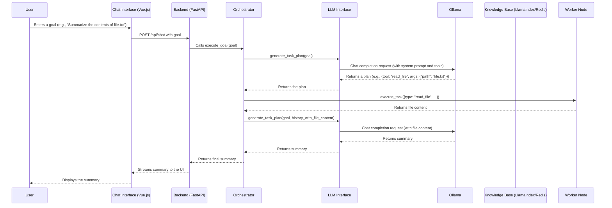

```mermaid
sequenceDiagram
    participant User
    participant ChatInterface as Chat Interface (Vue.js)
    participant Backend as Backend (FastAPI)
    participant Orchestrator
    participant LLMInterface as LLM Interface
    participant Ollama
    participant KnowledgeBase as Knowledge Base (LlamaIndex/Redis)
    participant WorkerNode as Worker Node

    User->>ChatInterface: Enters a goal (e.g., "Summarize the contents of file.txt")
    ChatInterface->>Backend: POST /api/chat with goal
    Backend->>Orchestrator: Calls execute_goal(goal)
    Orchestrator->>LLMInterface: generate_task_plan(goal)
    LLMInterface->>Ollama: Chat completion request (with system prompt and tools)
    Ollama-->>LLMInterface: Returns a plan (e.g., {tool: "read_file", args: {"path": "file.txt"}})
    LLMInterface-->>Orchestrator: Returns the plan
    Orchestrator->>WorkerNode: execute_task({type: "read_file", ...})
    WorkerNode-->>Orchestrator: Returns file content
    Orchestrator->>LLMInterface: generate_task_plan(goal, history_with_file_content)
    LLMInterface->>Ollama: Chat completion request (with file content)
    Ollama-->>LLMInterface: Returns summary
    LLMInterface-->>Orchestrator: Returns summary
    Orchestrator-->>Backend: Returns final summary
    Backend-->>ChatInterface: Streams summary to the UI
    ChatInterface-->>User: Displays the summary
```
