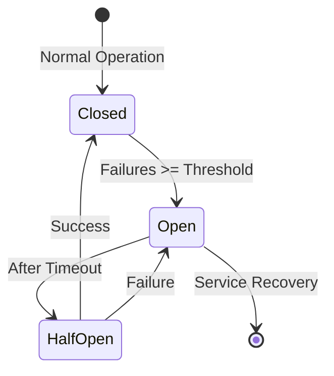

# AutoBot Distributed Deployment Guide

## Overview

AutoBot now supports **distributed deployment** where each service can run on separate machines, providing scalability, fault tolerance, and better resource utilization. This guide covers all deployment modes and configuration options.

## Table of Contents

1. [Deployment Modes](#deployment-modes)
2. [Service Registry Architecture](#service-registry-architecture)
3. [Configuration Management](#configuration-management)
4. [Deployment Examples](#deployment-examples)
5. [Health Monitoring](#health-monitoring)
6. [Troubleshooting](#troubleshooting)
7. [Migration Guide](#migration-guide)

## Deployment Modes

### 1. Local + Docker Hybrid (`local`) - **DEFAULT**
- **Use Case**: Default AutoBot deployment method
- **Backend/Frontend**: Run on host system (`localhost`)
- **Services**: Run in Docker containers, exposed on `localhost` ports
- **Configuration**: `config/deployment/local.yml`
- **Architecture**:
  - Backend: `http://localhost:8001` (host process)
  - Frontend: `http://localhost:5173` (host process)
  - Redis: `redis://localhost:6379` (Docker container, port exposed)
  - AI Stack: `http://localhost:8080` (Docker container, port exposed)
  - NPU Worker: `http://localhost:8081` (Docker container, port exposed)

```bash
# Start in local mode
export AUTOBOT_DEPLOYMENT_MODE=local
./run_agent.sh
```

### 2. Docker Local (`docker_local`)
- **Use Case**: Containerized services on single machine
- **Services**: Docker containers communicate via internal network
- **Configuration**: `config/deployment/docker-local.yml`

```bash
# Start in Docker local mode
export AUTOBOT_DEPLOYMENT_MODE=docker_local
./run_agent.sh --docker
```

### 3. Distributed (`distributed`)
- **Use Case**: Production deployment across multiple machines
- **Services**: Each service runs on dedicated hardware/VM
- **Configuration**: `config/deployment/distributed.yml`

```bash
# Start in distributed mode
export AUTOBOT_DEPLOYMENT_MODE=distributed
export AUTOBOT_DOMAIN=autobot.prod
./run_agent.sh --distributed
```

### 4. Kubernetes (`kubernetes`)
- **Use Case**: Cloud-native deployment with orchestration
- **Services**: Managed by Kubernetes with service discovery
- **Configuration**: `config/deployment/kubernetes.yml`

```bash
# Deploy to Kubernetes
kubectl apply -f k8s/
```

## Service Registry Architecture

### Core Components

#### ServiceRegistry Class
- **Location**: `src/utils/service_registry.py`
- **Purpose**: Centralized service discovery and configuration
- **Features**:
  - Automatic deployment mode detection
  - Environment-based configuration
  - Health checking with circuit breakers
  - Fallback strategies

#### Service Configuration
```python
@dataclass
class ServiceConfig:
    name: str
    host: str
    port: int
    scheme: str = "http"
    health_endpoint: str = "/health"
    timeout: int = 30
    circuit_breaker_threshold: int = 5
```

### Usage Examples

#### Basic Service URL Resolution
```python
from src.utils.service_registry import get_service_url

# Get Redis connection URL
redis_url = get_service_url("redis")
# Returns: redis://localhost:6379 (local)
# Returns: redis://autobot-redis:6379 (docker_local)
# Returns: redis://redis-01.autobot.prod:6379 (distributed)

# Get AI service endpoint
ai_endpoint = get_service_url("ai-stack", "/api/process")
# Returns: http://ai-worker-01.autobot.prod:8080/api/process
```

#### Health Checking
```python
from src.utils.service_registry import get_service_registry

registry = get_service_registry()

# Check single service health
health = await registry.check_service_health("redis")
if health.status == ServiceStatus.HEALTHY:
    print(f"Redis is healthy (response time: {health.response_time}ms)")

# Check all services
health_report = await registry.check_all_services_health()
for service, health in health_report.items():
    print(f"{service}: {health.status.value}")
```

#### Circuit Breaker Pattern
```python
# Services with repeated failures trigger circuit breaker
# Circuit opens after 5 consecutive failures (configurable)
# Services are automatically retried after 60 seconds

registry = get_service_registry()
health = await registry.check_service_health("ai-stack")

if health.status == ServiceStatus.CIRCUIT_OPEN:
    print("AI service circuit breaker is open - using fallback")
    # Implement fallback logic here
```

## Configuration Management

### Environment Variables

#### Service Discovery
```bash
# Deployment mode (auto-detected if not set)
export AUTOBOT_DEPLOYMENT_MODE=distributed
export AUTOBOT_DOMAIN=autobot.prod
export AUTOBOT_DISTRIBUTED=true

# Service-specific overrides
export REDIS_HOST=redis-cluster.prod.com
export REDIS_PORT=6379
export AI_STACK_HOST=ai-farm-01.prod.com
export AI_STACK_PORT=8080
export NPU_WORKER_HOST=npu-cluster.prod.com
export NPU_WORKER_PORT=8081
```

#### Health Check Configuration
```bash
# Circuit breaker settings
export REDIS_CIRCUIT_BREAKER_THRESHOLD=5
export REDIS_CIRCUIT_BREAKER_TIMEOUT=60
export AI_STACK_TIMEOUT=60
export AI_STACK_RETRIES=3
```

### Configuration Files

#### Local Development (`config/deployment/local.yml`)
```yaml
deployment:
  mode: local
  domain: localhost

services:
  redis:
    host: localhost
    port: 6379
    scheme: redis
  backend:
    host: localhost
    port: 8001
    scheme: http
```

#### Distributed Production (`config/deployment/distributed.yml`)
```yaml
deployment:
  mode: distributed
  domain: autobot.prod

services:
  redis:
    host: redis-01.autobot.prod
    port: 6379
    scheme: redis
    timeout: 10
    retries: 5

  ai-stack:
    host: ai-worker-01.autobot.prod
    port: 8080
    timeout: 60
    retries: 3

load_balancers:
  api:
    hosts:
      - api-01.autobot.prod:8001
      - api-02.autobot.prod:8001
    strategy: round_robin
```

## Deployment Examples

### Scenario 1: Single Machine Development
```bash
# All services on localhost
git clone https://github.com/your-org/AutoBot
cd AutoBot
./setup_agent.sh
export AUTOBOT_DEPLOYMENT_MODE=local
./run_agent.sh
```

**Services Running:**
- Backend: `http://localhost:8001`
- Frontend: `http://localhost:5173`
- Redis: `redis://localhost:6379`
- AI Stack: `http://localhost:8080`

### Scenario 2: Docker Compose (Single Machine)
```bash
# All services in containers
export AUTOBOT_DEPLOYMENT_MODE=docker_local
./run_agent.sh --docker

# Or with specific compose file
docker-compose -f docker-compose.hybrid.yml up -d
```

**Services Running:**
- Backend: `http://autobot-backend:8001` (internal)
- Redis: `redis://autobot-redis:6379` (internal)
- AI Stack: `http://autobot-ai-stack:8080` (internal)
- All services exposed on host ports

### Scenario 3: Distributed Production

#### Machine 1: Database Services
```bash
# redis-01.autobot.prod
docker run -d --name redis -p 6379:6379 redis:7.2-alpine
```

#### Machine 2: AI Processing
```bash
# ai-worker-01.autobot.prod
export AUTOBOT_DEPLOYMENT_MODE=distributed
export AUTOBOT_DOMAIN=autobot.prod
export REDIS_HOST=redis-01.autobot.prod
docker run -d --name ai-stack \
  -p 8080:8080 \
  -e REDIS_HOST=redis-01.autobot.prod \
  autobot-ai-stack
```

#### Machine 3: NPU Acceleration
```bash
# npu-farm-01.autobot.prod
export AUTOBOT_DEPLOYMENT_MODE=distributed
export REDIS_HOST=redis-01.autobot.prod
export AI_STACK_HOST=ai-worker-01.autobot.prod
docker run -d --name npu-worker \
  -p 8081:8081 \
  -e REDIS_HOST=redis-01.autobot.prod \
  -e AI_STACK_HOST=ai-worker-01.autobot.prod \
  autobot-npu-worker
```

#### Machine 4: Web Services
```bash
# api-01.autobot.prod
export AUTOBOT_DEPLOYMENT_MODE=distributed
export REDIS_HOST=redis-01.autobot.prod
export AI_STACK_HOST=ai-worker-01.autobot.prod
export NPU_WORKER_HOST=npu-farm-01.autobot.prod

./run_agent.sh --backend-only
```

### Scenario 4: Kubernetes Deployment

#### Namespace and Services
```yaml
# k8s/namespace.yml
apiVersion: v1
kind: Namespace
metadata:
  name: autobot-system

---
# k8s/redis-service.yml
apiVersion: v1
kind: Service
metadata:
  name: redis-service
  namespace: autobot-system
spec:
  selector:
    app: redis
  ports:
    - port: 6379
      targetPort: 6379
```

#### Application Deployment
```yaml
# k8s/backend-deployment.yml
apiVersion: apps/v1
kind: Deployment
metadata:
  name: backend
  namespace: autobot-system
spec:
  replicas: 3
  selector:
    matchLabels:
      app: backend
  template:
    metadata:
      labels:
        app: backend
    spec:
      containers:
      - name: backend
        image: autobot-backend:latest
        env:
        - name: AUTOBOT_DEPLOYMENT_MODE
          value: "kubernetes"
        - name: REDIS_HOST
          value: "redis-service.autobot-system.svc.cluster.local"
```

## Health Monitoring

### Built-in Health Checks

All services include health monitoring:

```python
# Check service health programmatically
from src.utils.service_registry import get_service_registry

registry = get_service_registry()

# Get deployment overview
info = registry.get_deployment_info()
print(f"Deployment Mode: {info['deployment_mode']}")
print(f"Services: {info['services_count']}")

for service, details in info['services'].items():
    print(f"  {service}: {details['url']} ({details['health']})")
```

### Health Check Endpoints

| Service | Health Endpoint | Expected Response |
|---------|----------------|-------------------|
| Backend | `/api/system/health` | `{"status": "healthy"}` |
| AI Stack | `/health` | `{"status": "ok"}` |
| NPU Worker | `/health` | `{"status": "ready"}` |
| Redis | `/` | `PONG` response |
| Frontend | `/` | HTML page |

### Circuit Breaker Behavior



**States:**
- **Closed**: Normal operation, requests pass through
- **Open**: Service marked unavailable, requests fail fast
- **Half-Open**: Testing if service has recovered

## Troubleshooting

### Common Issues

#### Service Discovery Failures
```bash
# Check deployment mode detection
python -c "
from src.utils.service_registry import get_service_registry
registry = get_service_registry()
print(f'Mode: {registry.deployment_mode.value}')
print(f'Services: {registry.list_services()}')
"

# Verify service URLs
python -c "
from src.utils.service_registry import get_service_url
print('Redis:', get_service_url('redis'))
print('Backend:', get_service_url('backend'))
print('AI Stack:', get_service_url('ai-stack'))
"
```

#### Connection Issues
```bash
# Test service connectivity
curl -f http://ai-worker-01.autobot.prod:8080/health
curl -f http://api-01.autobot.prod:8001/api/system/health

# Check Redis connectivity
redis-cli -h redis-01.autobot.prod -p 6379 ping
```

#### Configuration Problems
```bash
# Check environment variables
env | grep -E "(AUTOBOT|REDIS|AI_STACK|NPU)"

# Validate configuration file
python -c "
import yaml
with open('config/deployment/distributed.yml') as f:
    config = yaml.safe_load(f)
    print('Valid YAML configuration')
    print(f'Mode: {config[\"deployment\"][\"mode\"]}')
"
```

### Debug Mode

Enable detailed logging:

```bash
export AUTOBOT_LOG_LEVEL=DEBUG
export AUTOBOT_SERVICE_REGISTRY_DEBUG=true
./run_agent.sh
```

### Health Check Testing

```python
# Test all services
import asyncio
from src.utils.service_registry import get_service_registry

async def test_health():
    registry = get_service_registry()
    results = await registry.check_all_services_health()

    for service, health in results.items():
        status_emoji = "✅" if health.status.value == "healthy" else "❌"
        print(f"{status_emoji} {service}: {health.status.value}")
        if health.response_time > 0:
            print(f"   Response time: {health.response_time:.3f}s")

asyncio.run(test_health())
```

## Migration Guide

### From Hardcoded URLs to Service Registry

#### Before (Legacy)
```python
# Hardcoded service URLs
REDIS_URL = "redis://localhost:6379"
AI_ENDPOINT = "http://localhost:8080"

redis_client = redis.from_url(REDIS_URL)
response = requests.get(f"{AI_ENDPOINT}/api/process")
```

#### After (Service Registry)
```python
# Dynamic service discovery
from src.utils.service_registry import get_service_url

redis_url = get_service_url("redis")
ai_endpoint = get_service_url("ai-stack", "/api/process")

redis_client = redis.from_url(redis_url)
response = requests.get(ai_endpoint)
```

### Deployment Migration Steps

#### Step 1: Update Code
1. Replace hardcoded URLs with `get_service_url()` calls
2. Add health check endpoints to services
3. Update configuration loading

#### Step 2: Test Locally
```bash
# Verify local mode works
export AUTOBOT_DEPLOYMENT_MODE=local
./run_agent.sh --test-mode
```

#### Step 3: Test Docker Mode
```bash
# Verify Docker mode works
export AUTOBOT_DEPLOYMENT_MODE=docker_local
./run_agent.sh --docker
```

#### Step 4: Deploy Distributed
```bash
# Create distributed configuration
cp config/deployment/distributed.yml.example config/deployment/production.yml
# Edit production.yml with your hostnames

export AUTOBOT_DEPLOYMENT_MODE=distributed
./run_agent.sh --config config/deployment/production.yml
```

### Configuration File Migration

Create deployment-specific configurations:

```bash
# Create deployment configs directory
mkdir -p config/deployment

# Copy templates
cp docs/examples/local.yml config/deployment/
cp docs/examples/distributed.yml config/deployment/
cp docs/examples/kubernetes.yml config/deployment/

# Edit for your environment
vim config/deployment/production.yml
```

## Best Practices

### 1. Configuration Management
- Use environment-specific configuration files
- Override with environment variables for secrets
- Version control your deployment configurations
- Document any custom service configurations

### 2. Health Monitoring
- Implement comprehensive health checks for all services
- Use circuit breakers to handle service failures gracefully
- Monitor service response times and failure rates
- Set up alerting for service degradation

### 3. Security
- Use TLS/SSL for inter-service communication in production
- Implement authentication between services
- Secure Redis with password authentication
- Use network segmentation to isolate services

### 4. Scaling
- Design services to be stateless where possible
- Use load balancers for high-availability services
- Monitor resource usage to identify scaling needs
- Implement horizontal pod autoscaling in Kubernetes

### 5. Deployment
- Use Infrastructure as Code (Terraform, Ansible)
- Implement blue-green or rolling deployments
- Test deployment configurations in staging environment
- Maintain rollback procedures for failed deployments

## Advanced Features

### Load Balancing
```yaml
# config/deployment/distributed.yml
load_balancers:
  ai-workers:
    hosts:
      - ai-worker-01.autobot.prod:8080
      - ai-worker-02.autobot.prod:8080
      - ai-worker-03.autobot.prod:8080
    strategy: round_robin
    health_check: /health
```

### Service Mesh Integration
```yaml
# Integration with Istio/Linkerd
kubernetes:
  service_mesh:
    enabled: true
    type: istio
    traffic_policy:
      load_balancer: round_robin
      circuit_breaker:
        consecutive_errors: 5
        interval: 30s
```

### External Service Discovery
```python
# Integration with Consul/etcd
registry = ServiceRegistry(
    config_file="config/deployment/production.yml",
    external_registry={
        "type": "consul",
        "host": "consul.autobot.prod:8500"
    }
)
```

This comprehensive guide covers all aspects of AutoBot's distributed deployment capabilities. For specific deployment scenarios or troubleshooting, refer to the relevant sections above.
