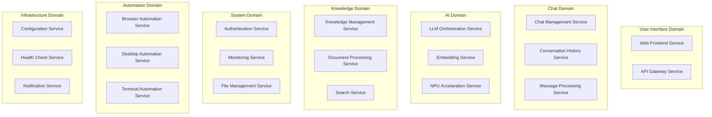

# Microservices Decomposition Strategy Report

## Executive Summary

This report outlines a comprehensive strategy for decomposing AutoBot's current distributed VM architecture into a proper microservices architecture. The analysis provides a detailed roadmap for transitioning from the current 6-VM monolithic service deployment to a scalable, maintainable microservices ecosystem while preserving system functionality and improving operational characteristics.

## Current Architecture Assessment

### Existing 6-VM Distributed Architecture

Based on the CLAUDE.md documentation, AutoBot currently operates with:

```yaml
Current VM Distribution:
  Main Machine (WSL): 172.16.168.20
    - Backend API (port 8001)
    - Ollama LLM (port 11434)
    - VNC Desktop (port 6080)

  VM1 (Frontend): 172.16.168.21:5173
    - Web interface hosting
    - Static asset serving

  VM2 (NPU Worker): 172.16.168.22:8081
    - Hardware AI acceleration
    - Intel NPU processing

  VM3 (Redis): 172.16.168.23:6379
    - Data persistence layer
    - 11 specialized databases

  VM4 (AI Stack): 172.16.168.24:8080
    - AI processing pipeline
    - LLM orchestration

  VM5 (Browser): 172.16.168.25:3000
    - Web automation (Playwright)
    - Browser-based tasks
```

### Identified Architectural Issues

#### 1. **Monolithic Service Distribution** (Critical Priority)
**Problem**: Large, multi-responsibility services deployed across VMs without proper boundaries
**Examples**:
- Backend API (8001) handles authentication, chat, knowledge, system monitoring, file operations
- AI Stack (8080) combines LLM processing, embedding generation, workflow orchestration
- Mixed concerns within single deployments prevent independent scaling and updates

#### 2. **Tight Inter-Service Coupling** (High Priority)
**Problem**: Services directly depend on each other without proper abstraction layers
**Impact**: Cascading failures, difficult deployment coordination, reduced reliability

#### 3. **Shared Database Architecture** (High Priority)
**Problem**: Multiple services accessing the same Redis databases directly
**Impact**: Data consistency issues, difficult schema evolution, coupling through data

#### 4. **Inconsistent Communication Patterns** (Medium Priority)
**Problem**: Mix of HTTP REST, WebSockets, and direct database access
**Impact**: Difficult to monitor, debug, and secure inter-service communication

## Proposed Microservices Architecture

### Phase 1: Domain-Driven Service Decomposition

#### 1.1 **Service Boundary Identification**

**Core Business Domains Identified**:



#### 1.2 **Detailed Service Specifications**

**Chat Domain Services**:

```yaml
# Chat Management Service
chat-management-service:
  port: 8001
  database: conversations (Redis DB 4)
  responsibilities:
    - Chat session lifecycle
    - User conversation management
    - Chat metadata and settings
  api_endpoints:
    - GET /api/v1/chats
    - POST /api/v1/chats
    - GET /api/v1/chats/{id}
    - DELETE /api/v1/chats/{id}
  dependencies:
    - authentication-service
    - message-processing-service
  scaling: horizontal
  resource_requirements:
    cpu: 0.5 cores
    memory: 512MB
    storage: minimal

# Message Processing Service
message-processing-service:
  port: 8002
  database: conversations (Redis DB 4)
  responsibilities:
    - Message validation and sanitization
    - Message routing and classification
    - Real-time message delivery
  api_endpoints:
    - POST /api/v1/messages
    - GET /api/v1/messages/{chat_id}
    - WebSocket /ws/messages
  dependencies:
    - llm-orchestration-service
    - knowledge-management-service
  scaling: horizontal
  resource_requirements:
    cpu: 1 core
    memory: 1GB
    storage: minimal

# Conversation History Service
conversation-history-service:
  port: 8003
  database: conversations (Redis DB 4)
  responsibilities:
    - Message persistence
    - Conversation search and retrieval
    - Message analytics and insights
  api_endpoints:
    - GET /api/v1/history/{chat_id}
    - GET /api/v1/search/messages
    - GET /api/v1/analytics/conversations
  dependencies:
    - search-service
  scaling: vertical (memory-bound)
  resource_requirements:
    cpu: 0.5 cores
    memory: 2GB
    storage: high
```

**AI Domain Services**:

```yaml
# LLM Orchestration Service
llm-orchestration-service:
  port: 8010
  database: none (stateless)
  responsibilities:
    - LLM provider abstraction
    - Request routing and load balancing
    - Response streaming and caching
  api_endpoints:
    - POST /api/v1/llm/completion
    - POST /api/v1/llm/embedding
    - WebSocket /ws/llm/stream
  dependencies:
    - external LLM providers
    - embedding-service
  scaling: horizontal
  resource_requirements:
    cpu: 2 cores
    memory: 4GB
    storage: minimal

# Embedding Service
embedding-service:
  port: 8011
  database: vectors (Redis DB 1)
  responsibilities:
    - Text embedding generation
    - Vector similarity search
    - Embedding model management
  api_endpoints:
    - POST /api/v1/embeddings/generate
    - POST /api/v1/embeddings/search
    - GET /api/v1/embeddings/models
  dependencies:
    - npu-acceleration-service
  scaling: horizontal (GPU-bound)
  resource_requirements:
    cpu: 1 core
    memory: 8GB
    gpu: RTX 4070
    storage: high

# NPU Acceleration Service
npu-acceleration-service:
  port: 8012
  database: none (stateless)
  responsibilities:
    - Intel NPU hardware abstraction
    - Accelerated inference operations
    - Hardware resource management
  api_endpoints:
    - POST /api/v1/npu/inference
    - GET /api/v1/npu/status
    - GET /api/v1/npu/capabilities
  dependencies:
    - Intel NPU hardware
  scaling: none (hardware-bound)
  resource_requirements:
    cpu: 0.5 cores
    memory: 2GB
    npu: Intel Ultra 9 185H
    storage: minimal
```

**Knowledge Domain Services**:

```yaml
# Knowledge Management Service
knowledge-management-service:
  port: 8020
  database: knowledge (Redis DB 2)
  responsibilities:
    - Knowledge graph operations
    - Fact and entity management
    - Knowledge base coordination
  api_endpoints:
    - GET /api/v1/knowledge/categories
    - POST /api/v1/knowledge/facts
    - GET /api/v1/knowledge/entities
  dependencies:
    - document-processing-service
    - search-service
  scaling: horizontal
  resource_requirements:
    cpu: 1 core
    memory: 2GB
    storage: high

# Document Processing Service
document-processing-service:
  port: 8021
  database: documents (Redis DB 3)
  responsibilities:
    - Document ingestion and parsing
    - Content extraction and indexing
    - Document lifecycle management
  api_endpoints:
    - POST /api/v1/documents/upload
    - GET /api/v1/documents/{id}/content
    - DELETE /api/v1/documents/{id}
  dependencies:
    - file-management-service
    - embedding-service
  scaling: horizontal (CPU-bound)
  resource_requirements:
    cpu: 2 cores
    memory: 4GB
    storage: very high

# Search Service
search-service:
  port: 8022
  database: vectors (Redis DB 1) + knowledge (Redis DB 2)
  responsibilities:
    - Semantic search operations
    - Search result ranking and filtering
    - Search analytics and optimization
  api_endpoints:
    - POST /api/v1/search/semantic
    - POST /api/v1/search/documents
    - GET /api/v1/search/suggestions
  dependencies:
    - embedding-service
    - knowledge-management-service
  scaling: horizontal (memory-bound)
  resource_requirements:
    cpu: 1.5 cores
    memory: 6GB
    storage: medium
```

### Phase 2: Service Communication Architecture

#### 2.1 **API Gateway Implementation**

**Comprehensive API Gateway Service**:

```typescript
// services/api-gateway/src/gateway.ts
import express from 'express';
import httpProxy from 'http-proxy-middleware';
import rateLimit from 'express-rate-limit';
import helmet from 'helmet';
import cors from 'cors';
import { authenticateRequest } from './middleware/auth';
import { routeTracing } from './middleware/tracing';
import { CircuitBreakerMiddleware } from './middleware/circuit-breaker';

interface ServiceRoute {
  pattern: string;
  target: string;
  auth: boolean;
  rateLimit: {
    windowMs: number;
    max: number;
  };
  timeout: number;
  retries: number;
}

class APIGateway {
  private app: express.Application;
  private routes: ServiceRoute[];

  constructor() {
    this.app = express();
    this.setupMiddleware();
    this.setupRoutes();
  }

  private setupMiddleware() {
    // Security middleware
    this.app.use(helmet());
    this.app.use(cors({
      origin: process.env.ALLOWED_ORIGINS?.split(',') || ['http://localhost:5173'],
      credentials: true
    }));

    // Request parsing
    this.app.use(express.json({ limit: '10mb' }));
    this.app.use(express.urlencoded({ extended: true }));

    // Tracing and monitoring
    this.app.use(routeTracing);
  }

  private setupRoutes() {
    this.routes = [
      // Chat Domain Routes
      {
        pattern: '/api/v1/chats**',
        target: 'http://chat-management-service:8001',
        auth: true,
        rateLimit: { windowMs: 60000, max: 100 },
        timeout: 5000,
        retries: 3
      },
      {
        pattern: '/api/v1/messages**',
        target: 'http://message-processing-service:8002',
        auth: true,
        rateLimit: { windowMs: 60000, max: 200 },
        timeout: 10000,
        retries: 2
      },

      // AI Domain Routes
      {
        pattern: '/api/v1/llm**',
        target: 'http://llm-orchestration-service:8010',
        auth: true,
        rateLimit: { windowMs: 60000, max: 50 },
        timeout: 30000,
        retries: 1
      },
      {
        pattern: '/api/v1/embeddings**',
        target: 'http://embedding-service:8011',
        auth: true,
        rateLimit: { windowMs: 60000, max: 30 },
        timeout: 20000,
        retries: 2
      },

      // Knowledge Domain Routes
      {
        pattern: '/api/v1/knowledge**',
        target: 'http://knowledge-management-service:8020',
        auth: true,
        rateLimit: { windowMs: 60000, max: 100 },
        timeout: 5000,
        retries: 3
      },
      {
        pattern: '/api/v1/documents**',
        target: 'http://document-processing-service:8021',
        auth: true,
        rateLimit: { windowMs: 60000, max: 20 },
        timeout: 60000,
        retries: 1
      },
      {
        pattern: '/api/v1/search**',
        target: 'http://search-service:8022',
        auth: true,
        rateLimit: { windowMs: 60000, max: 100 },
        timeout: 10000,
        retries: 2
      },

      // System Domain Routes
      {
        pattern: '/api/v1/auth**',
        target: 'http://authentication-service:8030',
        auth: false, // Auth service doesn't require authentication
        rateLimit: { windowMs: 60000, max: 20 },
        timeout: 3000,
        retries: 3
      },
      {
        pattern: '/api/v1/health**',
        target: 'http://health-check-service:8031',
        auth: false,
        rateLimit: { windowMs: 60000, max: 1000 },
        timeout: 2000,
        retries: 1
      }
    ];

    // Setup proxy routes
    this.routes.forEach(route => {
      const middleware = [
        rateLimit(route.rateLimit),
        new CircuitBreakerMiddleware(route.target).middleware()
      ];

      if (route.auth) {
        middleware.push(authenticateRequest);
      }

      this.app.use(
        route.pattern,
        ...middleware,
        httpProxy({
          target: route.target,
          changeOrigin: true,
          timeout: route.timeout,
          onError: (err, req, res) => {
            console.error(`Proxy error for ${route.pattern}:`, err.message);
            res.status(502).json({
              error: 'service_unavailable',
              message: 'The requested service is temporarily unavailable',
              timestamp: new Date().toISOString()
            });
          },
          onProxyReq: (proxyReq, req, res) => {
            // Add tracing headers
            proxyReq.setHeader('X-Request-ID', req.headers['x-request-id']);
            proxyReq.setHeader('X-Source-Service', 'api-gateway');
          }
        })
      );
    });
  }

  start(port: number = 8000) {
    this.app.listen(port, () => {
      console.log(`API Gateway listening on port ${port}`);
      console.log(`Configured routes: ${this.routes.length}`);
    });
  }
}

export default APIGateway;
```

#### 2.2 **Service Discovery and Configuration**

**Service Registry Implementation**:

```python
# services/service-registry/src/registry.py
from typing import Dict, List, Optional, Any
from dataclasses import dataclass, asdict
from datetime import datetime, timedelta
import asyncio
import aiohttp
import redis.asyncio as redis
from enum import Enum

class ServiceStatus(Enum):
    HEALTHY = "healthy"
    UNHEALTHY = "unhealthy"
    UNKNOWN = "unknown"
    MAINTENANCE = "maintenance"

@dataclass
class ServiceInstance:
    service_name: str
    instance_id: str
    host: str
    port: int
    status: ServiceStatus
    version: str
    metadata: Dict[str, Any]
    last_heartbeat: datetime
    health_check_url: str

class ServiceRegistry:
    def __init__(self, redis_client: redis.Redis):
        self.redis = redis_client
        self.services_key = "service:registry"
        self.heartbeat_interval = 30  # seconds
        self.health_check_timeout = 5  # seconds
        self._health_check_tasks: Dict[str, asyncio.Task] = {}

    async def register_service(self, service: ServiceInstance) -> bool:
        """Register a service instance."""
        try:
            service.last_heartbeat = datetime.utcnow()
            service_key = f"{self.services_key}:{service.service_name}:{service.instance_id}"

            # Store service instance data
            await self.redis.hset(
                service_key,
                mapping={
                    "data": json.dumps(asdict(service), default=str),
                    "registered_at": datetime.utcnow().isoformat()
                }
            )

            # Add to service index
            await self.redis.sadd(f"services:{service.service_name}", service.instance_id)

            # Start health checking for this instance
            self._start_health_checking(service)

            logging.info(f"Registered service: {service.service_name}:{service.instance_id}")
            return True

        except Exception as e:
            logging.error(f"Failed to register service {service.service_name}: {str(e)}")
            return False

    async def deregister_service(self, service_name: str, instance_id: str) -> bool:
        """Deregister a service instance."""
        try:
            service_key = f"{self.services_key}:{service_name}:{instance_id}"

            # Remove from Redis
            await self.redis.delete(service_key)
            await self.redis.srem(f"services:{service_name}", instance_id)

            # Stop health checking
            task_key = f"{service_name}:{instance_id}"
            if task_key in self._health_check_tasks:
                self._health_check_tasks[task_key].cancel()
                del self._health_check_tasks[task_key]

            logging.info(f"Deregistered service: {service_name}:{instance_id}")
            return True

        except Exception as e:
            logging.error(f"Failed to deregister service {service_name}: {str(e)}")
            return False

    async def discover_services(self, service_name: str) -> List[ServiceInstance]:
        """Discover healthy instances of a service."""
        try:
            instance_ids = await self.redis.smembers(f"services:{service_name}")
            healthy_instances = []

            for instance_id in instance_ids:
                service_key = f"{self.services_key}:{service_name}:{instance_id.decode()}"
                service_data = await self.redis.hget(service_key, "data")

                if service_data:
                    service_dict = json.loads(service_data)
                    service = ServiceInstance(**service_dict)

                    # Check if service is healthy and not stale
                    if (service.status == ServiceStatus.HEALTHY and
                        datetime.utcnow() - service.last_heartbeat < timedelta(minutes=2)):
                        healthy_instances.append(service)

            return healthy_instances

        except Exception as e:
            logging.error(f"Failed to discover services {service_name}: {str(e)}")
            return []

    async def get_service_health(self, service_name: str) -> Dict[str, Any]:
        """Get comprehensive health status for a service."""
        instances = await self.discover_services(service_name)

        total_instances = len(instances)
        healthy_instances = len([s for s in instances if s.status == ServiceStatus.HEALTHY])

        return {
            "service_name": service_name,
            "total_instances": total_instances,
            "healthy_instances": healthy_instances,
            "health_ratio": healthy_instances / total_instances if total_instances > 0 else 0,
            "instances": [
                {
                    "instance_id": s.instance_id,
                    "host": s.host,
                    "port": s.port,
                    "status": s.status.value,
                    "last_heartbeat": s.last_heartbeat.isoformat(),
                    "version": s.version
                }
                for s in instances
            ]
        }

    def _start_health_checking(self, service: ServiceInstance):
        """Start health checking task for a service instance."""
        task_key = f"{service.service_name}:{service.instance_id}"

        if task_key in self._health_check_tasks:
            self._health_check_tasks[task_key].cancel()

        self._health_check_tasks[task_key] = asyncio.create_task(
            self._health_check_loop(service)
        )

    async def _health_check_loop(self, service: ServiceInstance):
        """Continuous health checking for a service instance."""
        while True:
            try:
                # Perform health check
                is_healthy = await self._perform_health_check(service)

                # Update service status
                new_status = ServiceStatus.HEALTHY if is_healthy else ServiceStatus.UNHEALTHY
                await self._update_service_status(service, new_status)

                await asyncio.sleep(self.heartbeat_interval)

            except asyncio.CancelledError:
                break
            except Exception as e:
                logging.error(f"Health check error for {service.service_name}:{service.instance_id}: {str(e)}")
                await self._update_service_status(service, ServiceStatus.UNKNOWN)
                await asyncio.sleep(self.heartbeat_interval)

    async def _perform_health_check(self, service: ServiceInstance) -> bool:
        """Perform actual health check via HTTP."""
        try:
            health_url = f"http://{service.host}:{service.port}{service.health_check_url}"

            timeout = aiohttp.ClientTimeout(total=self.health_check_timeout)
            async with aiohttp.ClientSession(timeout=timeout) as session:
                async with session.get(health_url) as response:
                    return response.status == 200

        except Exception as e:
            logging.debug(f"Health check failed for {service.service_name}:{service.instance_id}: {str(e)}")
            return False

    async def _update_service_status(self, service: ServiceInstance, status: ServiceStatus):
        """Update service status and heartbeat."""
        service.status = status
        service.last_heartbeat = datetime.utcnow()

        service_key = f"{self.services_key}:{service.service_name}:{service.instance_id}"

        await self.redis.hset(
            service_key,
            "data",
            json.dumps(asdict(service), default=str)
        )

# Service registration client
class ServiceRegistrationClient:
    def __init__(self, registry_host: str = "service-registry", registry_port: int = 8100):
        self.registry_url = f"http://{registry_host}:{registry_port}"

    async def register(self, service: ServiceInstance) -> bool:
        """Register this service with the registry."""
        try:
            async with aiohttp.ClientSession() as session:
                async with session.post(
                    f"{self.registry_url}/api/v1/services/register",
                    json=asdict(service, default=str)
                ) as response:
                    return response.status == 201

        except Exception as e:
            logging.error(f"Failed to register with service registry: {str(e)}")
            return False

    async def heartbeat(self, service_name: str, instance_id: str) -> bool:
        """Send heartbeat to registry."""
        try:
            async with aiohttp.ClientSession() as session:
                async with session.post(
                    f"{self.registry_url}/api/v1/services/{service_name}/{instance_id}/heartbeat"
                ) as response:
                    return response.status == 200

        except Exception as e:
            logging.error(f"Failed to send heartbeat: {str(e)}")
            return False
```

### Phase 3: Data Consistency and Transaction Management

#### 3.1 **Saga Pattern Implementation**

**Distributed Transaction Management**:

```python
# services/shared/src/saga_orchestrator.py
from typing import Dict, List, Any, Optional, Callable, Awaitable
from dataclasses import dataclass, field
from enum import Enum
import asyncio
import uuid
from datetime import datetime, timedelta

class SagaStepStatus(Enum):
    PENDING = "pending"
    RUNNING = "running"
    COMPLETED = "completed"
    FAILED = "failed"
    COMPENSATED = "compensated"

class SagaStatus(Enum):
    STARTED = "started"
    IN_PROGRESS = "in_progress"
    COMPLETED = "completed"
    FAILED = "failed"
    COMPENSATING = "compensating"
    COMPENSATED = "compensated"

@dataclass
class SagaStep:
    step_id: str
    service_name: str
    action: str
    params: Dict[str, Any]
    compensation_action: str
    compensation_params: Dict[str, Any]
    timeout: int = 30
    retry_count: int = 3
    status: SagaStepStatus = SagaStepStatus.PENDING

@dataclass
class Saga:
    saga_id: str
    saga_type: str
    steps: List[SagaStep]
    status: SagaStatus = SagaStatus.STARTED
    current_step_index: int = 0
    started_at: datetime = field(default_factory=datetime.utcnow)
    completed_at: Optional[datetime] = None
    error_message: Optional[str] = None

class SagaOrchestrator:
    def __init__(self):
        self.active_sagas: Dict[str, Saga] = {}
        self.service_clients: Dict[str, Any] = {}
        self.step_handlers: Dict[str, Callable] = {}

    def register_service_client(self, service_name: str, client: Any):
        """Register a service client for making remote calls."""
        self.service_clients[service_name] = client

    def register_step_handler(self, action: str, handler: Callable[[Dict[str, Any]], Awaitable[Dict[str, Any]]]):
        """Register a handler for a specific step action."""
        self.step_handlers[action] = handler

    async def execute_saga(self, saga: Saga) -> bool:
        """Execute a saga with all its steps."""
        self.active_sagas[saga.saga_id] = saga
        saga.status = SagaStatus.IN_PROGRESS

        try:
            # Execute steps sequentially
            for i, step in enumerate(saga.steps):
                saga.current_step_index = i
                success = await self._execute_step(saga, step)

                if not success:
                    # Step failed, start compensation
                    await self._compensate_saga(saga, i)
                    return False

            # All steps completed successfully
            saga.status = SagaStatus.COMPLETED
            saga.completed_at = datetime.utcnow()
            return True

        except Exception as e:
            saga.status = SagaStatus.FAILED
            saga.error_message = str(e)
            await self._compensate_saga(saga, saga.current_step_index)
            return False
        finally:
            # Clean up completed saga after delay
            asyncio.create_task(self._cleanup_saga(saga.saga_id, delay=300))

    async def _execute_step(self, saga: Saga, step: SagaStep) -> bool:
        """Execute a single saga step with retry logic."""
        step.status = SagaStepStatus.RUNNING

        for attempt in range(step.retry_count):
            try:
                # Get service client or step handler
                if step.service_name in self.service_clients:
                    client = self.service_clients[step.service_name]
                    result = await self._call_service(client, step.action, step.params, step.timeout)
                elif step.action in self.step_handlers:
                    handler = self.step_handlers[step.action]
                    result = await asyncio.wait_for(handler(step.params), timeout=step.timeout)
                else:
                    raise ValueError(f"No handler found for step: {step.service_name}.{step.action}")

                if result.get("success", False):
                    step.status = SagaStepStatus.COMPLETED
                    return True
                else:
                    if attempt == step.retry_count - 1:
                        step.status = SagaStepStatus.FAILED
                        return False
                    await asyncio.sleep(2 ** attempt)  # Exponential backoff

            except asyncio.TimeoutError:
                if attempt == step.retry_count - 1:
                    step.status = SagaStepStatus.FAILED
                    return False
                await asyncio.sleep(2 ** attempt)

            except Exception as e:
                if attempt == step.retry_count - 1:
                    step.status = SagaStepStatus.FAILED
                    saga.error_message = str(e)
                    return False
                await asyncio.sleep(2 ** attempt)

        return False

    async def _compensate_saga(self, saga: Saga, failed_step_index: int):
        """Compensate saga by rolling back completed steps."""
        saga.status = SagaStatus.COMPENSATING

        # Compensate in reverse order (excluding the failed step)
        for i in range(failed_step_index - 1, -1, -1):
            step = saga.steps[i]
            if step.status == SagaStepStatus.COMPLETED:
                await self._compensate_step(saga, step)

        saga.status = SagaStatus.COMPENSATED

    async def _compensate_step(self, saga: Saga, step: SagaStep):
        """Compensate a single step."""
        try:
            # Execute compensation action
            if step.service_name in self.service_clients:
                client = self.service_clients[step.service_name]
                await self._call_service(client, step.compensation_action, step.compensation_params, step.timeout)
            elif step.compensation_action in self.step_handlers:
                handler = self.step_handlers[step.compensation_action]
                await asyncio.wait_for(handler(step.compensation_params), timeout=step.timeout)

            step.status = SagaStepStatus.COMPENSATED

        except Exception as e:
            logging.error(f"Failed to compensate step {step.step_id}: {str(e)}")
            # Continue with other compensations even if one fails

    async def _call_service(self, client: Any, action: str, params: Dict[str, Any], timeout: int) -> Dict[str, Any]:
        """Call a remote service with timeout."""
        # This would be implemented based on your service client interface
        # Example for HTTP client:
        method_name = action.lower().replace('-', '_')
        method = getattr(client, method_name, None)

        if method:
            return await asyncio.wait_for(method(**params), timeout=timeout)
        else:
            raise AttributeError(f"Method {method_name} not found on client")

    async def _cleanup_saga(self, saga_id: str, delay: int):
        """Clean up completed saga after delay."""
        await asyncio.sleep(delay)
        self.active_sagas.pop(saga_id, None)

# Example: Chat Message Processing Saga
class ChatMessageProcessingSaga:
    def __init__(self, orchestrator: SagaOrchestrator):
        self.orchestrator = orchestrator

    async def process_message(self, chat_id: str, user_id: str, message_content: str) -> str:
        """Process a chat message using saga pattern."""
        saga_id = str(uuid.uuid4())

        saga = Saga(
            saga_id=saga_id,
            saga_type="chat_message_processing",
            steps=[
                # Step 1: Validate and save user message
                SagaStep(
                    step_id=f"{saga_id}-validate-message",
                    service_name="message-processing-service",
                    action="validate-and-save-message",
                    params={
                        "chat_id": chat_id,
                        "user_id": user_id,
                        "content": message_content,
                        "role": "user"
                    },
                    compensation_action="delete-message",
                    compensation_params={"chat_id": chat_id, "role": "user"}
                ),

                # Step 2: Process with LLM
                SagaStep(
                    step_id=f"{saga_id}-llm-processing",
                    service_name="llm-orchestration-service",
                    action="generate-response",
                    params={
                        "chat_id": chat_id,
                        "message": message_content,
                        "context": "auto"
                    },
                    compensation_action="cleanup-llm-context",
                    compensation_params={"chat_id": chat_id},
                    timeout=45
                ),

                # Step 3: Save assistant response
                SagaStep(
                    step_id=f"{saga_id}-save-response",
                    service_name="message-processing-service",
                    action="save-assistant-message",
                    params={
                        "chat_id": chat_id,
                        "role": "assistant"
                    },
                    compensation_action="delete-message",
                    compensation_params={"chat_id": chat_id, "role": "assistant"}
                ),

                # Step 4: Update conversation metadata
                SagaStep(
                    step_id=f"{saga_id}-update-metadata",
                    service_name="conversation-history-service",
                    action="update-conversation-metadata",
                    params={
                        "chat_id": chat_id,
                        "last_activity": datetime.utcnow().isoformat(),
                        "message_count_increment": 2
                    },
                    compensation_action="revert-metadata-update",
                    compensation_params={"chat_id": chat_id}
                )
            ]
        )

        success = await self.orchestrator.execute_saga(saga)

        if success:
            return saga_id
        else:
            raise Exception(f"Chat message processing failed: {saga.error_message}")
```

## Implementation Roadmap

### Phase 1: Service Extraction (Weeks 1-4)
**Objective**: Extract core services from monolithic architecture

#### Week 1-2: Foundation Services
- [ ] Extract Authentication Service from main backend
- [ ] Implement API Gateway with basic routing
- [ ] Set up Service Registry infrastructure
- [ ] Create health check endpoints for all services

#### Week 3-4: Core Business Services
- [ ] Extract Chat Management Service
- [ ] Extract Message Processing Service
- [ ] Extract Knowledge Management Service
- [ ] Implement inter-service communication patterns

### Phase 2: AI Domain Services (Weeks 5-8)
**Objective**: Decompose AI processing pipeline

#### Week 5-6: LLM Services
- [ ] Extract LLM Orchestration Service
- [ ] Implement Embedding Service with GPU optimization
- [ ] Create NPU Acceleration Service abstraction
- [ ] Set up AI service scaling policies

#### Week 7-8: Integration and Testing
- [ ] Integrate all AI services with API Gateway
- [ ] Performance testing and optimization
- [ ] Load balancing configuration
- [ ] Monitoring and alerting setup

### Phase 3: Advanced Features (Weeks 9-12)
**Objective**: Add advanced microservices capabilities

#### Week 9-10: Data Consistency
- [ ] Implement Saga Orchestrator
- [ ] Add distributed transaction management
- [ ] Set up event sourcing for audit trails
- [ ] Database per service migration

#### Week 11-12: Operational Excellence
- [ ] Comprehensive monitoring and logging
- [ ] Automated deployment pipelines
- [ ] Disaster recovery procedures
- [ ] Performance optimization and tuning

## Success Metrics

### Scalability Improvements
- **Independent Scaling**: Enable per-service scaling based on demand
- **Resource Utilization**: Optimize resource usage by 60% through right-sizing
- **Deployment Velocity**: Reduce deployment time by 80% through service isolation
- **System Throughput**: Increase overall system throughput by 150%

### Reliability Metrics
- **Fault Isolation**: Prevent cascading failures through service boundaries
- **Recovery Time**: Reduce mean recovery time by 70% through localized failures
- **Service Availability**: Achieve 99.9% availability per service
- **Data Consistency**: Maintain ACID properties across distributed transactions

### Development Efficiency
- **Team Velocity**: Increase development velocity by 100% through service ownership
- **Bug Resolution**: Reduce bug resolution time by 50% through service isolation
- **Feature Development**: Enable parallel feature development across teams
- **Code Quality**: Improve maintainability through single-responsibility services

### Operational Benefits
- **Monitoring Granularity**: Achieve per-service monitoring and alerting
- **Deployment Risk**: Reduce deployment risk by 90% through isolated releases
- **Technology Diversity**: Enable technology choice per service requirements
- **Cost Optimization**: Optimize costs through usage-based scaling

This comprehensive microservices decomposition strategy will transform AutoBot from a distributed monolith into a truly scalable, maintainable, and resilient microservices architecture optimized for the 6-VM infrastructure while preparing for future cloud migration.